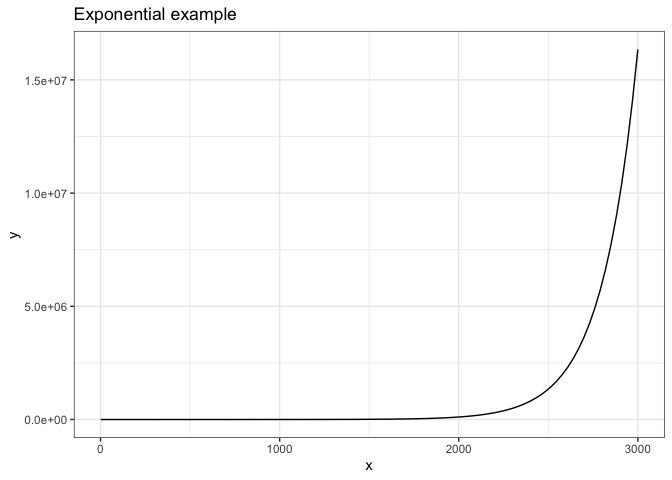
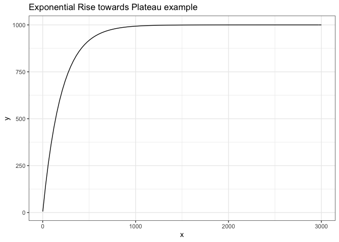
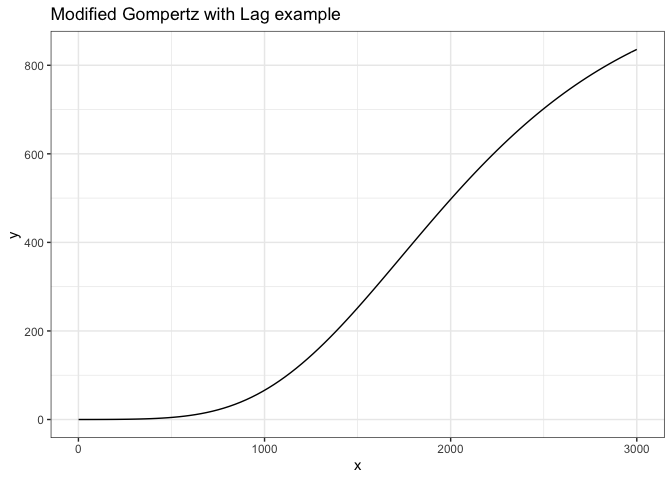
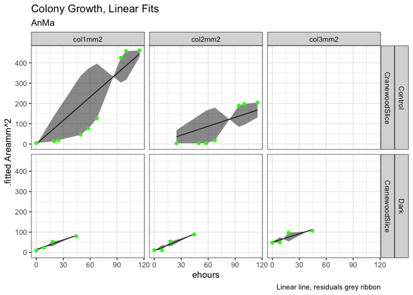
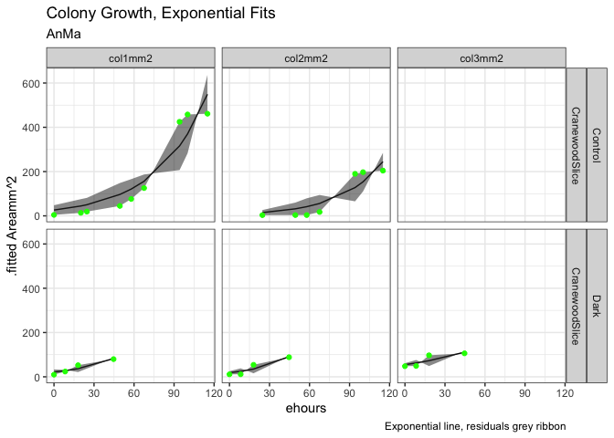
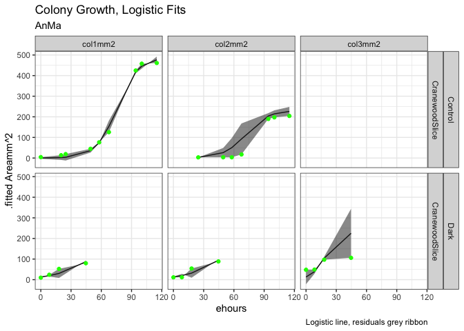
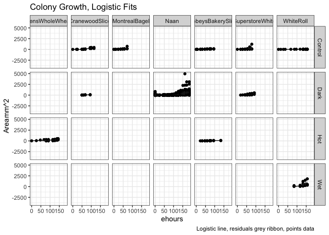

# Acknowledgements
This report uses test data accumulated by the BIOL2201 Class, 2021, Mount Allison University under the guidance of L. Barney.

# Run These Chunks First


```r
knitr::opts_chunk$set(fig.path='Figs/')
```
Additional libraries needed to run the project.
'googledrive' and 'googlesheets4' manage access to googlesheets, used for MetaData catalogs


# Introduction
Microbes grow.
We will import microbial growth data, tidy it, plot growth data vs. time and fit models of microbial growth to the data.

# Some possible models for microbial growth
Each model defines a pattern of growth.  

## Linear
Microbial population increases by a constant amount per unit time.
(Pseudo)Linear growth is sometimes observed when a constant input of a resource (ex. light) is shared among an increasing number of cells.  
The population adds a constant number of cells per unit time, but each cell is growing more slowly with each time increment as its share of the constant resource input decreases.  

Two fitted parameters; intercept (P0) and linearslope (m)
Pt = ehours*m + P0

### Linear Example

```r
linear_eqn <- function(x, m, Intercept){(x * m) + Intercept
}

linear_eqn_test <- function(x, m = 0.005, Intercept = 5){x*m + Intercept
}

ggplot(data.frame(x=c(1, 3000)), aes(x=x)) + 
  stat_function(fun = linear_eqn_test) +
  labs(title = "Linear example") +
  theme_bw()
```

<!-- -->


## Exponential  
Microbial population increases by a constant proportion per unit time.
Exponential growth is observed when microbial cell replication is not resource limited, but is rather limited by intrinsic processes like nutrient uptake rates or DNA replication rate.

Two fitted parameters; intercept (P0) and exponential growth rate constant (mu, µ)
Pt = P0 *(exp(mu*ehours))

### Exponential Example

```r
exp_rise_eqn <- function(x, mu, Intercept){Intercept *exp(x*mu)
}
  
exp_rise_eqn_test <- function(x, mu = 0.005, Intercept = 5){Intercept *exp(x*mu)
}
ggplot(data.frame(x=c(1, 3000)), aes(x=x)) + 
  stat_function(fun = exp_rise_eqn_test) +
  labs(title = "Exponential example") +
  theme_bw()
```

<!-- -->


## Exponential rise towards a plateau
The gap between a maximum population and the current microbial population decreases by a constant proportion per unit time.
Three parameters; intercept (P0), exponential growth rate constant (mu) and plateau (Max)
Pt = Max - ((Max-Intercept)*exp(x*-mu)

### Exponential rise towards a plateau example

```r
exp_rise_plat_eqn <- function(x, mu = 0.005, Intercept){Max - ((Max-Intercept)*exp(x*-mu))
}

exp_rise_plat_eqn_test <- function(x, mu = 0.005, Intercept = 0.5, Max = 1000){Max - ((Max-Intercept)*exp(x*-mu))
}
ggplot(data.frame(x=c(1, 3000)), aes(x=x)) + 
  stat_function(fun = exp_rise_plat_eqn_test) +
  labs(title = "Exponential Rise towards Plateau example") +
  theme_bw()
```

<!-- -->


## Logistic
Microbial population initially increases exponentially but slows as population approaches a plateau, Pmax.

Pmax is maximum population tenable under the prevailing conditions, sometimes termed the carrying capacity.
mu dominates the early part of the rise, transitioning towards an asymptote towards Pmax.
Three parameters; intercept (P0), exponential rate constant (mu) and maximum population Pmax.
There are multiple equivalent formulations of the logistic equation.
Pt= {Pmax e^µt }/{Pmax + P0 (e^µt- 1)}

### Logistic example

```r
logistic_eqn <- function(x, mu, Intercept, Max){(Max*Intercept*exp(mu*x))/(Max + (Intercept*(exp(mu*x)-1)))
}

logistic_eqn_test <- function(x, mu = 0.005, Intercept = 5, Max = 10000){(Max*Intercept*exp(mu*x))/(Max + (Intercept*(exp(mu*x)-1)))
}

ggplot(data.frame(x = c(1, 3000)), aes(x=x)) + 
  stat_function(fun = logistic_eqn_test) +
  labs(title = "Logistic example") +
  theme_bw()
```

<!-- -->


## Modified Gompertz Fit with Lag
Gompertz equations [@zwieteringModelingBacterialGrowth1990] have shapes similar to Logistic fits but are more readily modified to include 'lag' as a parameter for an initial time period over which cell count does not (measurably) increase.
'lag' may be a true biological lag representing cellular acclimation to new growth conditions, and/or may result from cell counts below the level of instrumental resolution, giving no detectable growth.

Pt = ModGompertzEqn <- (Amax*(exp(-exp((Amu*exp(1))/Amax*(lag-x)+1))))

ModGompertzEqn <- function(Amax,Amu,lag,x){(Amax*(exp(-exp((Amu*exp(1))/Amax*(lag-x)+1))))}

### Modified Gompertz Fit with Lag example

```r
#natural log(RFU/min(RFU)); works, but confusing
mod_gomp_lag_eqn <-  function(x, Amax,Amu,lag){(Amax*(exp(-exp((Amu*exp(1))/Amax*(Lag-x)+1))))
  }

mod_gomp_lag_eqn_test <-  function(x, Amax = 1000, Amu  = 0.5, Lag = 1000 ){(Amax*(exp(-exp((Amu*exp(1))/Amax*(Lag-x)+1))))
  }

ggplot(data.frame(x = c(1, 3000)), aes(x=x)) + 
  stat_function(fun = mod_gomp_lag_eqn_test) +
  labs(title = "Modified Gompertz with Lag example") +
  theme_bw()
```

<!-- -->

# XXXXXXXXX

# Materials and Methods 
We grew cultures.

Set your initials code for your MicroColonyGrowth data.

```r
MyInitials <- c("AnMa")
```


## Import data. 
The import function may open a Google log in to get an authorization code in a separate browser window. Copy/paste the authorization code into the 'Console' window below.
See next chunk for manual alternative if needed; download .csv from GoogleSheet, then upload the .csv to RStudio.cloud.


```r
gs4_deauth()
ColonyData <- read_sheet("https://docs.google.com/spreadsheets/d/1DWyASxmu5DURkcegWM0Sykp9x3F3eQfMxdz0VYJ9mOI/edit?usp=sharing")

ColonyData
```

```
## # A tibble: 1,087 x 10
##    Initials_4letter YYYYMMDDHHMM Substrate Treatment col1mm2 col2mm2 col3mm2
##    <chr>            <list>       <chr>     <chr>       <dbl>   <dbl>   <dbl>
##  1 JuDe             <dbl [1]>    WhiteRoll Control      7.28   NA      NA   
##  2 JuDe             <dbl [1]>    WhiteRoll Control     13.0    NA      NA   
##  3 JuDe             <dbl [1]>    WhiteRoll Control     14.4    NA      NA   
##  4 JuDe             <dbl [1]>    WhiteRoll Control     18.9    NA      NA   
##  5 JuDe             <dbl [1]>    WhiteRoll Control     26.1    NA      NA   
##  6 JuDe             <dbl [1]>    WhiteRoll Control     30.0    NA      NA   
##  7 JuDe             <dbl [1]>    WhiteRoll Control     40.9    NA      NA   
##  8 JuDe             <dbl [1]>    WhiteRoll Control     44.4    NA      NA   
##  9 JuDe             <dbl [1]>    WhiteRoll Control     59.5     1.72    7.25
## 10 JuDe             <dbl [1]>    WhiteRoll Control     64.6     1.90   12.4 
## # … with 1,077 more rows, and 3 more variables: Temp_C <dbl>, ...9 <lgl>,
## #   ...10 <dbl>
```
Alternative
Doug: Manually Download Data from Googlesheets as .csv.
Doug: Manually Upload to RStudio.cloud.
Read in .csv into ColonyData object.min

```r
# ColonyData <- read_csv("MicroColonyData2021.csv", col_names = TRUE)
# ColonyData
```


Error correction chunk if some data columns have converted to 'list' format upon import by 'plucking' the first entry in each cell in each column and converting to numeric format.
Could make more sophisticated.

```r
# ColonyData <- ColonyData %>%
#   mutate (YYYYMMDDHHMM = as.numeric(as.character(pluck(col1mm2, 1))),
#           col1mm2_test = as.numeric(as.character(pluck(col1mm2, 1))),
#           col2mm2_test = as.numeric(as.character(pluck(col2mm2, 1))),
#           col3mm2_test = as.numeric(as.character(pluck(col3mm2, 1))))
# 
# ColonyData
```

Filter the class data to include only 'MyData' (defined by 'MyInitials' set above). 
Convert the data to long format for analyses.
Convert the YYYYMMDDHHMM data column to a formatted datetime column,
Generate a numeric ehours column for elapsed time.

```r
#filter data,long format for analyses
MyData <- ColonyData %>%
  filter(Initials_4letter == MyInitials) %>%
  pivot_longer(cols = colnames(ColonyData[5:7]), names_to = 'Colonies', values_to = "Areamm2") %>%
  mutate(Areamm2 = as.numeric(Areamm2))

#convert YYYYMMDDHHMM to datetime format
MyData <- MyData %>%
  group_by(Substrate, Treatment) %>%
  mutate(YYYYMMDDHHMM = ymd_hm(YYYYMMDDHHMM)) %>%
  mutate(ehours = as.numeric(((YYYYMMDDHHMM - min(YYYYMMDDHHMM, na.rm = TRUE)))/3600))
```


# Results  
Upload representative colony images to your RStudio.cloud.
Add representative images of your colony growth over time to your .Rmd.
Will work with .JPG and .png; not sure about other graphic formats.

```r
#knitr::include_graphics(file.path("202101262155.jpg"))
```


## Example of Mould Colony on Naan, 202101240946.JPG

## Plot the data with a separate facet for each colony.
Or, plot the data with all colonies under a common combination of substrate and treatment in a single panel.

```r
#set Y axis limit range
#YLIM = c(0,max(MyData$Areamm2, na.rm = TRUE))

MyData %>%
  ggplot() +
  geom_point(aes(x = ehours, y = Areamm2, colour = Colonies)) +
  facet_grid(cols = vars(Treatment), rows = vars(Substrate)) +
  theme_bw() +
  labs(title = "Colony Growth",
       subtitle = MyInitials)
```

```
## Warning: Removed 11 rows containing missing values (geom_point).
```

<!-- -->

```r
MyData %>%
  ggplot() +
  geom_point(aes(x = ehours, y = Areamm2, colour = Colonies)) +
  facet_grid(cols = vars(Colonies), rows = vars(Substrate, Treatment)) +
  theme_bw() +
  labs(title = "Colony Growth",
       subtitle = MyInitials)
```

```
## Warning: Removed 11 rows containing missing values (geom_point).
```

<!-- -->

# Colony Size vs. Hours Elapsed since First Measure.

Plot the ln(Areamm2) to check whether growth follows an exponential pattern
Default log in R is log base E, not log base 10.

```r
MyData %>%
  ggplot() +
  geom_point(aes(x = ehours, y = log(Areamm2), colour = Colonies)) +
  facet_grid(cols = vars(Colonies), rows = vars(Substrate, Treatment)) +
  theme_bw() +
  labs(title = "Colony Growth",
       subtitle = MyInitials)
```

```
## Warning: Removed 11 rows containing missing values (geom_point).
```

<!-- -->


## My Favourite Caption

## Let R find the best fit parameters for models of the data.
Create R function for linear equation.


```r
#define a linear equation as a function.
#x will be taken from 'ehours' when we run the fit.
linear_eqn <- function(x, m, intercept){(x * m) + intercept
}
```


```r
#define starting, lower, and upper bounds for fit parameters to constrain linear equations
linear_eqn_start <- list(m = 1, intercept = min(MyData$Areamm2, na.rm = TRUE))
linear_eqn_lower <- c(0,0)

linear_eqn_upper <- c(max(MyData$Areamm2, na.rm = TRUE), max(MyData$Areamm2, na.rm = TRUE))
```

Create R function for exponential equation.

```r
#define an exponential equation as a function.
#x will be taken from 'ehours' when we run the fit.
exp_eqn <- function(x, mu, intercept){intercept * exp(x*mu)
}
```


```r
#define starting, lower, and upper bounds for fit parameters to constrain linear equations
exp_eqn_start <- list(mu = 0.1, intercept = min(MyData$Areamm2, na.rm = TRUE))
exp_eqn_lower <- c(0,0)

exp_eqn_upper <- c(1, max(MyData$Areamm2, na.rm = TRUE))
```

Create R function for logistic equation.

```r
#define a logistic equation as a function.
#x will be taken from 'ehours' when we run the fit.
logistic_eqn <- function(x, pmax, mu, intercept){(pmax*intercept*exp(mu*x))/(pmax + (intercept*(exp(mu*x)-1)))
}
```


```r
#define starting, lower, and upper bounds for fit parameters to constrain logistic fit
logistic_eqn_start<-list(pmax = max(MyData$Areamm2, na.rm = TRUE), mu = 0.05, intercept = min(MyData$Areamm2, na.rm = TRUE))

logistic_eqn_lower<-c((max(MyData$Areamm2, na.rm = TRUE) * 0.5),0.001,((min(MyData$Areamm2, na.rm = TRUE) * 0.1)))

logistic_eqn_upper<-c((max(MyData$Areamm2, na.rm = TRUE) * 2),1,((min(MyData$Areamm2, na.rm = TRUE) * 4)))
```


Each user measured multiple colonies, possibly on multiple substrates with multiple treatments.
We create a 'nested' data frame where all data in columns YYYYMMDDHHMM, Areamm2, ehours, from a single user, a single colony, on a single substrate, with a single treatment are 'nested' together for later fitting of growth curves.

```r
MyData_nest <- as_tibble(MyData) %>%
  #filter(Treatment != "Hot") %>%
  nest(data = c(YYYYMMDDHHMM, Areamm2, ehours, Temp_C))
```

## Fit and plot treatment colony specific linear growth trajectories using nest purrr:map & broom::augment
This chunk uses complicated code from the 'Tidyverse' package.
R will iteratively vary the parameters of the fitting equations to minimize the residuals (discrepancies) between the data points (nested) and the points predicted by the model with a given set of parameters.

```r
colony_lin  <- MyData_nest %>% 
  mutate(
  fit = map(data, possibly(~nlsLM(Areamm2 ~ linear_eqn(x = ehours, m, intercept), data = .x, start = linear_eqn_start, lower = linear_eqn_lower, upper = linear_eqn_upper), otherwise = NULL)),
  predict = map(fit, possibly(augment, otherwise = NULL)),
  tidied =  map(fit, possibly(tidy, otherwise = NULL)),
  param = map(fit, possibly(glance, otherwise = NULL))
  )

colony_lin %>%
  unnest(predict)  %>% 
  ggplot() +  
  geom_line(aes(x = ehours, y = .fitted), size = 0.5) +
geom_ribbon(aes(x = ehours, ymin = (.fitted - .resid), ymax = (.fitted + .resid), alpha = 0.1),show.legend = FALSE) +
  facet_grid(cols = vars(Colonies), rows = vars(Treatment, Substrate)) +
  geom_point(data = MyData, aes(x = ehours, y = Areamm2), colour = "green") +
  theme_bw() +
  labs(y = ".fitted Areamm^2",
       title = "Colony Growth, Linear Fits",
       subtitle = MyInitials,
       caption = "Linear line, residuals grey ribbon")
```

```
## Warning: Removed 11 rows containing missing values (geom_point).
```

<!-- -->

```r
#parameters of colony specific linear fits
colony_lin %>% 
  unnest(tidied) %>%
  select(-c(data, fit, predict, param)) %>%
  mutate_if(is.numeric, round, digits = 2)
```

```
## # A tibble: 10 x 11
##    Initials_4letter Substrate Treatment ...4   ...5 Colonies term  estimate
##    <chr>            <chr>     <chr>     <lgl> <dbl> <chr>    <chr>    <dbl>
##  1 AnMa             Cranewoo… Control   NA       NA col1mm2  m         3.86
##  2 AnMa             Cranewoo… Control   NA       NA col1mm2  inte…     0   
##  3 AnMa             Cranewoo… Control   NA       NA col2mm2  m         1.46
##  4 AnMa             Cranewoo… Control   NA       NA col2mm2  inte…     0   
##  5 AnMa             Cranewoo… Dark      NA       NA col1mm2  m         1.57
##  6 AnMa             Cranewoo… Dark      NA       NA col1mm2  inte…    13.6 
##  7 AnMa             Cranewoo… Dark      NA       NA col2mm2  m         1.85
##  8 AnMa             Cranewoo… Dark      NA       NA col2mm2  inte…     8.5 
##  9 AnMa             Cranewoo… Dark      NA       NA col3mm2  m         1.39
## 10 AnMa             Cranewoo… Dark      NA       NA col3mm2  inte…    50.4 
## # … with 3 more variables: std.error <dbl>, statistic <dbl>, p.value <dbl>
```

## Fit and plot treatment colony specific exponential growth trajectories using nest purrr:map & broom::augment

```r
colony_exp <- MyData_nest %>% 
  mutate(
  fit = map(data, possibly(~nlsLM(Areamm2 ~ exp_eqn(x = ehours, mu, intercept), data = .x, start = exp_eqn_start, lower = exp_eqn_lower, upper = exp_eqn_upper), otherwise = NULL)),
  predict = map(fit, possibly(augment, otherwise = NULL)),
  tidied =  map(fit, possibly(tidy, otherwise = NULL)),
  param = map(fit,possibly(glance, otherwise = NULL))
  )

colony_exp %>%
  unnest(predict)  %>% 
  ggplot() +  
  geom_line(aes(x = ehours, y = .fitted), size = 0.5) +
geom_ribbon(aes(x = ehours, ymin = (.fitted - .resid), ymax = (.fitted + .resid), alpha = 0.1),show.legend = FALSE) +
  facet_grid(cols = vars(Colonies), rows = vars(Treatment, Substrate)) +
  geom_point(data = MyData, aes(x = ehours, y = Areamm2), colour = "green") +
  theme_bw() +
  labs(y = ".fitted Areamm^2",
       title = "Colony Growth, Exponential Fits",
       subtitle = MyInitials,
       caption = "Exponential line, residuals grey ribbon")
```

```
## Warning: Removed 11 rows containing missing values (geom_point).
```

<!-- -->

```r
#parameters of colony specific exponential fits
colony_exp %>% 
  unnest(tidied) %>%
  select(-c(data, fit, predict, param)) %>%
  mutate_if(is.numeric, round, digits = 2)
```

```
## # A tibble: 10 x 11
##    Initials_4letter Substrate Treatment ...4   ...5 Colonies term  estimate
##    <chr>            <chr>     <chr>     <lgl> <dbl> <chr>    <chr>    <dbl>
##  1 AnMa             Cranewoo… Control   NA       NA col1mm2  mu        0.03
##  2 AnMa             Cranewoo… Control   NA       NA col1mm2  inte…    26.2 
##  3 AnMa             Cranewoo… Control   NA       NA col2mm2  mu        0.03
##  4 AnMa             Cranewoo… Control   NA       NA col2mm2  inte…     6.85
##  5 AnMa             Cranewoo… Dark      NA       NA col1mm2  mu        0.03
##  6 AnMa             Cranewoo… Dark      NA       NA col1mm2  inte…    21.5 
##  7 AnMa             Cranewoo… Dark      NA       NA col2mm2  mu        0.04
##  8 AnMa             Cranewoo… Dark      NA       NA col2mm2  inte…    18.4 
##  9 AnMa             Cranewoo… Dark      NA       NA col3mm2  mu        0.02
## 10 AnMa             Cranewoo… Dark      NA       NA col3mm2  inte…    54.7 
## # … with 3 more variables: std.error <dbl>, statistic <dbl>, p.value <dbl>
```


## Fit and plot treatment colony specific logistic growth trajectories using nest purrr:map & broom::augment

```r
colony_log <- MyData_nest  %>% 
  #filter(Colonies == "col1mm2") %>%
  mutate(
  fit = map(data, possibly(~nlsLM(Areamm2 ~ logistic_eqn(x = ehours, pmax, mu, intercept), data = .x, start = logistic_eqn_start, lower = logistic_eqn_lower, upper = logistic_eqn_upper), otherwise = NULL)),
  predict = map(fit, possibly(augment, otherwise = NULL)),
  tidied =  map(fit, possibly(tidy, otherwise = NULL)),
  param = map(fit,possibly(glance, otherwise = NULL))
  )

colony_log %>% 
  unnest(predict) %>%
  ggplot() +  
  geom_line(aes(x = ehours, y = .fitted), size = 0.5) +
geom_ribbon(aes(x = ehours, ymin = (.fitted - .resid), ymax = (.fitted + .resid), alpha = 0.1),show.legend = FALSE) +
  geom_point(data = MyData, aes(x = ehours, y = Areamm2), colour = "green") +
  facet_grid(cols = vars(Colonies), rows = vars(Treatment, Substrate)) +
  theme_bw() +
  labs(y = ".fitted Areamm^2",
       title = "Colony Growth, Logistic Fits",
       subtitle = MyInitials,
       caption = "Logistic line, residuals grey ribbon")
```

```
## Warning: Removed 11 rows containing missing values (geom_point).
```

<!-- -->

```r
#parameters of colony specific logistic fits
colony_log %>%
  unnest(tidied) %>%
  select(-c(data, fit, predict, param)) %>%
  mutate_if(is.numeric, round, digits = 2)
```

```
## # A tibble: 15 x 11
##    Initials_4letter Substrate Treatment ...4   ...5 Colonies term  estimate
##    <chr>            <chr>     <chr>     <lgl> <dbl> <chr>    <chr>    <dbl>
##  1 AnMa             Cranewoo… Control   NA       NA col1mm2  pmax    487.  
##  2 AnMa             Cranewoo… Control   NA       NA col1mm2  mu        0.1 
##  3 AnMa             Cranewoo… Control   NA       NA col1mm2  inte…     0.32
##  4 AnMa             Cranewoo… Control   NA       NA col2mm2  pmax    231.  
##  5 AnMa             Cranewoo… Control   NA       NA col2mm2  mu        0.09
##  6 AnMa             Cranewoo… Control   NA       NA col2mm2  inte…     0.32
##  7 AnMa             Cranewoo… Dark      NA       NA col1mm2  pmax    231.  
##  8 AnMa             Cranewoo… Dark      NA       NA col1mm2  mu        0.05
##  9 AnMa             Cranewoo… Dark      NA       NA col1mm2  inte…    13.0 
## 10 AnMa             Cranewoo… Dark      NA       NA col2mm2  pmax    231.  
## 11 AnMa             Cranewoo… Dark      NA       NA col2mm2  mu        0.05
## 12 AnMa             Cranewoo… Dark      NA       NA col2mm2  inte…    13.0 
## 13 AnMa             Cranewoo… Dark      NA       NA col3mm2  pmax    231.  
## 14 AnMa             Cranewoo… Dark      NA       NA col3mm2  mu        0.15
## 15 AnMa             Cranewoo… Dark      NA       NA col3mm2  inte…    13.0 
## # … with 3 more variables: std.error <dbl>, statistic <dbl>, p.value <dbl>
```


## Compare Linear, Exponential, and Logistic Models using ANOVA
Doug to implement if feasible;  too slow, too long


## Organize all class data

```r
ClassData <- ColonyData %>%
  pivot_longer(cols = colnames(ColonyData[5:7]), names_to = 'Colonies', values_to = "Areamm2") %>%
  filter(Areamm2 != "NULL") %>%
  mutate(Areamm2 = as.numeric(Areamm2)) %>%
  mutate(YYYYMMDDHHMM = ymd_hm(YYYYMMDDHHMM)) %>%
  group_by(Initials_4letter) %>%
  mutate(ehours = as.numeric((YYYYMMDDHHMM - min(YYYYMMDDHHMM, na.rm = TRUE))/3600)) %>% 
  filter(ehours < 320)
```

## Plot class data facet by Substrate and Treatment

```r
ClassDataPlot <- ClassData %>%
  ggplot() +
  geom_point(aes(x = ehours, y = Areamm2, colour = Initials_4letter)) +
  facet_grid(rows = vars(Substrate), cols = vars(Treatment)) +
  theme_bw() +
  labs(title = "Class Colony Growth")

 ClassDataPlot 
```

<!-- -->

# Exploratory plot of all combinations of substrate and treatment run by the class.


```r
Class_nest <- as_tibble(ClassData) %>%
  nest(data = c(Temp_C, Initials_4letter, YYYYMMDDHHMM, Areamm2, ehours, Colonies))
```

## Fit logistic model to pooled class data, nested by Substrate and Treatment
Some data 'nests' have too little data to fit or too little variation in the data to support a valid fit.  The range of minimum and maximum values across different Substrate/Treatment 'nests' also makes it difficult to assign starting, minimum and maximum values for parameters.
Doug added 'possibly' as an error catch that allows the fit of nests to proceed even if one nest is unable to be fit.

```r
#define starting values for fit parameters to constrain logistic fit
#logistic_eqn_start<-list(pmax = max(ClassData$Areamm2, na.rm = TRUE), mu = 0.05, intercept = min(ClassData$Areamm2, na.rm = TRUE))

logistic_eqn_start<-list(pmax = 300, mu = 0.05, intercept = 1)

#define lower, and upper bounds for fit parameters to constrain logistic fit
#logistic_eqn_lower<-c(50,0.001,1)

#logistic_eqn_upper<-c(1000,1,20)

#fit a pooled model using the logistic equation nested by temp_C

Class_log <- Class_nest %>%
  mutate(
   fit = map(data, possibly(~nlsLM(Areamm2 ~ logistic_eqn(x = ehours, pmax, mu, intercept), data = .x, start = logistic_eqn_start), otherwise = NULL)),
  predict = map(fit, possibly(augment, otherwise = NULL)),
  tidied =  map(fit, possibly(tidy, otherwise = NULL)),
  param = map(fit, possibly(glance, otherwise = NULL))
  )

# , lower = logistic_eqn_lower, upper = logistic_eqn_upper

Class_log %>%
  unnest(predict) %>%
  ggplot() +
  geom_point(aes(x = ehours, y = Areamm2)) +
  geom_line(aes(x = ehours, y = .fitted), size = 0.5) +
geom_ribbon(aes(x = ehours, ymin = (.fitted - .resid), ymax = (.fitted + .resid), alpha = 0.1),show.legend = FALSE) +
  facet_grid(cols = vars(Substrate), rows = vars(Treatment)) +
  theme_bw() +
  labs(y = "Areamm^2",
       title = "Colony Growth, Logistic Fits",
       caption = "Logistic line, residuals grey ribbon, points data")
```

<!-- -->

```r
#parameters of colony specific logistic fits
Class_log %>%
  unnest(tidied) %>%
  select(-c(data, fit, predict, param)) %>%
  mutate_if(is.numeric, round, digits = 2)
```

```
## # A tibble: 33 x 9
##    Substrate   Treatment ...3   ...4 term   estimate std.error statistic p.value
##    <chr>       <chr>     <lgl> <dbl> <chr>     <dbl>     <dbl>     <dbl>   <dbl>
##  1 WhiteRoll   Control   NA       NA pmax      30.4       6.59      4.61    0   
##  2 WhiteRoll   Control   NA       NA mu         0.05      0.12      0.46    0.65
##  3 WhiteRoll   Control   NA       NA inter…     6.82     16.3       0.42    0.68
##  4 WhiteRoll   Wet       NA       NA pmax    1010.      705.        1.43    0.17
##  5 WhiteRoll   Wet       NA       NA mu         0.09      0.13      0.73    0.48
##  6 WhiteRoll   Wet       NA       NA inter…     0         0.06      0.06    0.95
##  7 Naan        Dark      NA       NA pmax     835.       74.8      11.2     0   
##  8 Naan        Dark      NA       NA mu         0.05      0        11.7     0   
##  9 Naan        Dark      NA       NA inter…     0.81      0.39      2.09    0.04
## 10 SobeysBake… Control   NA       NA pmax     122.       22.3       5.47    0   
## # … with 23 more rows
```


# Bibliography


