# Acknowledgements
This report uses test data accumulated by the BIOL2201 Class, 2021, Mount Allison University under the guidance of L. Barney.

# Run This Chunk First
Additional libraries needed to run the project.
'googledrive' and 'googlesheets4' manage access to googlesheets, used for MetaData catalogs


# Introduction
Microbes grow.
We will import microbial growth data, tidy it, plot growth data vs. time and fit models of microbial growth to the data.

# Some possible models for microbial growth
Each model defines a pattern of growth.  

## Linear
Microbial population increases by a constant amount per unit time.
(Pseudo)Linear growth is sometimes observed when a constant input of a resource (ex. light) is shared among an increasing number of cells.  
The population adds a constant number of cells per unit time, but each cell is growing more slowly with each time increment as its share of the constant resource input decreases.  

Two fitted parameters; intercept (P0) and linearslope (m)
Pt = ehours*m + P0

### Linear Example

```r
linear_eqn <- function(x, m, Intercept){(x * m) + Intercept
}

linear_eqn_test <- function(x, m = 0.005, Intercept = 5){x*m + Intercept
}

ggplot(data.frame(x=c(1, 3000)), aes(x=x)) + 
  stat_function(fun = linear_eqn_test) +
  labs(title = "Linear example") +
  theme_bw()
```

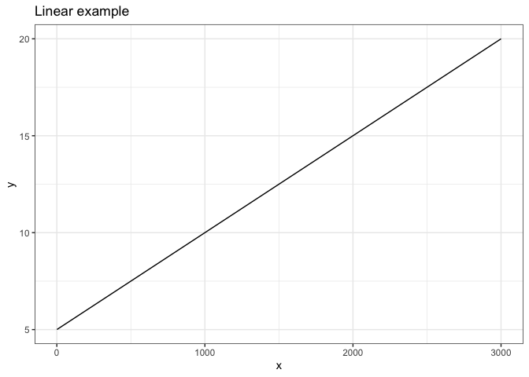<!-- -->


## Exponential  
Microbial population increases by a constant proportion per unit time.
Exponential growth is observed when microbial cell replication is not resource limited, but is rather limited by intrinsic processes like nutrient uptake rates or DNA replication rate.

Two fitted parameters; intercept (P0) and exponential growth rate constant (mu, µ)
Pt = P0 *(exp(mu*ehours))

### Exponential Example

```r
exp_rise_eqn <- function(x, mu, Intercept){Intercept *exp(x*mu)
}
  
exp_rise_eqn_test <- function(x, mu = 0.005, Intercept = 5){Intercept *exp(x*mu)
}
ggplot(data.frame(x=c(1, 3000)), aes(x=x)) + 
  stat_function(fun = exp_rise_eqn_test) +
  labs(title = "Exponential example") +
  theme_bw()
```

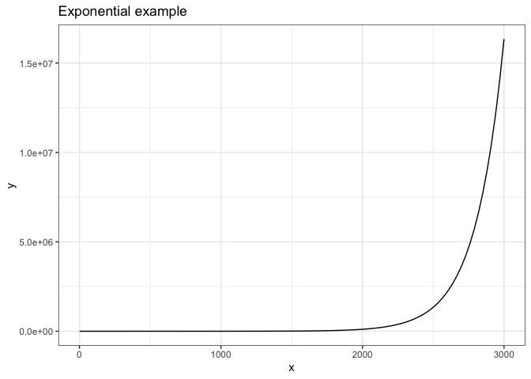<!-- -->


## Exponential rise towards a plateau
The gap between a maximum population and the current microbial population decreases by a constant proportion per unit time.
Three parameters; intercept (P0), exponential growth rate constant (mu) and plateau (Max)
Pt = Max - ((Max-Intercept)*exp(x*-mu)

### Exponential rise towards a plateau example

```r
exp_rise_plat_eqn <- function(x, mu = 0.005, Intercept){Max - ((Max-Intercept)*exp(x*-mu))
}

exp_rise_plat_eqn_test <- function(x, mu = 0.005, Intercept = 0.5, Max = 1000){Max - ((Max-Intercept)*exp(x*-mu))
}
ggplot(data.frame(x=c(1, 3000)), aes(x=x)) + 
  stat_function(fun = exp_rise_plat_eqn_test) +
  labs(title = "Exponential Rise towards Plateau example") +
  theme_bw()
```

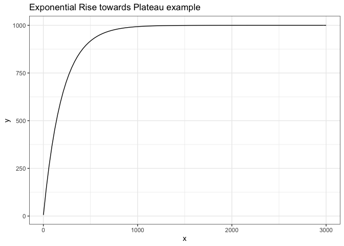<!-- -->


## Logistic
Microbial population initially increases exponentially but slows as population approaches a plateau, Pmax.

Pmax is maximum population tenable under the prevailing conditions, sometimes termed the carrying capacity.
mu dominates the early part of the rise, transitioning towards an asymptote towards Pmax.
Three parameters; intercept (P0), exponential rate constant (mu) and maximum population Pmax.
There are multiple equivalent formulations of the logistic equation.
Pt= {Pmax e^µt }/{Pmax + P0 (e^µt- 1)}

### Logistic example

```r
logistic_eqn <- function(x, mu, Intercept, Max){(Max*Intercept*exp(mu*x))/(Max + (Intercept*(exp(mu*x)-1)))
}

logistic_eqn_test <- function(x, mu = 0.005, Intercept = 5, Max = 10000){(Max*Intercept*exp(mu*x))/(Max + (Intercept*(exp(mu*x)-1)))
}

ggplot(data.frame(x = c(1, 3000)), aes(x=x)) + 
  stat_function(fun = logistic_eqn_test) +
  labs(title = "Logistic example") +
  theme_bw()
```

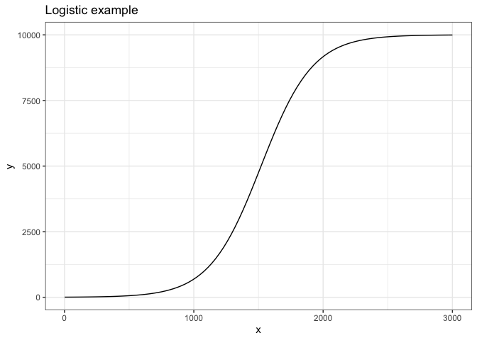<!-- -->


## Modified Gompertz Fit with Lag
Gompertz equations [@zwieteringModelingBacterialGrowth1990] have shapes similar to Logistic fits but are more readily modified to include 'lag' as a parameter for an initial time period over which cell count does not (measurably) increase.
'lag' may be a true biological lag representing cellular acclimation to new growth conditions, and/or may result from cell counts below the level of instrumental resolution, giving no detectable growth.

Pt = ModGompertzEqn <- (Amax*(exp(-exp((Amu*exp(1))/Amax*(lag-x)+1))))

ModGompertzEqn <- function(Amax,Amu,lag,x){(Amax*(exp(-exp((Amu*exp(1))/Amax*(lag-x)+1))))}

### Modified Gompertz Fit with Lag example

```r
#natural log(RFU/min(RFU)); works, but confusing
mod_gomp_lag_eqn <-  function(x, Amax,Amu,lag){(Amax*(exp(-exp((Amu*exp(1))/Amax*(Lag-x)+1))))
  }

mod_gomp_lag_eqn_test <-  function(x, Amax = 1000, Amu  = 0.5, Lag = 1000 ){(Amax*(exp(-exp((Amu*exp(1))/Amax*(Lag-x)+1))))
  }

ggplot(data.frame(x = c(1, 3000)), aes(x=x)) + 
  stat_function(fun = mod_gomp_lag_eqn_test) +
  labs(title = "Modified Gompertz with Lag example") +
  theme_bw()
```

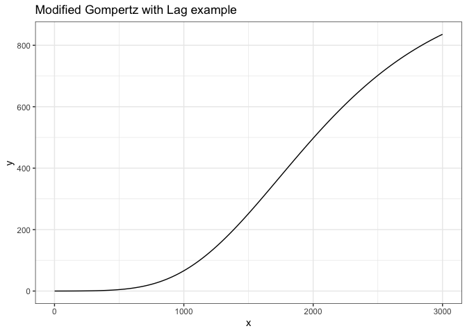<!-- -->

# XXXXXXXXX

# Materials and Methods 
We grew cultures.

Set your initials code for your MicroColonyGrowth data.

```r
MyInitials <- c("AnMa")
```


## Import data. 
The import function may open a Google log in to get an authorization code in a separate browser window. Copy/paste the authorization code into the 'Console' window below.
See next chunk for manual alternative if needed; download .csv from GoogleSheet, then upload the .csv to RStudio.cloud.


```r
gs4_deauth()
ColonyData <- read_sheet("https://docs.google.com/spreadsheets/d/1DWyASxmu5DURkcegWM0Sykp9x3F3eQfMxdz0VYJ9mOI/edit?usp=sharing")

ColonyData
```

<div data-pagedtable="false">
  <script data-pagedtable-source type="application/json">
{"columns":[{"label":["Initials_4letter"],"name":[1],"type":["chr"],"align":["left"]},{"label":["YYYYMMDDHHMM"],"name":[2],"type":["list"],"align":["right"]},{"label":["Substrate"],"name":[3],"type":["chr"],"align":["left"]},{"label":["Treatment"],"name":[4],"type":["chr"],"align":["left"]},{"label":["col1mm2"],"name":[5],"type":["dbl"],"align":["right"]},{"label":["col2mm2"],"name":[6],"type":["dbl"],"align":["right"]},{"label":["col3mm2"],"name":[7],"type":["dbl"],"align":["right"]},{"label":["Temp_C"],"name":[8],"type":["dbl"],"align":["right"]},{"label":["...9"],"name":[9],"type":["lgl"],"align":["right"]},{"label":["...10"],"name":[10],"type":["dbl"],"align":["right"]}],"data":[{"1":"JuDe","2":"<dbl [1]>","3":"WhiteRoll","4":"Control","5":"7.282","6":"NA","7":"NA","8":"21","9":"NA","10":"NA"},{"1":"JuDe","2":"<dbl [1]>","3":"WhiteRoll","4":"Control","5":"13.036","6":"NA","7":"NA","8":"21","9":"NA","10":"NA"},{"1":"JuDe","2":"<dbl [1]>","3":"WhiteRoll","4":"Control","5":"14.380","6":"NA","7":"NA","8":"21","9":"NA","10":"NA"},{"1":"JuDe","2":"<dbl [1]>","3":"WhiteRoll","4":"Control","5":"18.869","6":"NA","7":"NA","8":"21","9":"NA","10":"NA"},{"1":"JuDe","2":"<dbl [1]>","3":"WhiteRoll","4":"Control","5":"26.060","6":"NA","7":"NA","8":"21","9":"NA","10":"NA"},{"1":"JuDe","2":"<dbl [1]>","3":"WhiteRoll","4":"Control","5":"30.050","6":"NA","7":"NA","8":"21","9":"NA","10":"NA"},{"1":"JuDe","2":"<dbl [1]>","3":"WhiteRoll","4":"Control","5":"40.933","6":"NA","7":"NA","8":"21","9":"NA","10":"NA"},{"1":"JuDe","2":"<dbl [1]>","3":"WhiteRoll","4":"Control","5":"44.444","6":"NA","7":"NA","8":"21","9":"NA","10":"NA"},{"1":"JuDe","2":"<dbl [1]>","3":"WhiteRoll","4":"Control","5":"59.478","6":"1.7170","7":"7.252","8":"21","9":"NA","10":"NA"},{"1":"JuDe","2":"<dbl [1]>","3":"WhiteRoll","4":"Control","5":"64.599","6":"1.9030","7":"12.446","8":"21","9":"NA","10":"NA"},{"1":"JuDe","2":"<dbl [1]>","3":"WhiteRoll","4":"Control","5":"68.101","6":"3.2660","7":"18.105","8":"21","9":"NA","10":"NA"},{"1":"JuDe","2":"<dbl [1]>","3":"WhiteRoll","4":"Control","5":"69.279","6":"3.3720","7":"30.221","8":"21","9":"NA","10":"NA"},{"1":"JuDe","2":"<dbl [1]>","3":"WhiteRoll","4":"Wet","5":"54.458","6":"38.3520","7":"233.288","8":"21","9":"NA","10":"NA"},{"1":"JuDe","2":"<dbl [1]>","3":"WhiteRoll","4":"Wet","5":"89.176","6":"49.4460","7":"317.122","8":"21","9":"NA","10":"NA"},{"1":"JuDe","2":"<dbl [1]>","3":"WhiteRoll","4":"Wet","5":"114.326","6":"201.9290","7":"711.987","8":"21","9":"NA","10":"NA"},{"1":"JuDe","2":"<dbl [1]>","3":"WhiteRoll","4":"Wet","5":"136.588","6":"403.6860","7":"1218.047","8":"21","9":"NA","10":"NA"},{"1":"JuDe","2":"<dbl [1]>","3":"WhiteRoll","4":"Wet","5":"248.589","6":"483.5020","7":"1501.314","8":"21","9":"NA","10":"NA"},{"1":"JuDe","2":"<dbl [1]>","3":"WhiteRoll","4":"Wet","5":"327.219","6":"526.6490","7":"1803.938","8":"21","9":"NA","10":"NA"},{"1":"ClKl","2":"<dbl [1]>","3":"Naan","4":"Dark","5":"9.213","6":"6.7110","7":"5.513","8":"20","9":"NA","10":"NA"},{"1":"ClKl","2":"<dbl [1]>","3":"Naan","4":"Dark","5":"15.574","6":"7.6600","7":"5.728","8":"20","9":"NA","10":"NA"},{"1":"ClKl","2":"<dbl [1]>","3":"Naan","4":"Dark","5":"23.568","6":"9.0530","7":"5.882","8":"20","9":"NA","10":"NA"},{"1":"ClKl","2":"<dbl [1]>","3":"Naan","4":"Dark","5":"25.496","6":"10.9180","7":"6.023","8":"20","9":"NA","10":"NA"},{"1":"ClKl","2":"<dbl [1]>","3":"Naan","4":"Dark","5":"31.538","6":"13.5230","7":"7.202","8":"20","9":"NA","10":"NA"},{"1":"ClKl","2":"<dbl [1]>","3":"Naan","4":"Dark","5":"34.042","6":"13.9900","7":"8.356","8":"20","9":"NA","10":"NA"},{"1":"ClKl","2":"<dbl [1]>","3":"Naan","4":"Dark","5":"36.603","6":"17.0780","7":"8.445","8":"20","9":"NA","10":"NA"},{"1":"ClKl","2":"<dbl [1]>","3":"Naan","4":"Dark","5":"41.411","6":"18.5710","7":"8.567","8":"20","9":"NA","10":"NA"},{"1":"ClKl","2":"<dbl [1]>","3":"Naan","4":"Dark","5":"48.563","6":"24.1620","7":"8.688","8":"20","9":"NA","10":"NA"},{"1":"ClKl","2":"<dbl [1]>","3":"Naan","4":"Dark","5":"44.491","6":"25.5620","7":"9.330","8":"20","9":"NA","10":"NA"},{"1":"ClKl","2":"<dbl [1]>","3":"Naan","4":"Dark","5":"50.013","6":"37.6700","7":"12.620","8":"20","9":"NA","10":"NA"},{"1":"ClKl","2":"<dbl [1]>","3":"Naan","4":"Dark","5":"51.273","6":"39.4620","7":"13.202","8":"20","9":"NA","10":"NA"},{"1":"ClKl","2":"<dbl [1]>","3":"Naan","4":"Dark","5":"72.972","6":"50.6415","7":"14.099","8":"20","9":"NA","10":"NA"},{"1":"ClKl","2":"<dbl [1]>","3":"Naan","4":"Dark","5":"260.922","6":"260.9220","7":"25.363","8":"20","9":"NA","10":"NA"},{"1":"ClKl","2":"<dbl [1]>","3":"Naan","4":"Dark","5":"306.577","6":"306.5770","7":"56.557","8":"20","9":"NA","10":"NA"},{"1":"MaSc","2":"<dbl [1]>","3":"SobeysBakerySlice","4":"Control","5":"8.664","6":"5.1620","7":"4.765","8":"21","9":"NA","10":"NA"},{"1":"MaSc","2":"<dbl [1]>","3":"SobeysBakerySlice","4":"Control","5":"14.491","6":"6.7150","7":"7.308","8":"21","9":"NA","10":"NA"},{"1":"MaSc","2":"<dbl [1]>","3":"SobeysBakerySlice","4":"Control","5":"35.232","6":"15.3170","7":"25.753","8":"21","9":"NA","10":"NA"},{"1":"MaSc","2":"<dbl [1]>","3":"SobeysBakerySlice","4":"Control","5":"45.377","6":"25.9000","7":"40.616","8":"21","9":"NA","10":"NA"},{"1":"MaSc","2":"<dbl [1]>","3":"SobeysBakerySlice","4":"Control","5":"75.059","6":"50.2960","7":"41.183","8":"21","9":"NA","10":"NA"},{"1":"MaSc","2":"<dbl [1]>","3":"SobeysBakerySlice","4":"Control","5":"138.008","6":"79.7130","7":"51.207","8":"21","9":"NA","10":"NA"},{"1":"MaSc","2":"<dbl [1]>","3":"SobeysBakerySlice","4":"Control","5":"154.331","6":"96.7050","7":"52.270","8":"21","9":"NA","10":"NA"},{"1":"MaSc","2":"<dbl [1]>","3":"SobeysBakerySlice","4":"Control","5":"163.297","6":"114.1070","7":"55.550","8":"21","9":"NA","10":"NA"},{"1":"MaSc","2":"<dbl [1]>","3":"SobeysBakerySlice","4":"Control","5":"163.903","6":"118.8100","7":"59.588","8":"21","9":"NA","10":"NA"},{"1":"MaSc","2":"<dbl [1]>","3":"SobeysBakerySlice","4":"Hot","5":"6.359","6":"NA","7":"NA","8":"27","9":"NA","10":"NA"},{"1":"MaSc","2":"<dbl [1]>","3":"SobeysBakerySlice","4":"Hot","5":"9.109","6":"3.9380","7":"NA","8":"27","9":"NA","10":"NA"},{"1":"MaSc","2":"<dbl [1]>","3":"SobeysBakerySlice","4":"Hot","5":"11.677","6":"7.3890","7":"2.378","8":"27","9":"NA","10":"NA"},{"1":"MaSc","2":"<dbl [1]>","3":"SobeysBakerySlice","4":"Hot","5":"31.184","6":"15.6020","7":"9.143","8":"27","9":"NA","10":"NA"},{"1":"MaSc","2":"<dbl [1]>","3":"SobeysBakerySlice","4":"Hot","5":"53.745","6":"30.1380","7":"16.847","8":"27","9":"NA","10":"NA"},{"1":"MaSc","2":"<dbl [1]>","3":"SobeysBakerySlice","4":"Hot","5":"75.267","6":"45.7790","7":"26.674","8":"27","9":"NA","10":"NA"},{"1":"MaSc","2":"<dbl [1]>","3":"SobeysBakerySlice","4":"Hot","5":"105.697","6":"73.5350","7":"35.189","8":"27","9":"NA","10":"NA"},{"1":"MaSc","2":"<dbl [1]>","3":"SobeysBakerySlice","4":"Hot","5":"109.250","6":"84.4290","7":"53.114","8":"27","9":"NA","10":"NA"},{"1":"GaSu","2":"<dbl [1]>","3":"Naan","4":"Dark","5":"18.337","6":"5.6300","7":"14.144","8":"20","9":"NA","10":"NA"},{"1":"GaSu","2":"<dbl [1]>","3":"Naan","4":"Dark","5":"22.864","6":"7.8230","7":"18.588","8":"20","9":"NA","10":"NA"},{"1":"GaSu","2":"<dbl [1]>","3":"Naan","4":"Dark","5":"32.947","6":"23.0270","7":"20.621","8":"20","9":"NA","10":"NA"},{"1":"GaSu","2":"<dbl [1]>","3":"Naan","4":"Dark","5":"38.900","6":"30.9770","7":"16.807","8":"20","9":"NA","10":"NA"},{"1":"GaSu","2":"<dbl [1]>","3":"Naan","4":"Dark","5":"46.673","6":"45.5820","7":"23.189","8":"20","9":"NA","10":"NA"},{"1":"GaSu","2":"<dbl [1]>","3":"Naan","4":"Dark","5":"52.268","6":"54.0980","7":"24.154","8":"20","9":"NA","10":"NA"},{"1":"GaSu","2":"<dbl [1]>","3":"Naan","4":"Dark","5":"64.032","6":"86.2340","7":"20.081","8":"20","9":"NA","10":"NA"},{"1":"GaSu","2":"<dbl [1]>","3":"Naan","4":"Dark","5":"82.861","6":"126.5600","7":"23.102","8":"20","9":"NA","10":"NA"},{"1":"GaSu","2":"<dbl [1]>","3":"Naan","4":"Dark","5":"101.928","6":"143.1790","7":"28.422","8":"20","9":"NA","10":"NA"},{"1":"GaSu","2":"<dbl [1]>","3":"Naan","4":"Dark","5":"115.712","6":"126.2360","7":"22.609","8":"20","9":"NA","10":"NA"},{"1":"GaSu","2":"<dbl [1]>","3":"Naan","4":"Dark","5":"318.510","6":"165.5900","7":"36.273","8":"20","9":"NA","10":"NA"},{"1":"GaSu","2":"<dbl [1]>","3":"Naan","4":"Dark","5":"339.487","6":"162.3040","7":"46.130","8":"20","9":"NA","10":"NA"},{"1":"GaSu","2":"<dbl [1]>","3":"Naan","4":"Dark","5":"351.103","6":"181.3330","7":"59.292","8":"20","9":"NA","10":"NA"},{"1":"GaSu","2":"<dbl [1]>","3":"Naan","4":"Dark","5":"488.331","6":"182.1200","7":"80.470","8":"20","9":"NA","10":"NA"},{"1":"LaSw","2":"<dbl [1]>","3":"Naan","4":"Dark","5":"11.359","6":"3.2020","7":"5.432","8":"20","9":"NA","10":"NA"},{"1":"LaSw","2":"<dbl [1]>","3":"Naan","4":"Dark","5":"20.993","6":"9.1760","7":"10.986","8":"20","9":"NA","10":"NA"},{"1":"LaSw","2":"<dbl [1]>","3":"Naan","4":"Dark","5":"34.259","6":"25.4770","7":"12.019","8":"20","9":"NA","10":"NA"},{"1":"LaSw","2":"<dbl [1]>","3":"Naan","4":"Dark","5":"32.767","6":"29.4370","7":"11.607","8":"20","9":"NA","10":"NA"},{"1":"LaSw","2":"<dbl [1]>","3":"Naan","4":"Dark","5":"37.718","6":"43.2180","7":"9.117","8":"20","9":"NA","10":"NA"},{"1":"ZaBo","2":"<dbl [1]>","3":"Naan","4":"Dark","5":"10.113","6":"4.9560","7":"2.146","8":"20","9":"NA","10":"NA"},{"1":"ZaBo","2":"<dbl [1]>","3":"Naan","4":"Dark","5":"13.824","6":"6.8900","7":"7.123","8":"20","9":"NA","10":"NA"},{"1":"ZaBo","2":"<dbl [1]>","3":"Naan","4":"Dark","5":"28.433","6":"11.7500","7":"14.513","8":"20","9":"NA","10":"NA"},{"1":"ZaBo","2":"<dbl [1]>","3":"Naan","4":"Dark","5":"36.858","6":"14.5460","7":"29.812","8":"20","9":"NA","10":"NA"},{"1":"ZaBo","2":"<dbl [1]>","3":"Naan","4":"Dark","5":"41.291","6":"18.0390","7":"52.686","8":"20","9":"NA","10":"NA"},{"1":"ZaBo","2":"<dbl [1]>","3":"Naan","4":"Dark","5":"47.234","6":"19.1780","7":"67.432","8":"20","9":"NA","10":"NA"},{"1":"ZaBo","2":"<dbl [1]>","3":"Naan","4":"Dark","5":"51.982","6":"19.9670","7":"87.571","8":"20","9":"NA","10":"NA"},{"1":"ZaBo","2":"<dbl [1]>","3":"Naan","4":"Dark","5":"67.642","6":"38.9200","7":"67.233","8":"20","9":"NA","10":"NA"},{"1":"ZaBo","2":"<dbl [1]>","3":"Naan","4":"Dark","5":"76.166","6":"43.4560","7":"45.641","8":"20","9":"NA","10":"NA"},{"1":"ZaBo","2":"<dbl [1]>","3":"Naan","4":"Dark","5":"95.604","6":"48.1120","7":"32.541","8":"20","9":"NA","10":"NA"},{"1":"ZaBo","2":"<dbl [1]>","3":"Naan","4":"Dark","5":"125.914","6":"55.8260","7":"26.158","8":"20","9":"NA","10":"NA"},{"1":"ZaBo","2":"<dbl [1]>","3":"Naan","4":"Dark","5":"197.456","6":"63.6620","7":"25.984","8":"20","9":"NA","10":"NA"},{"1":"ZaBo","2":"<dbl [1]>","3":"Naan","4":"Dark","5":"163.494","6":"74.3210","7":"24.763","8":"20","9":"NA","10":"NA"},{"1":"RoAi","2":"<dbl [1]>","3":"Naan","4":"Dark","5":"7.631","6":"2.0010","7":"2.734","8":"20","9":"NA","10":"NA"},{"1":"RoAi","2":"<dbl [1]>","3":"Naan","4":"Dark","5":"16.538","6":"4.1840","7":"3.316","8":"20","9":"NA","10":"NA"},{"1":"RoAi","2":"<dbl [1]>","3":"Naan","4":"Dark","5":"23.332","6":"13.6600","7":"6.448","8":"20","9":"NA","10":"NA"},{"1":"RoAi","2":"<dbl [1]>","3":"Naan","4":"Dark","5":"27.470","6":"28.3980","7":"6.954","8":"20","9":"NA","10":"NA"},{"1":"RoAi","2":"<dbl [1]>","3":"Naan","4":"Dark","5":"37.444","6":"43.6010","7":"8.619","8":"20","9":"NA","10":"NA"},{"1":"RoAi","2":"<dbl [1]>","3":"Naan","4":"Dark","5":"40.324","6":"53.4940","7":"7.913","8":"20","9":"NA","10":"NA"},{"1":"RoAi","2":"<dbl [1]>","3":"Naan","4":"Dark","5":"52.415","6":"69.0340","7":"10.863","8":"20","9":"NA","10":"NA"},{"1":"RoAi","2":"<dbl [1]>","3":"Naan","4":"Dark","5":"70.906","6":"97.8970","7":"12.133","8":"20","9":"NA","10":"NA"},{"1":"KeWr","2":"<dbl [1]>","3":"Naan","4":"Dark","5":"6.733","6":"0.9870","7":"0.567","8":"20","9":"NA","10":"NA"},{"1":"KeWr","2":"<dbl [1]>","3":"Naan","4":"Dark","5":"13.150","6":"2.8080","7":"4.241","8":"20","9":"NA","10":"NA"},{"1":"KeWr","2":"<dbl [1]>","3":"Naan","4":"Dark","5":"23.230","6":"9.5570","7":"4.731","8":"20","9":"NA","10":"NA"},{"1":"LaSw","2":"<dbl [1]>","3":"Naan","4":"Dark","5":"38.619","6":"47.4660","7":"10.520","8":"20","9":"NA","10":"NA"},{"1":"LaSw","2":"<dbl [1]>","3":"Naan","4":"Dark","5":"47.075","6":"62.1790","7":"11.738","8":"20","9":"NA","10":"NA"},{"1":"LaSw","2":"<dbl [1]>","3":"Naan","4":"Dark","5":"71.559","6":"92.0730","7":"13.866","8":"20","9":"NA","10":"NA"},{"1":"BaMu","2":"<dbl [1]>","3":"Naan","4":"Dark","5":"8.296","6":"1.8770","7":"1.757","8":"20","9":"NA","10":"NA"},{"1":"BaMu","2":"<dbl [1]>","3":"Naan","4":"Dark","5":"15.683","6":"8.9920","7":"4.296","8":"20","9":"NA","10":"NA"},{"1":"BaMu","2":"<dbl [1]>","3":"Naan","4":"Dark","5":"31.181","6":"21.7450","7":"9.444","8":"20","9":"NA","10":"NA"},{"1":"BaMu","2":"<dbl [1]>","3":"Naan","4":"Dark","5":"38.971","6":"25.3370","7":"10.650","8":"20","9":"NA","10":"NA"},{"1":"BaMu","2":"<dbl [1]>","3":"Naan","4":"Dark","5":"39.086","6":"43.9050","7":"11.786","8":"20","9":"NA","10":"NA"},{"1":"BaMu","2":"<dbl [1]>","3":"Naan","4":"Dark","5":"39.247","6":"47.0660","7":"11.850","8":"20","9":"NA","10":"NA"},{"1":"BaMu","2":"<dbl [1]>","3":"Naan","4":"Dark","5":"51.473","6":"64.7530","7":"11.980","8":"20","9":"NA","10":"NA"},{"1":"BaMu","2":"<dbl [1]>","3":"Naan","4":"Dark","5":"64.907","6":"91.0370","7":"13.362","8":"20","9":"NA","10":"NA"},{"1":"SaMc","2":"<dbl [1]>","3":"Naan","4":"Dark","5":"10.112","6":"4.9230","7":"2.692","8":"20","9":"NA","10":"NA"},{"1":"SaMc","2":"<dbl [1]>","3":"Naan","4":"Dark","5":"13.816","6":"6.0500","7":"7.039","8":"20","9":"NA","10":"NA"},{"1":"SaMc","2":"<dbl [1]>","3":"Naan","4":"Dark","5":"27.433","6":"11.6300","7":"14.507","8":"20","9":"NA","10":"NA"},{"1":"SaMc","2":"<dbl [1]>","3":"Naan","4":"Dark","5":"35.758","6":"14.5380","7":"28.708","8":"20","9":"NA","10":"NA"},{"1":"SaMc","2":"<dbl [1]>","3":"Naan","4":"Dark","5":"40.281","6":"17.0390","7":"52.626","8":"20","9":"NA","10":"NA"},{"1":"SaMc","2":"<dbl [1]>","3":"Naan","4":"Dark","5":"47.230","6":"19.1670","7":"66.435","8":"20","9":"NA","10":"NA"},{"1":"SaMc","2":"<dbl [1]>","3":"Naan","4":"Dark","5":"52.088","6":"19.8320","7":"87.762","8":"20","9":"NA","10":"NA"},{"1":"SaMc","2":"<dbl [1]>","3":"Naan","4":"Dark","5":"78.851","6":"22.5650","7":"105.319","8":"20","9":"NA","10":"NA"},{"1":"SaMc","2":"<dbl [1]>","3":"Naan","4":"Dark","5":"93.382","6":"22.9370","7":"109.018","8":"20","9":"NA","10":"NA"},{"1":"SaMc","2":"<dbl [1]>","3":"Naan","4":"Dark","5":"99.117","6":"22.9940","7":"111.572","8":"20","9":"NA","10":"NA"},{"1":"SaMc","2":"<dbl [1]>","3":"Naan","4":"Dark","5":"227.477","6":"23.0780","7":"125.450","8":"20","9":"NA","10":"NA"},{"1":"SaMc","2":"<dbl [1]>","3":"Naan","4":"Dark","5":"241.078","6":"24.4560","7":"128.630","8":"20","9":"NA","10":"NA"},{"1":"SaMc","2":"<dbl [1]>","3":"Naan","4":"Dark","5":"285.485","6":"24.5000","7":"129.540","8":"20","9":"NA","10":"NA"},{"1":"SaMc","2":"<dbl [1]>","3":"Naan","4":"Dark","5":"302.643","6":"27.3420","7":"135.792","8":"20","9":"NA","10":"NA"},{"1":"SaMc","2":"<dbl [1]>","3":"Naan","4":"Dark","5":"606.282","6":"606.2820","7":"606.282","8":"20","9":"NA","10":"NA"},{"1":"SaMc","2":"<dbl [1]>","3":"Naan","4":"Dark","5":"762.069","6":"762.0690","7":"762.069","8":"20","9":"NA","10":"NA"},{"1":"SaMc","2":"<dbl [1]>","3":"Naan","4":"Dark","5":"984.281","6":"984.2810","7":"984.281","8":"20","9":"NA","10":"NA"},{"1":"SaMc","2":"<dbl [1]>","3":"Naan","4":"Dark","5":"1128.324","6":"1128.3240","7":"1128.324","8":"20","9":"NA","10":"NA"},{"1":"AlNu","2":"<dbl [1]>","3":"BensWholeWheat","4":"Hot","5":"15.410","6":"NA","7":"NA","8":"27","9":"NA","10":"NA"},{"1":"AlNu","2":"<dbl [1]>","3":"BensWholeWheat","4":"Hot","5":"50.040","6":"NA","7":"NA","8":"27","9":"NA","10":"NA"},{"1":"AlNu","2":"<dbl [1]>","3":"BensWholeWheat","4":"Hot","5":"194.120","6":"NA","7":"NA","8":"27","9":"NA","10":"NA"},{"1":"AlNu","2":"<dbl [1]>","3":"BensWholeWheat","4":"Hot","5":"298.610","6":"NA","7":"NA","8":"27","9":"NA","10":"NA"},{"1":"GuKa","2":"<dbl [1]>","3":"Naan","4":"Dark","5":"12.104","6":"4.3860","7":"5.152","8":"20","9":"NA","10":"NA"},{"1":"GuKa","2":"<dbl [1]>","3":"Naan","4":"Dark","5":"23.646","6":"8.5400","7":"7.152","8":"20","9":"NA","10":"NA"},{"1":"GuKa","2":"<dbl [1]>","3":"Naan","4":"Dark","5":"31.848","6":"31.1640","7":"10.918","8":"20","9":"NA","10":"NA"},{"1":"GuKa","2":"<dbl [1]>","3":"Naan","4":"Dark","5":"37.190","6":"41.5020","7":"11.038","8":"20","9":"NA","10":"NA"},{"1":"GuKa","2":"<dbl [1]>","3":"Naan","4":"Dark","5":"39.162","6":"47.5940","7":"12.280","8":"20","9":"NA","10":"NA"},{"1":"GuKa","2":"<dbl [1]>","3":"Naan","4":"Dark","5":"42.498","6":"56.6880","7":"12.256","8":"20","9":"NA","10":"NA"},{"1":"GuKa","2":"<dbl [1]>","3":"Naan","4":"Dark","5":"51.814","6":"67.0440","7":"10.320","8":"20","9":"NA","10":"NA"},{"1":"GuKa","2":"<dbl [1]>","3":"Naan","4":"Dark","5":"67.642","6":"78.9200","7":"10.738","8":"20","9":"NA","10":"NA"},{"1":"GuKa","2":"<dbl [1]>","3":"Naan","4":"Dark","5":"76.166","6":"93.1720","7":"10.960","8":"20","9":"NA","10":"NA"},{"1":"GuKa","2":"<dbl [1]>","3":"Naan","4":"Dark","5":"95.604","6":"98.3340","7":"16.456","8":"20","9":"NA","10":"NA"},{"1":"GuKa","2":"<dbl [1]>","3":"Naan","4":"Dark","5":"125.914","6":"108.8140","7":"26.158","8":"20","9":"NA","10":"NA"},{"1":"GuKa","2":"<dbl [1]>","3":"Naan","4":"Dark","5":"197.456","6":"106.6620","7":"26.984","8":"20","9":"NA","10":"NA"},{"1":"GuKa","2":"<dbl [1]>","3":"Naan","4":"Dark","5":"163.494","6":"104.0790","7":"26.763","8":"20","9":"NA","10":"NA"},{"1":"KeBe","2":"<dbl [1]>","3":"Naan","4":"Dark","5":"9.465","6":"2.0330","7":"6.287","8":"20","9":"NA","10":"NA"},{"1":"KeBe","2":"<dbl [1]>","3":"Naan","4":"Dark","5":"21.643","6":"5.3420","7":"7.300","8":"20","9":"NA","10":"NA"},{"1":"KeBe","2":"<dbl [1]>","3":"Naan","4":"Dark","5":"27.450","6":"19.1700","7":"9.237","8":"20","9":"NA","10":"NA"},{"1":"KeBe","2":"<dbl [1]>","3":"Naan","4":"Dark","5":"31.377","6":"31.1960","7":"10.231","8":"20","9":"NA","10":"NA"},{"1":"KeBe","2":"<dbl [1]>","3":"Naan","4":"Dark","5":"38.006","6":"49.0870","7":"8.963","8":"20","9":"NA","10":"NA"},{"1":"KeBe","2":"<dbl [1]>","3":"Naan","4":"Dark","5":"45.499","6":"59.1250","7":"7.648","8":"20","9":"NA","10":"NA"},{"1":"KeBe","2":"<dbl [1]>","3":"Naan","4":"Dark","5":"47.279","6":"59.3740","7":"5.269","8":"20","9":"NA","10":"NA"},{"1":"KeBe","2":"<dbl [1]>","3":"Naan","4":"Dark","5":"62.617","6":"99.9040","7":"7.002","8":"20","9":"NA","10":"NA"},{"1":"KeBe","2":"<dbl [1]>","3":"Naan","4":"Dark","5":"95.981","6":"113.4370","7":"12.001","8":"20","9":"NA","10":"NA"},{"1":"KeBe","2":"<dbl [1]>","3":"Naan","4":"Dark","5":"95.261","6":"107.3570","7":"7.955","8":"20","9":"NA","10":"NA"},{"1":"KeBe","2":"<dbl [1]>","3":"Naan","4":"Dark","5":"254.623","6":"169.4530","7":"16.357","8":"20","9":"NA","10":"NA"},{"1":"KeBe","2":"<dbl [1]>","3":"Naan","4":"Dark","5":"308.471","6":"190.5270","7":"37.399","8":"20","9":"NA","10":"NA"},{"1":"KeBe","2":"<dbl [1]>","3":"Naan","4":"Dark","5":"348.504","6":"222.3020","7":"47.196","8":"20","9":"NA","10":"NA"},{"1":"KeBe","2":"<dbl [1]>","3":"Naan","4":"Dark","5":"439.320","6":"229.1200","7":"168.112","8":"20","9":"NA","10":"NA"},{"1":"KeBe","2":"<dbl [1]>","3":"Naan","4":"Dark","5":"736.089","6":"351.8150","7":"385.345","8":"20","9":"NA","10":"NA"},{"1":"KeBe","2":"<dbl [1]>","3":"Naan","4":"Dark","5":"1045.189","6":"355.1230","7":"398.937","8":"20","9":"NA","10":"NA"},{"1":"KeBe","2":"<dbl [1]>","3":"Naan","4":"Dark","5":"1256.671","6":"369.3530","7":"557.889","8":"20","9":"NA","10":"NA"},{"1":"KeBe","2":"<dbl [1]>","3":"Naan","4":"Dark","5":"1457.932","6":"375.1780","7":"684.349","8":"20","9":"NA","10":"NA"},{"1":"AnMa","2":"<dbl [1]>","3":"CranewoodSlice","4":"Control","5":"4.363","6":"NA","7":"NA","8":"NA","9":"NA","10":"NA"},{"1":"AnMa","2":"<dbl [1]>","3":"CranewoodSlice","4":"Control","5":"13.652","6":"NA","7":"NA","8":"NA","9":"NA","10":"NA"},{"1":"AnMa","2":"<dbl [1]>","3":"CranewoodSlice","4":"Control","5":"19.183","6":"3.2450","7":"NA","8":"NA","9":"NA","10":"NA"},{"1":"AnMa","2":"<dbl [1]>","3":"CranewoodSlice","4":"Control","5":"44.880","6":"3.5890","7":"NA","8":"NA","9":"NA","10":"NA"},{"1":"AnMa","2":"<dbl [1]>","3":"CranewoodSlice","4":"Control","5":"76.180","6":"3.5880","7":"NA","8":"NA","9":"NA","10":"NA"},{"1":"AnMa","2":"<dbl [1]>","3":"CranewoodSlice","4":"Control","5":"125.548","6":"17.4590","7":"NA","8":"NA","9":"NA","10":"NA"},{"1":"AnMa","2":"<dbl [1]>","3":"CranewoodSlice","4":"Control","5":"424.854","6":"189.8080","7":"NA","8":"NA","9":"NA","10":"NA"},{"1":"AnMa","2":"<dbl [1]>","3":"CranewoodSlice","4":"Control","5":"457.934","6":"197.3020","7":"NA","8":"NA","9":"NA","10":"NA"},{"1":"AnMa","2":"<dbl [1]>","3":"CranewoodSlice","4":"Control","5":"461.326","6":"204.2890","7":"NA","8":"NA","9":"NA","10":"NA"},{"1":"AnMa","2":"<dbl [1]>","3":"CranewoodSlice","4":"Dark","5":"9.684","6":"11.3020","7":"48.039","8":"NA","9":"NA","10":"NA"},{"1":"AnMa","2":"<dbl [1]>","3":"CranewoodSlice","4":"Dark","5":"23.837","6":"11.5150","7":"49.009","8":"NA","9":"NA","10":"NA"},{"1":"AnMa","2":"<dbl [1]>","3":"CranewoodSlice","4":"Dark","5":"52.362","6":"54.1740","7":"97.054","8":"NA","9":"NA","10":"NA"},{"1":"AnMa","2":"<dbl [1]>","3":"CranewoodSlice","4":"Dark","5":"79.856","6":"88.4310","7":"106.034","8":"NA","9":"NA","10":"NA"},{"1":"LiPa","2":"<dbl [1]>","3":"Naan","4":"Dark","5":"14.646","6":"3.4280","7":"4.086","8":"20","9":"NA","10":"NA"},{"1":"LiPa","2":"<dbl [1]>","3":"Naan","4":"Dark","5":"24.374","6":"8.3490","7":"4.546","8":"20","9":"NA","10":"NA"},{"1":"LiPa","2":"<dbl [1]>","3":"Naan","4":"Dark","5":"31.536","6":"22.3410","7":"5.254","8":"20","9":"NA","10":"NA"},{"1":"KaCa","2":"<dbl [1]>","3":"Naan","4":"Dark","5":"12.222","6":"9.6890","7":"3.450","8":"20","9":"NA","10":"NA"},{"1":"EmLw","2":"<dbl [1]>","3":"Naan","4":"Dark","5":"5.035","6":"4.9800","7":"10.589","8":"20","9":"NA","10":"NA"},{"1":"KaCa","2":"<dbl [1]>","3":"Naan","4":"Dark","5":"19.546","6":"10.2160","7":"6.549","8":"20","9":"NA","10":"NA"},{"1":"KaCa","2":"<dbl [1]>","3":"Naan","4":"Dark","5":"21.874","6":"16.2770","7":"12.007","8":"20","9":"NA","10":"NA"},{"1":"EmLw","2":"<dbl [1]>","3":"Naan","4":"Dark","5":"7.673","6":"8.3520","7":"21.621","8":"20","9":"NA","10":"NA"},{"1":"EmLw","2":"<dbl [1]>","3":"Naan","4":"Dark","5":"20.209","6":"9.3210","7":"28.551","8":"20","9":"NA","10":"NA"},{"1":"KaCa","2":"<dbl [1]>","3":"Naan","4":"Dark","5":"30.528","6":"26.7750","7":"17.237","8":"20","9":"NA","10":"NA"},{"1":"EmLw","2":"<dbl [1]>","3":"Naan","4":"Dark","5":"21.788","6":"10.5960","7":"29.502","8":"20","9":"NA","10":"NA"},{"1":"EmLw","2":"<dbl [1]>","3":"Naan","4":"Dark","5":"42.033","6":"10.8460","7":"35.091","8":"20","9":"NA","10":"NA"},{"1":"EmLw","2":"<dbl [1]>","3":"Naan","4":"Dark","5":"43.395","6":"12.0570","7":"40.134","8":"20","9":"NA","10":"NA"},{"1":"KaCa","2":"<dbl [1]>","3":"Naan","4":"Dark","5":"40.649","6":"43.7190","7":"20.548","8":"20","9":"NA","10":"NA"},{"1":"EmLw","2":"<dbl [1]>","3":"Naan","4":"Dark","5":"53.339","6":"13.6040","7":"49.985","8":"20","9":"NA","10":"NA"},{"1":"EmLw","2":"<dbl [1]>","3":"Naan","4":"Dark","5":"71.855","6":"14.8300","7":"53.903","8":"20","9":"NA","10":"NA"},{"1":"EmLw","2":"<dbl [1]>","3":"Naan","4":"Dark","5":"87.342","6":"15.0670","7":"76.606","8":"20","9":"NA","10":"NA"},{"1":"EmLw","2":"<dbl [1]>","3":"Naan","4":"Dark","5":"119.837","6":"16.1410","7":"91.441","8":"20","9":"NA","10":"NA"},{"1":"KaCa","2":"<dbl [1]>","3":"Naan","4":"Dark","5":"72.920","6":"59.7020","7":"22.350","8":"20","9":"NA","10":"NA"},{"1":"IsAc","2":"<dbl [1]>","3":"Naan","4":"Dark","5":"1.150","6":"0.7300","7":"0.420","8":"20","9":"NA","10":"NA"},{"1":"IsAc","2":"<dbl [1]>","3":"Naan","4":"Dark","5":"1.950","6":"0.7900","7":"0.810","8":"20","9":"NA","10":"NA"},{"1":"IsAc","2":"<dbl [1]>","3":"Naan","4":"Dark","5":"4.190","6":"2.1400","7":"0.620","8":"20","9":"NA","10":"NA"},{"1":"IsAc","2":"<dbl [1]>","3":"Naan","4":"Dark","5":"4.630","6":"3.5000","7":"0.670","8":"20","9":"NA","10":"NA"},{"1":"IsAc","2":"<dbl [1]>","3":"Naan","4":"Dark","5":"5.060","6":"5.2000","7":"1.010","8":"20","9":"NA","10":"NA"},{"1":"IsAc","2":"<dbl [1]>","3":"Naan","4":"Dark","5":"5.410","6":"7.0300","7":"1.240","8":"20","9":"NA","10":"NA"},{"1":"IsAc","2":"<dbl [1]>","3":"Naan","4":"Dark","5":"5.320","6":"6.8800","7":"0.920","8":"20","9":"NA","10":"NA"},{"1":"IsAc","2":"<dbl [1]>","3":"Naan","4":"Dark","5":"6.050","6":"10.8500","7":"1.440","8":"20","9":"NA","10":"NA"},{"1":"IsAc","2":"<dbl [1]>","3":"Naan","4":"Dark","5":"11.560","6":"12.6900","7":"1.820","8":"20","9":"NA","10":"NA"},{"1":"IsAc","2":"<dbl [1]>","3":"Naan","4":"Dark","5":"11.520","6":"11.1700","7":"0.102","8":"20","9":"NA","10":"NA"},{"1":"LaSw","2":"<dbl [1]>","3":"Naan","4":"Dark","5":"90.081","6":"103.6750","7":"22.128","8":"20","9":"NA","10":"NA"},{"1":"LaSw","2":"<dbl [1]>","3":"Naan","4":"Dark","5":"108.333","6":"105.1590","7":"29.534","8":"20","9":"NA","10":"NA"},{"1":"MiDo","2":"<dbl [1]>","3":"Naan","4":"Dark","5":"43.678","6":"73.2860","7":"2.451","8":"20","9":"NA","10":"NA"},{"1":"MiDo","2":"<dbl [1]>","3":"Naan","4":"Dark","5":"72.304","6":"89.6410","7":"4.482","8":"20","9":"NA","10":"NA"},{"1":"MiDo","2":"<dbl [1]>","3":"Naan","4":"Dark","5":"41.864","6":"77.8200","7":"7.664","8":"20","9":"NA","10":"NA"},{"1":"MiDo","2":"<dbl [1]>","3":"Naan","4":"Dark","5":"32.325","6":"54.4060","7":"4.386","8":"20","9":"NA","10":"NA"},{"1":"MiDo","2":"<dbl [1]>","3":"Naan","4":"Dark","5":"35.929","6":"58.7880","7":"6.195","8":"20","9":"NA","10":"NA"},{"1":"MiDo","2":"<dbl [1]>","3":"Naan","4":"Dark","5":"29.594","6":"41.2820","7":"2.721","8":"20","9":"NA","10":"NA"},{"1":"MiDo","2":"<dbl [1]>","3":"Naan","4":"Dark","5":"32.536","6":"26.1160","7":"5.900","8":"20","9":"NA","10":"NA"},{"1":"MiDo","2":"<dbl [1]>","3":"Naan","4":"Dark","5":"25.747","6":"18.8800","7":"6.468","8":"20","9":"NA","10":"NA"},{"1":"EmJo","2":"<dbl [1]>","3":"Naan","4":"Dark","5":"10.025","6":"2.8150","7":"3.654","8":"20","9":"NA","10":"NA"},{"1":"EmJo","2":"<dbl [1]>","3":"Naan","4":"Dark","5":"14.682","6":"3.2550","7":"5.300","8":"20","9":"NA","10":"NA"},{"1":"EmJo","2":"<dbl [1]>","3":"Naan","4":"Dark","5":"25.192","6":"13.8600","7":"6.771","8":"20","9":"NA","10":"NA"},{"1":"EmJo","2":"<dbl [1]>","3":"Naan","4":"Dark","5":"37.446","6":"24.0030","7":"7.529","8":"20","9":"NA","10":"NA"},{"1":"EmJo","2":"<dbl [1]>","3":"Naan","4":"Dark","5":"39.919","6":"26.8440","7":"6.066","8":"20","9":"NA","10":"NA"},{"1":"EmJo","2":"<dbl [1]>","3":"Naan","4":"Dark","5":"40.405","6":"31.9440","7":"4.938","8":"20","9":"NA","10":"NA"},{"1":"EmJo","2":"<dbl [1]>","3":"Naan","4":"Dark","5":"45.490","6":"45.1760","7":"3.181","8":"20","9":"NA","10":"NA"},{"1":"EmJo","2":"<dbl [1]>","3":"Naan","4":"Dark","5":"50.626","6":"77.1600","7":"8.819","8":"20","9":"NA","10":"NA"},{"1":"EmJo","2":"<dbl [1]>","3":"Naan","4":"Dark","5":"62.868","6":"79.0630","7":"5.280","8":"20","9":"NA","10":"NA"},{"1":"EmJo","2":"<dbl [1]>","3":"Naan","4":"Dark","5":"69.929","6":"93.6540","7":"2.155","8":"20","9":"NA","10":"NA"},{"1":"EmJo","2":"<dbl [1]>","3":"Naan","4":"Dark","5":"77.117","6":"108.9670","7":"8.953","8":"20","9":"NA","10":"NA"},{"1":"EmJo","2":"<dbl [1]>","3":"Naan","4":"Dark","5":"105.012","6":"118.8250","7":"9.268","8":"20","9":"NA","10":"NA"},{"1":"EmJo","2":"<dbl [1]>","3":"Naan","4":"Dark","5":"111.809","6":"121.6500","7":"8.503","8":"20","9":"NA","10":"NA"},{"1":"SuMa","2":"<dbl [1]>","3":"Naan","4":"Dark","5":"17.219","6":"3.9450","7":"11.099","8":"20","9":"NA","10":"NA"},{"1":"SuMa","2":"<dbl [1]>","3":"Naan","4":"Dark","5":"17.986","6":"9.0930","7":"14.103","8":"20","9":"NA","10":"NA"},{"1":"SuMa","2":"<dbl [1]>","3":"Naan","4":"Dark","5":"31.650","6":"24.5380","7":"16.035","8":"20","9":"NA","10":"NA"},{"1":"SuMa","2":"<dbl [1]>","3":"Naan","4":"Dark","5":"36.126","6":"30.5370","7":"17.638","8":"20","9":"NA","10":"NA"},{"1":"SuMa","2":"<dbl [1]>","3":"Naan","4":"Dark","5":"41.900","6":"47.3040","7":"19.295","8":"20","9":"NA","10":"NA"},{"1":"SuMa","2":"<dbl [1]>","3":"Naan","4":"Dark","5":"42.692","6":"68.2910","7":"29.855","8":"20","9":"NA","10":"NA"},{"1":"SuMa","2":"<dbl [1]>","3":"Naan","4":"Dark","5":"63.524","6":"61.6980","7":"25.403","8":"20","9":"NA","10":"NA"},{"1":"SuMa","2":"<dbl [1]>","3":"Naan","4":"Dark","5":"73.626","6":"91.0880","7":"13.485","8":"20","9":"NA","10":"NA"},{"1":"SuMa","2":"<dbl [1]>","3":"Naan","4":"Dark","5":"114.356","6":"138.4270","7":"17.481","8":"20","9":"NA","10":"NA"},{"1":"SuMa","2":"<dbl [1]>","3":"Naan","4":"Dark","5":"114.648","6":"117.3290","7":"NA","8":"20","9":"NA","10":"NA"},{"1":"SuMa","2":"<dbl [1]>","3":"Naan","4":"Dark","5":"550.193","6":"NA","7":"71.653","8":"20","9":"NA","10":"NA"},{"1":"SuMa","2":"<dbl [1]>","3":"Naan","4":"Dark","5":"617.484","6":"NA","7":"90.900","8":"20","9":"NA","10":"NA"},{"1":"SuMa","2":"<dbl [1]>","3":"Naan","4":"Dark","5":"904.877","6":"NA","7":"NA","8":"20","9":"NA","10":"NA"},{"1":"SuMa","2":"<dbl [1]>","3":"Naan","4":"Dark","5":"1119.351","6":"NA","7":"NA","8":"20","9":"NA","10":"NA"},{"1":"SuMa","2":"<dbl [1]>","3":"Naan","4":"Dark","5":"2254.080","6":"NA","7":"NA","8":"20","9":"NA","10":"NA"},{"1":"SuMa","2":"<dbl [1]>","3":"Naan","4":"Dark","5":"2308.952","6":"NA","7":"NA","8":"20","9":"NA","10":"NA"},{"1":"SuMa","2":"<dbl [1]>","3":"Naan","4":"Dark","5":"3091.150","6":"NA","7":"NA","8":"20","9":"NA","10":"NA"},{"1":"SuMa","2":"<dbl [1]>","3":"Naan","4":"Dark","5":"3105.145","6":"876.8700","7":"NA","8":"20","9":"NA","10":"NA"},{"1":"AbLa","2":"<dbl [1]>","3":"Naan","4":"Dark","5":"25.556","6":"13.0180","7":"18.460","8":"20","9":"NA","10":"NA"},{"1":"AbLa","2":"<dbl [1]>","3":"Naan","4":"Dark","5":"16.840","6":"5.2510","7":"16.360","8":"20","9":"NA","10":"NA"},{"1":"AbLa","2":"<dbl [1]>","3":"Naan","4":"Dark","5":"91.139","6":"103.2560","7":"NA","8":"20","9":"NA","10":"NA"},{"1":"AbLa","2":"<dbl [1]>","3":"Naan","4":"Dark","5":"79.173","6":"91.1200","7":"21.224","8":"20","9":"NA","10":"NA"},{"1":"AbLa","2":"<dbl [1]>","3":"Naan","4":"Dark","5":"61.052","6":"87.1000","7":"19.985","8":"20","9":"NA","10":"NA"},{"1":"AbLa","2":"<dbl [1]>","3":"Naan","4":"Dark","5":"46.551","6":"52.7870","7":"18.351","8":"20","9":"NA","10":"NA"},{"1":"AbLa","2":"<dbl [1]>","3":"Naan","4":"Dark","5":"40.718","6":"52.0510","7":"20.315","8":"20","9":"NA","10":"NA"},{"1":"AbLa","2":"<dbl [1]>","3":"Naan","4":"Dark","5":"34.839","6":"38.0900","7":"21.057","8":"20","9":"NA","10":"NA"},{"1":"AbLa","2":"<dbl [1]>","3":"Naan","4":"Dark","5":"32.005","6":"29.1650","7":"15.607","8":"20","9":"NA","10":"NA"},{"1":"AbLa","2":"<dbl [1]>","3":"Naan","4":"Dark","5":"10.333","6":"4.0540","7":"6.174","8":"20","9":"NA","10":"NA"},{"1":"ChSe","2":"<dbl [1]>","3":"Naan","4":"Dark","5":"10.601","6":"3.9790","7":"2.206","8":"20","9":"NA","10":"NA"},{"1":"ChSe","2":"<dbl [1]>","3":"Naan","4":"Dark","5":"20.509","6":"3.9730","7":"8.955","8":"20","9":"NA","10":"NA"},{"1":"ChSe","2":"<dbl [1]>","3":"Naan","4":"Dark","5":"27.480","6":"16.8440","7":"5.613","8":"20","9":"NA","10":"NA"},{"1":"ChSe","2":"<dbl [1]>","3":"Naan","4":"Dark","5":"28.602","6":"20.8010","7":"7.286","8":"20","9":"NA","10":"NA"},{"1":"ChSe","2":"<dbl [1]>","3":"Naan","4":"Dark","5":"34.335","6":"44.3800","7":"9.118","8":"20","9":"NA","10":"NA"},{"1":"ChSe","2":"<dbl [1]>","3":"Naan","4":"Dark","5":"42.096","6":"53.3640","7":"11.094","8":"20","9":"NA","10":"NA"},{"1":"ChSe","2":"<dbl [1]>","3":"Naan","4":"Dark","5":"43.937","6":"58.7530","7":"12.335","8":"20","9":"NA","10":"NA"},{"1":"ChSe","2":"<dbl [1]>","3":"Naan","4":"Dark","5":"74.065","6":"97.0220","7":"14.057","8":"20","9":"NA","10":"NA"},{"1":"ChSe","2":"<dbl [1]>","3":"Naan","4":"Dark","5":"99.123","6":"114.5340","7":"17.222","8":"20","9":"NA","10":"NA"},{"1":"ChSe","2":"<dbl [1]>","3":"Naan","4":"Dark","5":"99.162","6":"116.6540","7":"NA","8":"20","9":"NA","10":"NA"},{"1":"ChSe","2":"<dbl [1]>","3":"Naan","4":"Dark","5":"126.673","6":"119.9100","7":"24.470","8":"20","9":"NA","10":"NA"},{"1":"ChSe","2":"<dbl [1]>","3":"Naan","4":"Dark","5":"203.241","6":"143.1740","7":"36.477","8":"20","9":"NA","10":"NA"},{"1":"ChSe","2":"<dbl [1]>","3":"Naan","4":"Dark","5":"248.008","6":"222.2990","7":"47.620","8":"20","9":"NA","10":"NA"},{"1":"ChSe","2":"<dbl [1]>","3":"Naan","4":"Dark","5":"374.893","6":"208.3550","7":"87.773","8":"20","9":"NA","10":"NA"},{"1":"ChSe","2":"<dbl [1]>","3":"Naan","4":"Dark","5":"462.312","6":"235.5470","7":"164.790","8":"20","9":"NA","10":"NA"},{"1":"ChSe","2":"<dbl [1]>","3":"Naan","4":"Dark","5":"861.642","6":"255.6560","7":"255.962","8":"20","9":"NA","10":"NA"},{"1":"ChSe","2":"<dbl [1]>","3":"Naan","4":"Dark","5":"1205.646","6":"301.5040","7":"261.037","8":"20","9":"NA","10":"NA"},{"1":"ChSe","2":"<dbl [1]>","3":"Naan","4":"Dark","5":"1327.123","6":"305.0930","7":"357.286","8":"20","9":"NA","10":"NA"},{"1":"RlMi","2":"<dbl [1]>","3":"Naan","4":"Dark","5":"10.295","6":"16.0700","7":"30.111","8":"20","9":"NA","10":"NA"},{"1":"RlMi","2":"<dbl [1]>","3":"Naan","4":"Dark","5":"11.705","6":"17.4460","7":"44.985","8":"20","9":"NA","10":"NA"},{"1":"RlMi","2":"<dbl [1]>","3":"Naan","4":"Dark","5":"13.890","6":"52.6940","7":"51.728","8":"20","9":"NA","10":"NA"},{"1":"RlMi","2":"<dbl [1]>","3":"Naan","4":"Dark","5":"20.903","6":"60.5780","7":"55.337","8":"20","9":"NA","10":"NA"},{"1":"RlMi","2":"<dbl [1]>","3":"Naan","4":"Dark","5":"25.662","6":"75.4190","7":"55.568","8":"20","9":"NA","10":"NA"},{"1":"RlMi","2":"<dbl [1]>","3":"Naan","4":"Dark","5":"26.772","6":"92.2240","7":"58.773","8":"20","9":"NA","10":"NA"},{"1":"RlMi","2":"<dbl [1]>","3":"Naan","4":"Dark","5":"28.525","6":"117.5320","7":"59.599","8":"20","9":"NA","10":"NA"},{"1":"RlMi","2":"<dbl [1]>","3":"Naan","4":"Dark","5":"30.935","6":"124.2850","7":"68.693","8":"20","9":"NA","10":"NA"},{"1":"RlMi","2":"<dbl [1]>","3":"Naan","4":"Dark","5":"32.005","6":"138.2450","7":"140.916","8":"20","9":"NA","10":"NA"},{"1":"RlMi","2":"<dbl [1]>","3":"Naan","4":"Dark","5":"34.523","6":"104.2970","7":"130.348","8":"20","9":"NA","10":"NA"},{"1":"RlMi","2":"<dbl [1]>","3":"Naan","4":"Dark","5":"35.558","6":"154.6920","7":"236.111","8":"20","9":"NA","10":"NA"},{"1":"RlMi","2":"<dbl [1]>","3":"Naan","4":"Dark","5":"50.163","6":"176.5500","7":"238.681","8":"20","9":"NA","10":"NA"},{"1":"RlMi","2":"<dbl [1]>","3":"Naan","4":"Dark","5":"55.132","6":"203.0640","7":"273.337","8":"20","9":"NA","10":"NA"},{"1":"RlMi","2":"<dbl [1]>","3":"Naan","4":"Dark","5":"65.589","6":"216.0830","7":"277.283","8":"20","9":"NA","10":"NA"},{"1":"RlMi","2":"<dbl [1]>","3":"Naan","4":"Dark","5":"72.106","6":"228.9100","7":"302.248","8":"20","9":"NA","10":"NA"},{"1":"RlMi","2":"<dbl [1]>","3":"Naan","4":"Dark","5":"89.468","6":"241.3200","7":"314.082","8":"20","9":"NA","10":"NA"},{"1":"RlMi","2":"<dbl [1]>","3":"Naan","4":"Dark","5":"107.491","6":"267.6500","7":"323.047","8":"20","9":"NA","10":"NA"},{"1":"RlMi","2":"<dbl [1]>","3":"Naan","4":"Dark","5":"109.270","6":"270.7580","7":"348.837","8":"20","9":"NA","10":"NA"},{"1":"LaSw","2":"<dbl [1]>","3":"Naan","4":"Dark","5":"169.935","6":"120.9980","7":"28.302","8":"20","9":"NA","10":"NA"},{"1":"LaSw","2":"<dbl [1]>","3":"Naan","4":"Dark","5":"194.151","6":"124.6420","7":"32.993","8":"20","9":"NA","10":"NA"},{"1":"LaSw","2":"<dbl [1]>","3":"Naan","4":"Dark","5":"291.099","6":"158.3940","7":"37.257","8":"20","9":"NA","10":"NA"},{"1":"BaMu","2":"<dbl [1]>","3":"Naan","4":"Dark","5":"107.614","6":"128.9060","7":"31.384","8":"20","9":"NA","10":"NA"},{"1":"BaMu","2":"<dbl [1]>","3":"Naan","4":"Dark","5":"111.836","6":"132.4720","7":"32.881","8":"20","9":"NA","10":"NA"},{"1":"SaCr","2":"<dbl [1]>","3":"Naan","4":"Dark","5":"8.658","6":"2.9910","7":"5.372","8":"20","9":"NA","10":"NA"},{"1":"SaCr","2":"<dbl [1]>","3":"Naan","4":"Dark","5":"18.110","6":"3.3460","7":"5.218","8":"20","9":"NA","10":"NA"},{"1":"SaCr","2":"<dbl [1]>","3":"Naan","4":"Dark","5":"29.311","6":"16.9950","7":"2.765","8":"20","9":"NA","10":"NA"},{"1":"SaCr","2":"<dbl [1]>","3":"Naan","4":"Dark","5":"34.706","6":"23.8250","7":"6.108","8":"20","9":"NA","10":"NA"},{"1":"SaCr","2":"<dbl [1]>","3":"Naan","4":"Dark","5":"43.159","6":"37.6660","7":"7.233","8":"20","9":"NA","10":"NA"},{"1":"SaCr","2":"<dbl [1]>","3":"Naan","4":"Dark","5":"45.488","6":"46.3670","7":"5.157","8":"20","9":"NA","10":"NA"},{"1":"SaCr","2":"<dbl [1]>","3":"Naan","4":"Dark","5":"49.045","6":"58.8670","7":"6.534","8":"20","9":"NA","10":"NA"},{"1":"SaCr","2":"<dbl [1]>","3":"Naan","4":"Dark","5":"60.257","6":"92.6620","7":"8.508","8":"20","9":"NA","10":"NA"},{"1":"SaCr","2":"<dbl [1]>","3":"Naan","4":"Dark","5":"93.614","6":"110.9070","7":"12.161","8":"20","9":"NA","10":"NA"},{"1":"SaCr","2":"<dbl [1]>","3":"Naan","4":"Dark","5":"106.581","6":"120.8000","7":"5.391","8":"20","9":"NA","10":"NA"},{"1":"SaCr","2":"<dbl [1]>","3":"Naan","4":"Dark","5":"237.886","6":"164.4560","7":"21.998","8":"20","9":"NA","10":"NA"},{"1":"SaCr","2":"<dbl [1]>","3":"Naan","4":"Dark","5":"295.234","6":"180.1590","7":"31.352","8":"20","9":"NA","10":"NA"},{"1":"SaCr","2":"<dbl [1]>","3":"Naan","4":"Dark","5":"355.986","6":"230.8740","7":"43.889","8":"20","9":"NA","10":"NA"},{"1":"LaSw","2":"<dbl [1]>","3":"Naan","4":"Dark","5":"361.610","6":"277.4650","7":"70.349","8":"20","9":"NA","10":"NA"},{"1":"AlPo","2":"<dbl [1]>","3":"Naan","4":"Dark","5":"11.351","6":"6.7970","7":"NA","8":"20","9":"NA","10":"NA"},{"1":"AlPo","2":"<dbl [1]>","3":"Naan","4":"Dark","5":"21.775","6":"9.5340","7":"NA","8":"20","9":"NA","10":"NA"},{"1":"AlPo","2":"<dbl [1]>","3":"Naan","4":"Dark","5":"32.274","6":"10.0300","7":"11.078","8":"20","9":"NA","10":"NA"},{"1":"AlPo","2":"<dbl [1]>","3":"Naan","4":"Dark","5":"36.058","6":"13.3430","7":"14.411","8":"20","9":"NA","10":"NA"},{"1":"AlPo","2":"<dbl [1]>","3":"Naan","4":"Dark","5":"39.047","6":"14.3750","7":"28.127","8":"20","9":"NA","10":"NA"},{"1":"AlPo","2":"<dbl [1]>","3":"Naan","4":"Dark","5":"40.676","6":"15.0320","7":"31.032","8":"20","9":"NA","10":"NA"},{"1":"AlPo","2":"<dbl [1]>","3":"Naan","4":"Dark","5":"41.338","6":"17.0360","7":"34.169","8":"20","9":"NA","10":"NA"},{"1":"AlPo","2":"<dbl [1]>","3":"Naan","4":"Dark","5":"61.410","6":"25.0110","7":"60.509","8":"20","9":"NA","10":"NA"},{"1":"AlPo","2":"<dbl [1]>","3":"Naan","4":"Dark","5":"64.222","6":"28.5700","7":"62.701","8":"20","9":"NA","10":"NA"},{"1":"AlPo","2":"<dbl [1]>","3":"Naan","4":"Dark","5":"67.893","6":"31.1870","7":"63.200","8":"20","9":"NA","10":"NA"},{"1":"AlPo","2":"<dbl [1]>","3":"Naan","4":"Dark","5":"75.160","6":"40.5530","7":"65.362","8":"20","9":"NA","10":"NA"},{"1":"AlPo","2":"<dbl [1]>","3":"Naan","4":"Dark","5":"80.215","6":"45.3620","7":"67.211","8":"20","9":"NA","10":"NA"},{"1":"AlNu","2":"<dbl [1]>","3":"BensWholeWheat","4":"Hot","5":"316.210","6":"4.2400","7":"2.170","8":"27","9":"NA","10":"NA"},{"1":"AlNu","2":"<dbl [1]>","3":"BensWholeWheat","4":"Hot","5":"322.010","6":"14.1100","7":"6.430","8":"27","9":"NA","10":"NA"},{"1":"KeWr","2":"<dbl [1]>","3":"Naan","4":"Dark","5":"26.204","6":"22.7510","7":"5.683","8":"20","9":"NA","10":"NA"},{"1":"EmLw","2":"<dbl [1]>","3":"Naan","4":"Dark","5":"157.943","6":"29.5970","7":"232.920","8":"20","9":"NA","10":"NA"},{"1":"EmLw","2":"<dbl [1]>","3":"Naan","4":"Dark","5":"178.007","6":"33.3700","7":"263.370","8":"20","9":"NA","10":"NA"},{"1":"EmLw","2":"<dbl [1]>","3":"Naan","4":"Dark","5":"225.082","6":"44.3620","7":"325.835","8":"20","9":"NA","10":"NA"},{"1":"EmLw","2":"<dbl [1]>","3":"Naan","4":"Dark","5":"250.057","6":"46.1160","7":"369.367","8":"20","9":"NA","10":"NA"},{"1":"KeWr","2":"<dbl [1]>","3":"Naan","4":"Dark","5":"33.974","6":"36.0370","7":"5.566","8":"20","9":"NA","10":"NA"},{"1":"KeWr","2":"<dbl [1]>","3":"Naan","4":"Dark","5":"33.662","6":"41.7280","7":"5.593","8":"20","9":"NA","10":"NA"},{"1":"KeWr","2":"<dbl [1]>","3":"Naan","4":"Dark","5":"52.235","6":"57.0960","7":"5.665","8":"20","9":"NA","10":"NA"},{"1":"KeWr","2":"<dbl [1]>","3":"Naan","4":"Dark","5":"55.553","6":"76.9930","7":"5.719","8":"20","9":"NA","10":"NA"},{"1":"IsAc","2":"<dbl [1]>","3":"Naan","4":"Dark","5":"29.630","6":"13.1100","7":"3.170","8":"20","9":"NA","10":"NA"},{"1":"IsAc","2":"<dbl [1]>","3":"Naan","4":"Dark","5":"42.560","6":"14.4700","7":"5.420","8":"20","9":"NA","10":"NA"},{"1":"IsAc","2":"<dbl [1]>","3":"Naan","4":"Dark","5":"45.930","6":"17.2500","7":"7.550","8":"20","9":"NA","10":"NA"},{"1":"IsAc","2":"<dbl [1]>","3":"Naan","4":"Dark","5":"51.520","6":"17.3500","7":"12.910","8":"20","9":"NA","10":"NA"},{"1":"KeMe","2":"<chr [1]>","3":"Naan","4":"Dark","5":"12.957","6":"1.8300","7":"3.135","8":"20","9":"NA","10":"NA"},{"1":"KeMe","2":"<chr [1]>","3":"Naan","4":"Dark","5":"17.418","6":"4.9750","7":"11.236","8":"20","9":"NA","10":"NA"},{"1":"KeMe","2":"<chr [1]>","3":"Naan","4":"Dark","5":"21.189","6":"20.8060","7":"11.775","8":"20","9":"NA","10":"NA"},{"1":"KeMe","2":"<chr [1]>","3":"Naan","4":"Dark","5":"28.385","6":"34.7980","7":"11.223","8":"20","9":"NA","10":"NA"},{"1":"KeMe","2":"<chr [1]>","3":"Naan","4":"Dark","5":"43.592","6":"60.1690","7":"12.252","8":"20","9":"NA","10":"NA"},{"1":"KeMe","2":"<chr [1]>","3":"Naan","4":"Dark","5":"49.525","6":"83.4650","7":"26.700","8":"20","9":"NA","10":"NA"},{"1":"KeMe","2":"<chr [1]>","3":"Naan","4":"Dark","5":"63.456","6":"91.0090","7":"21.714","8":"20","9":"NA","10":"NA"},{"1":"KeMe","2":"<chr [1]>","3":"Naan","4":"Dark","5":"100.077","6":"94.3340","7":"17.234","8":"20","9":"NA","10":"NA"},{"1":"KeMe","2":"<chr [1]>","3":"Naan","4":"Dark","5":"121.656","6":"106.5210","7":"16.466","8":"20","9":"NA","10":"NA"},{"1":"KeMe","2":"<chr [1]>","3":"Naan","4":"Dark","5":"258.731","6":"133.3120","7":"88.851","8":"20","9":"NA","10":"NA"},{"1":"KeMe","2":"<chr [1]>","3":"Naan","4":"Dark","5":"304.366","6":"193.9490","7":"90.260","8":"20","9":"NA","10":"NA"},{"1":"KeMe","2":"<chr [1]>","3":"Naan","4":"Dark","5":"380.208","6":"272.9210","7":"245.831","8":"20","9":"NA","10":"NA"},{"1":"KeMe","2":"<chr [1]>","3":"Naan","4":"Dark","5":"415.180","6":"312.6490","7":"295.862","8":"20","9":"NA","10":"NA"},{"1":"ElSh","2":"<dbl [1]>","3":"MontrealBagel","4":"Control","5":"4.940","6":"14.2230","7":"6.768","8":"20","9":"NA","10":"NA"},{"1":"ElSh","2":"<dbl [1]>","3":"MontrealBagel","4":"Control","5":"12.288","6":"20.1940","7":"13.680","8":"20","9":"NA","10":"NA"},{"1":"ElSh","2":"<dbl [1]>","3":"MontrealBagel","4":"Control","5":"25.170","6":"27.7170","7":"20.406","8":"20","9":"NA","10":"NA"},{"1":"AlNu","2":"<dbl [1]>","3":"BensWholeWheat","4":"Hot","5":"325.240","6":"90.2300","7":"15.630","8":"27","9":"NA","10":"NA"},{"1":"LiPa","2":"<dbl [1]>","3":"Naan","4":"Dark","5":"31.459","6":"26.5130","7":"5.455","8":"20","9":"NA","10":"NA"},{"1":"LiPa","2":"<dbl [1]>","3":"Naan","4":"Dark","5":"33.214","6":"34.1660","7":"6.540","8":"20","9":"NA","10":"NA"},{"1":"LiPa","2":"<dbl [1]>","3":"Naan","4":"Dark","5":"35.267","6":"38.7900","7":"7.240","8":"20","9":"NA","10":"NA"},{"1":"LiPa","2":"<dbl [1]>","3":"Naan","4":"Dark","5":"39.760","6":"49.2700","7":"6.975","8":"20","9":"NA","10":"NA"},{"1":"LiPa","2":"<dbl [1]>","3":"Naan","4":"Dark","5":"50.922","6":"73.8540","7":"9.108","8":"20","9":"NA","10":"NA"},{"1":"LiPa","2":"<dbl [1]>","3":"Naan","4":"Dark","5":"72.988","6":"81.7650","7":"9.681","8":"20","9":"NA","10":"NA"},{"1":"LiPa","2":"<dbl [1]>","3":"Naan","4":"Dark","5":"85.610","6":"84.9880","7":"NA","8":"20","9":"NA","10":"NA"},{"1":"LiPa","2":"<dbl [1]>","3":"Naan","4":"Dark","5":"194.682","6":"194.6820","7":"21.576","8":"20","9":"NA","10":"NA"},{"1":"LiPa","2":"<dbl [1]>","3":"Naan","4":"Dark","5":"206.230","6":"206.2300","7":"25.120","8":"20","9":"NA","10":"NA"},{"1":"LiPa","2":"<dbl [1]>","3":"Naan","4":"Dark","5":"211.050","6":"211.0500","7":"41.825","8":"20","9":"NA","10":"NA"},{"1":"LiPa","2":"<dbl [1]>","3":"Naan","4":"Dark","5":"272.692","6":"272.6920","7":"44.951","8":"20","9":"NA","10":"NA"},{"1":"EmLg","2":"<dbl [1]>","3":"Naan","4":"Dark","5":"9.641","6":"3.0800","7":"4.343","8":"20","9":"NA","10":"NA"},{"1":"EmLg","2":"<dbl [1]>","3":"Naan","4":"Dark","5":"21.037","6":"6.1400","7":"4.617","8":"20","9":"NA","10":"NA"},{"1":"EmLg","2":"<dbl [1]>","3":"Naan","4":"Dark","5":"24.959","6":"18.8410","7":"5.420","8":"20","9":"NA","10":"NA"},{"1":"EmLg","2":"<dbl [1]>","3":"Naan","4":"Dark","5":"33.147","6":"24.8590","7":"7.406","8":"20","9":"NA","10":"NA"},{"1":"EmLg","2":"<dbl [1]>","3":"Naan","4":"Dark","5":"39.798","6":"42.3010","7":"9.480","8":"20","9":"NA","10":"NA"},{"1":"EmLg","2":"<dbl [1]>","3":"Naan","4":"Dark","5":"40.929","6":"55.6760","7":"10.377","8":"20","9":"NA","10":"NA"},{"1":"EmLg","2":"<dbl [1]>","3":"Naan","4":"Dark","5":"54.035","6":"70.8740","7":"12.653","8":"20","9":"NA","10":"NA"},{"1":"EmLg","2":"<dbl [1]>","3":"Naan","4":"Dark","5":"72.869","6":"91.8420","7":"14.357","8":"20","9":"NA","10":"NA"},{"1":"EmLg","2":"<dbl [1]>","3":"Naan","4":"Dark","5":"92.022","6":"109.8340","7":"14.941","8":"20","9":"NA","10":"NA"},{"1":"EmLg","2":"<dbl [1]>","3":"Naan","4":"Dark","5":"99.377","6":"100.3200","7":"NA","8":"20","9":"NA","10":"NA"},{"1":"EmLg","2":"<dbl [1]>","3":"Naan","4":"Dark","5":"236.288","6":"125.7360","7":"28.962","8":"20","9":"NA","10":"NA"},{"1":"EmLg","2":"<dbl [1]>","3":"Naan","4":"Dark","5":"259.263","6":"177.5540","7":"44.853","8":"20","9":"NA","10":"NA"},{"1":"EmLg","2":"<dbl [1]>","3":"Naan","4":"Dark","5":"262.178","6":"209.6360","7":"56.702","8":"20","9":"NA","10":"NA"},{"1":"EmLg","2":"<dbl [1]>","3":"Naan","4":"Dark","5":"323.349","6":"228.2080","7":"144.240","8":"20","9":"NA","10":"NA"},{"1":"KaCa","2":"<dbl [1]>","3":"Naan","4":"Dark","5":"79.449","6":"98.5410","7":"20.109","8":"20","9":"NA","10":"NA"},{"1":"KaCa","2":"<dbl [1]>","3":"Naan","4":"Dark","5":"132.264","6":"115.7890","7":"21.600","8":"20","9":"NA","10":"NA"},{"1":"KaCa","2":"<dbl [1]>","3":"Naan","4":"Dark","5":"137.027","6":"123.0530","7":"22.460","8":"20","9":"NA","10":"NA"},{"1":"ToDi","2":"<dbl [1]>","3":"Naan","4":"Dark","5":"12.040","6":"2.9410","7":"3.606","8":"20","9":"NA","10":"NA"},{"1":"ToDi","2":"<dbl [1]>","3":"Naan","4":"Dark","5":"22.254","6":"4.1120","7":"5.171","8":"20","9":"NA","10":"NA"},{"1":"ToDi","2":"<dbl [1]>","3":"Naan","4":"Dark","5":"32.534","6":"11.2580","7":"5.430","8":"20","9":"NA","10":"NA"},{"1":"ToDi","2":"<dbl [1]>","3":"Naan","4":"Dark","5":"42.301","6":"11.9470","7":"9.470","8":"20","9":"NA","10":"NA"},{"1":"ToDi","2":"<dbl [1]>","3":"Naan","4":"Dark","5":"45.923","6":"31.7400","7":"11.253","8":"20","9":"NA","10":"NA"},{"1":"ToDi","2":"<dbl [1]>","3":"Naan","4":"Dark","5":"53.619","6":"36.8280","7":"10.347","8":"20","9":"NA","10":"NA"},{"1":"ToDi","2":"<dbl [1]>","3":"Naan","4":"Dark","5":"56.450","6":"43.8720","7":"12.041","8":"20","9":"NA","10":"NA"},{"1":"ToDi","2":"<dbl [1]>","3":"Naan","4":"Dark","5":"62.503","6":"75.8410","7":"13.429","8":"20","9":"NA","10":"NA"},{"1":"ToDi","2":"<dbl [1]>","3":"Naan","4":"Dark","5":"65.431","6":"81.5970","7":"14.474","8":"20","9":"NA","10":"NA"},{"1":"ToDi","2":"<dbl [1]>","3":"Naan","4":"Dark","5":"87.551","6":"93.2520","7":"NA","8":"20","9":"NA","10":"NA"},{"1":"ToDi","2":"<dbl [1]>","3":"Naan","4":"Dark","5":"156.175","6":"101.8150","7":"21.900","8":"20","9":"NA","10":"NA"},{"1":"ToDi","2":"<dbl [1]>","3":"Naan","4":"Dark","5":"179.900","6":"135.3690","7":"30.185","8":"20","9":"NA","10":"NA"},{"1":"ToDi","2":"<dbl [1]>","3":"Naan","4":"Dark","5":"216.022","6":"149.3200","7":"39.075","8":"20","9":"NA","10":"NA"},{"1":"ToDi","2":"<dbl [1]>","3":"Naan","4":"Dark","5":"263.387","6":"163.1450","7":"46.630","8":"20","9":"NA","10":"NA"},{"1":"ToDi","2":"<dbl [1]>","3":"Naan","4":"Dark","5":"307.533","6":"210.0150","7":"56.448","8":"20","9":"NA","10":"NA"},{"1":"ToDi","2":"<dbl [1]>","3":"Naan","4":"Dark","5":"323.922","6":"236.1920","7":"64.047","8":"20","9":"NA","10":"NA"},{"1":"ToDi","2":"<dbl [1]>","3":"Naan","4":"Dark","5":"461.812","6":"246.9030","7":"69.688","8":"20","9":"NA","10":"NA"},{"1":"ToDi","2":"<dbl [1]>","3":"Naan","4":"Dark","5":"471.714","6":"277.1740","7":"71.648","8":"20","9":"NA","10":"NA"},{"1":"KaCa","2":"<dbl [1]>","3":"Naan","4":"Dark","5":"250.232","6":"237.6370","7":"37.379","8":"20","9":"NA","10":"NA"},{"1":"KeWr","2":"<dbl [1]>","3":"Naan","4":"Dark","5":"89.548","6":"88.7720","7":"16.172","8":"20","9":"NA","10":"NA"},{"1":"KeWr","2":"<dbl [1]>","3":"Naan","4":"Dark","5":"99.868","6":"85.7690","7":"18.735","8":"20","9":"NA","10":"NA"},{"1":"KeWr","2":"<dbl [1]>","3":"Naan","4":"Dark","5":"230.371","6":"147.0150","7":"23.408","8":"20","9":"NA","10":"NA"},{"1":"KeWr","2":"<dbl [1]>","3":"Naan","4":"Dark","5":"293.320","6":"293.3210","7":"43.210","8":"20","9":"NA","10":"NA"},{"1":"TaBr","2":"<dbl [1]>","3":"Naan","4":"Dark","5":"7.724","6":"2.6570","7":"1.562","8":"20","9":"NA","10":"NA"},{"1":"TaBr","2":"<dbl [1]>","3":"Naan","4":"Dark","5":"17.807","6":"4.3330","7":"2.786","8":"20","9":"NA","10":"NA"},{"1":"TaBr","2":"<dbl [1]>","3":"Naan","4":"Dark","5":"24.113","6":"8.8590","7":"6.345","8":"20","9":"NA","10":"NA"},{"1":"TaBr","2":"<dbl [1]>","3":"Naan","4":"Dark","5":"25.419","6":"10.0860","7":"7.585","8":"20","9":"NA","10":"NA"},{"1":"TaBr","2":"<dbl [1]>","3":"Naan","4":"Dark","5":"28.984","6":"11.4570","7":"20.047","8":"20","9":"NA","10":"NA"},{"1":"TaBr","2":"<dbl [1]>","3":"Naan","4":"Dark","5":"32.254","6":"12.4580","7":"23.375","8":"20","9":"NA","10":"NA"},{"1":"TaBr","2":"<dbl [1]>","3":"Naan","4":"Dark","5":"37.609","6":"14.7510","7":"29.781","8":"20","9":"NA","10":"NA"},{"1":"TaBr","2":"<dbl [1]>","3":"Naan","4":"Dark","5":"46.078","6":"16.7850","7":"36.926","8":"20","9":"NA","10":"NA"},{"1":"TaBr","2":"<dbl [1]>","3":"Naan","4":"Dark","5":"51.628","6":"18.2010","7":"43.847","8":"20","9":"NA","10":"NA"},{"1":"TaBr","2":"<dbl [1]>","3":"Naan","4":"Dark","5":"58.435","6":"22.7330","7":"49.490","8":"20","9":"NA","10":"NA"},{"1":"TaBr","2":"<dbl [1]>","3":"Naan","4":"Dark","5":"84.218","6":"32.1530","7":"54.789","8":"20","9":"NA","10":"NA"},{"1":"TaBr","2":"<dbl [1]>","3":"Naan","4":"Dark","5":"92.055","6":"40.4570","7":"69.638","8":"20","9":"NA","10":"NA"},{"1":"TaBr","2":"<dbl [1]>","3":"Naan","4":"Dark","5":"107.215","6":"44.0280","7":"87.738","8":"20","9":"NA","10":"NA"},{"1":"TaBr","2":"<dbl [1]>","3":"Naan","4":"Dark","5":"142.602","6":"54.8020","7":"94.077","8":"20","9":"NA","10":"NA"},{"1":"HaGo","2":"<dbl [1]>","3":"Naan","4":"Dark","5":"8.133","6":"1.2550","7":"2.668","8":"20","9":"NA","10":"NA"},{"1":"HaGo","2":"<dbl [1]>","3":"Naan","4":"Dark","5":"22.825","6":"5.9790","7":"3.117","8":"20","9":"NA","10":"NA"},{"1":"HaGo","2":"<dbl [1]>","3":"Naan","4":"Dark","5":"22.054","6":"14.9910","7":"10.990","8":"20","9":"NA","10":"NA"},{"1":"HaGo","2":"<dbl [1]>","3":"Naan","4":"Dark","5":"32.562","6":"21.0900","7":"9.413","8":"20","9":"NA","10":"NA"},{"1":"HaGo","2":"<dbl [1]>","3":"Naan","4":"Dark","5":"33.726","6":"59.3780","7":"10.793","8":"20","9":"NA","10":"NA"},{"1":"HaGo","2":"<dbl [1]>","3":"Naan","4":"Dark","5":"42.522","6":"83.8410","7":"9.085","8":"20","9":"NA","10":"NA"},{"1":"HaGo","2":"<dbl [1]>","3":"Naan","4":"Dark","5":"46.590","6":"98.4680","7":"13.987","8":"20","9":"NA","10":"NA"},{"1":"HaGo","2":"<dbl [1]>","3":"Naan","4":"Dark","5":"45.245","6":"141.7220","7":"15.198","8":"20","9":"NA","10":"NA"},{"1":"HaGo","2":"<dbl [1]>","3":"Naan","4":"Dark","5":"125.920","6":"142.9900","7":"19.136","8":"20","9":"NA","10":"NA"},{"1":"HaGo","2":"<dbl [1]>","3":"Naan","4":"Dark","5":"88.965","6":"144.7340","7":"29.987","8":"20","9":"NA","10":"NA"},{"1":"HaGo","2":"<chr [1]>","3":"Naan","4":"Dark","5":"275.704","6":"175.4910","7":"36.692","8":"20","9":"NA","10":"NA"},{"1":"HaGo","2":"<dbl [1]>","3":"Naan","4":"Dark","5":"267.670","6":"348.2760","7":"40.433","8":"20","9":"NA","10":"NA"},{"1":"HaGo","2":"<dbl [1]>","3":"Naan","4":"Dark","5":"310.557","6":"358.8750","7":"46.833","8":"20","9":"NA","10":"NA"},{"1":"NiEl","2":"<dbl [1]>","3":"Naan","4":"Dark","5":"10.568","6":"3.9000","7":"6.724","8":"20","9":"NA","10":"NA"},{"1":"NiEl","2":"<dbl [1]>","3":"Naan","4":"Dark","5":"20.154","6":"8.0070","7":"8.238","8":"20","9":"NA","10":"NA"},{"1":"NiEl","2":"<dbl [1]>","3":"Naan","4":"Dark","5":"24.996","6":"17.1120","7":"12.462","8":"20","9":"NA","10":"NA"},{"1":"NiEl","2":"<dbl [1]>","3":"Naan","4":"Dark","5":"30.228","6":"25.2370","7":"13.358","8":"20","9":"NA","10":"NA"},{"1":"NiEl","2":"<dbl [1]>","3":"Naan","4":"Dark","5":"34.936","6":"42.3890","7":"14.476","8":"20","9":"NA","10":"NA"},{"1":"NiEl","2":"<dbl [1]>","3":"Naan","4":"Dark","5":"36.894","6":"43.5480","7":"14.552","8":"20","9":"NA","10":"NA"},{"1":"NiEl","2":"<dbl [1]>","3":"Naan","4":"Dark","5":"49.996","6":"48.7130","7":"14.885","8":"20","9":"NA","10":"NA"},{"1":"NiEl","2":"<dbl [1]>","3":"Naan","4":"Dark","5":"56.705","6":"67.5590","7":"15.377","8":"20","9":"NA","10":"NA"},{"1":"NiEl","2":"<dbl [1]>","3":"Naan","4":"Dark","5":"82.661","6":"74.3630","7":"16.253","8":"20","9":"NA","10":"NA"},{"1":"NiEl","2":"<dbl [1]>","3":"Naan","4":"Dark","5":"90.224","6":"74.7460","7":"16.455","8":"20","9":"NA","10":"NA"},{"1":"NiEl","2":"<dbl [1]>","3":"Naan","4":"Dark","5":"160.862","6":"114.3910","7":"23.348","8":"20","9":"NA","10":"NA"},{"1":"NiEl","2":"<dbl [1]>","3":"Naan","4":"Dark","5":"220.918","6":"181.2730","7":"34.114","8":"20","9":"NA","10":"NA"},{"1":"NiEl","2":"<dbl [1]>","3":"Naan","4":"Dark","5":"250.994","6":"208.6530","7":"42.790","8":"20","9":"NA","10":"NA"},{"1":"NiEl","2":"<dbl [1]>","3":"Naan","4":"Dark","5":"265.667","6":"224.0910","7":"124.744","8":"20","9":"NA","10":"NA"},{"1":"NiEl","2":"<dbl [1]>","3":"Naan","4":"Dark","5":"423.384","6":"246.3990","7":"233.621","8":"20","9":"NA","10":"NA"},{"1":"NiEl","2":"<dbl [1]>","3":"Naan","4":"Dark","5":"489.881","6":"270.4420","7":"310.933","8":"20","9":"NA","10":"NA"},{"1":"NiEl","2":"<dbl [1]>","3":"Naan","4":"Dark","5":"510.518","6":"322.7910","7":"328.720","8":"20","9":"NA","10":"NA"},{"1":"NiEl","2":"<dbl [1]>","3":"Naan","4":"Dark","5":"568.845","6":"327.0760","7":"391.816","8":"20","9":"NA","10":"NA"},{"1":"ElSh","2":"<dbl [1]>","3":"MontrealBagel","4":"Control","5":"38.518","6":"100.3580","7":"51.339","8":"20","9":"NA","10":"NA"},{"1":"ElSh","2":"<dbl [1]>","3":"MontrealBagel","4":"Control","5":"67.165","6":"145.8120","7":"58.136","8":"20","9":"NA","10":"NA"},{"1":"AlNu","2":"<dbl [1]>","3":"BensWholeWheat","4":"Hot","5":"351.230","6":"358.9200","7":"45.270","8":"27","9":"NA","10":"NA"},{"1":"AlNu","2":"<dbl [1]>","3":"BensWholeWheat","4":"Hot","5":"355.340","6":"514.2800","7":"129.210","8":"27","9":"NA","10":"NA"},{"1":"AlNu","2":"<dbl [1]>","3":"BensWholeWheat","4":"Hot","5":"368.190","6":"520.7600","7":"236.920","8":"27","9":"NA","10":"NA"},{"1":"IsAc","2":"<dbl [1]>","3":"Naan","4":"Dark","5":"71.750","6":"30.1000","7":"38.900","8":"20","9":"NA","10":"NA"},{"1":"IsAc","2":"<dbl [1]>","3":"Naan","4":"Dark","5":"134.850","6":"31.2000","7":"32.500","8":"20","9":"NA","10":"NA"},{"1":"IsAc","2":"<dbl [1]>","3":"Naan","4":"Dark","5":"176.930","6":"49.3500","7":"47.830","8":"20","9":"NA","10":"NA"},{"1":"IsAc","2":"<dbl [1]>","3":"Naan","4":"Dark","5":"180.340","6":"50.6900","7":"45.890","8":"20","9":"NA","10":"NA"},{"1":"AbLa","2":"<dbl [1]>","3":"Naan","4":"Dark","5":"269.586","6":"180.2860","7":"28.442","8":"20","9":"NA","10":"NA"},{"1":"AbLa","2":"<dbl [1]>","3":"Naan","4":"Dark","5":"278.700","6":"185.1430","7":"31.190","8":"20","9":"NA","10":"NA"},{"1":"AbLa","2":"<dbl [1]>","3":"Naan","4":"Dark","5":"287.621","6":"221.3500","7":"42.907","8":"20","9":"NA","10":"NA"},{"1":"OlHa","2":"<dbl [1]>","3":"Naan","4":"Dark","5":"12.099","6":"7.3130","7":"3.886","8":"20","9":"NA","10":"NA"},{"1":"OlHa","2":"<dbl [1]>","3":"Naan","4":"Dark","5":"19.145","6":"10.8560","7":"4.758","8":"20","9":"NA","10":"NA"},{"1":"OlHa","2":"<dbl [1]>","3":"Naan","4":"Dark","5":"25.838","6":"11.4630","7":"18.198","8":"20","9":"NA","10":"NA"},{"1":"OlHa","2":"<dbl [1]>","3":"Naan","4":"Dark","5":"30.419","6":"11.6710","7":"27.259","8":"20","9":"NA","10":"NA"},{"1":"OlHa","2":"<dbl [1]>","3":"Naan","4":"Dark","5":"38.401","6":"15.3440","7":"44.538","8":"20","9":"NA","10":"NA"},{"1":"OlHa","2":"<dbl [1]>","3":"Naan","4":"Dark","5":"42.175","6":"11.9760","7":"52.068","8":"20","9":"NA","10":"NA"},{"1":"OlHa","2":"<dbl [1]>","3":"Naan","4":"Dark","5":"43.316","6":"16.2110","7":"58.591","8":"20","9":"NA","10":"NA"},{"1":"OlHa","2":"<dbl [1]>","3":"Naan","4":"Dark","5":"54.104","6":"18.1270","7":"75.707","8":"20","9":"NA","10":"NA"},{"1":"OlHa","2":"<dbl [1]>","3":"Naan","4":"Dark","5":"78.830","6":"20.2360","7":"77.350","8":"20","9":"NA","10":"NA"},{"1":"OlHa","2":"<dbl [1]>","3":"Naan","4":"Dark","5":"87.010","6":"8.6940","7":"82.537","8":"20","9":"NA","10":"NA"},{"1":"OlHa","2":"<dbl [1]>","3":"Naan","4":"Dark","5":"223.483","6":"27.5230","7":"93.551","8":"20","9":"NA","10":"NA"},{"1":"OlHa","2":"<dbl [1]>","3":"Naan","4":"Dark","5":"264.742","6":"31.4550","7":"96.189","8":"20","9":"NA","10":"NA"},{"1":"OlHa","2":"<dbl [1]>","3":"Naan","4":"Dark","5":"265.803","6":"40.2720","7":"102.872","8":"20","9":"NA","10":"NA"},{"1":"OlHa","2":"<dbl [1]>","3":"Naan","4":"Dark","5":"303.038","6":"40.6850","7":"110.045","8":"20","9":"NA","10":"NA"},{"1":"OlHa","2":"<dbl [1]>","3":"Naan","4":"Dark","5":"449.251","6":"72.7450","7":"147.718","8":"20","9":"NA","10":"NA"},{"1":"OlHa","2":"<dbl [1]>","3":"Naan","4":"Dark","5":"559.540","6":"94.4520","7":"175.710","8":"20","9":"NA","10":"NA"},{"1":"OlHa","2":"<dbl [1]>","3":"Naan","4":"Dark","5":"556.722","6":"102.4670","7":"232.896","8":"20","9":"NA","10":"NA"},{"1":"OlHa","2":"<dbl [1]>","3":"Naan","4":"Dark","5":"691.866","6":"188.3010","7":"257.848","8":"20","9":"NA","10":"NA"},{"1":"ElHa","2":"<dbl [1]>","3":"Naan","4":"Dark","5":"9.842","6":"5.8270","7":"2.163","8":"20","9":"NA","10":"NA"},{"1":"ElHa","2":"<dbl [1]>","3":"Naan","4":"Dark","5":"19.078","6":"5.8600","7":"6.305","8":"20","9":"NA","10":"NA"},{"1":"ElHa","2":"<dbl [1]>","3":"Naan","4":"Dark","5":"25.520","6":"11.0070","7":"11.105","8":"20","9":"NA","10":"NA"},{"1":"ElHa","2":"<dbl [1]>","3":"Naan","4":"Dark","5":"30.607","6":"11.5390","7":"26.911","8":"20","9":"NA","10":"NA"},{"1":"ElHa","2":"<dbl [1]>","3":"Naan","4":"Dark","5":"34.952","6":"9.4340","7":"45.295","8":"20","9":"NA","10":"NA"},{"1":"ElHa","2":"<dbl [1]>","3":"Naan","4":"Dark","5":"39.300","6":"10.4960","7":"50.671","8":"20","9":"NA","10":"NA"},{"1":"ElHa","2":"<dbl [1]>","3":"Naan","4":"Dark","5":"45.958","6":"12.1560","7":"51.065","8":"20","9":"NA","10":"NA"},{"1":"ElHa","2":"<dbl [1]>","3":"Naan","4":"Dark","5":"51.343","6":"16.2290","7":"60.125","8":"20","9":"NA","10":"NA"},{"1":"ElHa","2":"<dbl [1]>","3":"Naan","4":"Dark","5":"77.697","6":"13.0300","7":"75.219","8":"20","9":"NA","10":"NA"},{"1":"ElHa","2":"<dbl [1]>","3":"Naan","4":"Dark","5":"80.177","6":"7.9720","7":"76.037","8":"20","9":"NA","10":"NA"},{"1":"ElHa","2":"<dbl [1]>","3":"Naan","4":"Dark","5":"222.969","6":"31.0950","7":"105.623","8":"20","9":"NA","10":"NA"},{"1":"ElHa","2":"<dbl [1]>","3":"Naan","4":"Dark","5":"256.776","6":"35.8550","7":"112.402","8":"20","9":"NA","10":"NA"},{"1":"ElHa","2":"<dbl [1]>","3":"Naan","4":"Dark","5":"284.351","6":"42.1420","7":"113.673","8":"20","9":"NA","10":"NA"},{"1":"ElHa","2":"<dbl [1]>","3":"Naan","4":"Dark","5":"409.923","6":"43.1250","7":"117.064","8":"20","9":"NA","10":"NA"},{"1":"ElHa","2":"<dbl [1]>","3":"Naan","4":"Dark","5":"688.332","6":"155.7790","7":"148.250","8":"20","9":"NA","10":"NA"},{"1":"ElHa","2":"<dbl [1]>","3":"Naan","4":"Dark","5":"828.819","6":"184.4490","7":"161.863","8":"20","9":"NA","10":"NA"},{"1":"ElHa","2":"<dbl [1]>","3":"Naan","4":"Dark","5":"1051.536","6":"271.0430","7":"193.781","8":"20","9":"NA","10":"NA"},{"1":"ElHa","2":"<dbl [1]>","3":"Naan","4":"Dark","5":"1232.594","6":"352.4840","7":"206.424","8":"20","9":"NA","10":"NA"},{"1":"MiDo","2":"<dbl [1]>","3":"Naan","4":"Dark","5":"12.121","6":"20.1000","7":"1.117","8":"20","9":"NA","10":"NA"},{"1":"MiDo","2":"<dbl [1]>","3":"Naan","4":"Dark","5":"55.005","6":"26.8770","7":"4.484","8":"20","9":"NA","10":"NA"},{"1":"MiDo","2":"<dbl [1]>","3":"Naan","4":"Dark","5":"56.048","6":"36.4250","7":"4.200","8":"20","9":"NA","10":"NA"},{"1":"ElSh","2":"<dbl [1]>","3":"MontrealBagel","4":"Control","5":"75.802","6":"177.5490","7":"76.649","8":"20","9":"NA","10":"NA"},{"1":"ElSh","2":"<dbl [1]>","3":"MontrealBagel","4":"Control","5":"132.396","6":"715.7260","7":"176.195","8":"20","9":"NA","10":"NA"},{"1":"MiDo","2":"<dbl [1]>","3":"Naan","4":"Dark","5":"53.267","6":"25.1450","7":"6.569","8":"20","9":"NA","10":"NA"},{"1":"MiDo","2":"<dbl [1]>","3":"Naan","4":"Dark","5":"94.535","6":"47.2220","7":"15.190","8":"20","9":"NA","10":"NA"},{"1":"MiDo","2":"<dbl [1]>","3":"Naan","4":"Dark","5":"186.902","6":"57.2550","7":"66.632","8":"20","9":"NA","10":"NA"},{"1":"MIDo","2":"<dbl [1]>","3":"Naan","4":"Dark","5":"142.294","6":"142.2940","7":"142.294","8":"20","9":"NA","10":"NA"},{"1":"EmLw","2":"<dbl [1]>","3":"Naan","4":"Dark","5":"295.057","6":"187.4310","7":"650.704","8":"20","9":"NA","10":"NA"},{"1":"MiDo","2":"<dbl [1]>","3":"Naan","4":"Dark","5":"193.239","6":"193.2390","7":"192.239","8":"20","9":"NA","10":"NA"},{"1":"EmLw","2":"<dbl [1]>","3":"Naan","4":"Dark","5":"332.556","6":"359.3850","7":"965.581","8":"20","9":"NA","10":"NA"},{"1":"MiDo","2":"<dbl [1]>","3":"Naan","4":"Dark","5":"196.356","6":"196.3560","7":"196.356","8":"20","9":"NA","10":"NA"},{"1":"EmLw","2":"<dbl [1]>","3":"Naan","4":"Dark","5":"364.774","6":"695.9170","7":"1021.416","8":"20","9":"NA","10":"NA"},{"1":"EmLw","2":"<dbl [1]>","3":"Naan","4":"Dark","5":"404.223","6":"718.9480","7":"1130.302","8":"20","9":"NA","10":"NA"},{"1":"JuCa","2":"<dbl [1]>","3":"Naan","4":"Dark","5":"27.216","6":"13.0000","7":"NA","8":"20","9":"NA","10":"NA"},{"1":"JuCa","2":"<dbl [1]>","3":"Naan","4":"Dark","5":"71.820","6":"25.8010","7":"NA","8":"20","9":"NA","10":"NA"},{"1":"JuCa","2":"<dbl [1]>","3":"Naan","4":"Dark","5":"164.860","6":"179.0000","7":"NA","8":"20","9":"NA","10":"NA"},{"1":"JuCa","2":"<dbl [1]>","3":"Naan","4":"Dark","5":"126.800","6":"196.0300","7":"NA","8":"20","9":"NA","10":"NA"},{"1":"JuCa","2":"<dbl [1]>","3":"Naan","4":"Dark","5":"187.830","6":"297.3700","7":"NA","8":"20","9":"NA","10":"NA"},{"1":"JuCa","2":"<dbl [1]>","3":"Naan","4":"Dark","5":"216.330","6":"325.5600","7":"NA","8":"20","9":"NA","10":"NA"},{"1":"JuCa","2":"<dbl [1]>","3":"Naan","4":"Dark","5":"363.950","6":"452.3250","7":"NA","8":"20","9":"NA","10":"NA"},{"1":"JuCa","2":"<dbl [1]>","3":"Naan","4":"Dark","5":"380.020","6":"439.9600","7":"NA","8":"20","9":"NA","10":"NA"},{"1":"JuCa","2":"<dbl [1]>","3":"Naan","4":"Dark","5":"806.000","6":"524.9800","7":"NA","8":"20","9":"NA","10":"NA"},{"1":"JuCa","2":"<dbl [1]>","3":"Naan","4":"Dark","5":"821.860","6":"825.0370","7":"NA","8":"20","9":"NA","10":"NA"},{"1":"KaCa","2":"<dbl [1]>","3":"Naan","4":"Dark","5":"250.819","6":"250.8190","7":"46.149","8":"20","9":"NA","10":"NA"},{"1":"KaCa","2":"<dbl [1]>","3":"Naan","4":"Dark","5":"53.765","6":"57.3550","7":"22.052","8":"20","9":"NA","10":"NA"},{"1":"LoRe","2":"<dbl [1]>","3":"Naan","4":"Dark","5":"9.600","6":"5.3900","7":"6.251","8":"20","9":"NA","10":"NA"},{"1":"LoRe","2":"<dbl [1]>","3":"Naan","4":"Dark","5":"18.916","6":"8.1600","7":"7.558","8":"20","9":"NA","10":"NA"},{"1":"LoRe","2":"<dbl [1]>","3":"Naan","4":"Dark","5":"34.928","6":"23.8970","7":"14.609","8":"20","9":"NA","10":"NA"},{"1":"LoRe","2":"<dbl [1]>","3":"Naan","4":"Dark","5":"40.766","6":"38.1530","7":"16.658","8":"20","9":"NA","10":"NA"},{"1":"LoRe","2":"<dbl [1]>","3":"Naan","4":"Dark","5":"47.671","6":"68.2880","7":"19.930","8":"20","9":"NA","10":"NA"},{"1":"LoRe","2":"<dbl [1]>","3":"Naan","4":"Dark","5":"61.169","6":"71.8160","7":"20.709","8":"20","9":"NA","10":"NA"},{"1":"LoRe","2":"<dbl [1]>","3":"Naan","4":"Dark","5":"75.536","6":"98.1860","7":"20.866","8":"20","9":"NA","10":"NA"},{"1":"LoRe","2":"<dbl [1]>","3":"Naan","4":"Dark","5":"110.239","6":"110.2380","7":"21.699","8":"20","9":"NA","10":"NA"},{"1":"LoRe","2":"<dbl [1]>","3":"Naan","4":"Dark","5":"134.797","6":"134.7970","7":"26.999","8":"20","9":"NA","10":"NA"},{"1":"LoRe","2":"<dbl [1]>","3":"Naan","4":"Dark","5":"139.276","6":"139.2760","7":"28.375","8":"20","9":"NA","10":"NA"},{"1":"LoRe","2":"<dbl [1]>","3":"Naan","4":"Dark","5":"247.167","6":"247.1670","7":"37.830","8":"20","9":"NA","10":"NA"},{"1":"LoRe","2":"<dbl [1]>","3":"Naan","4":"Dark","5":"291.212","6":"291.2120","7":"58.633","8":"20","9":"NA","10":"NA"},{"1":"LoRe","2":"<dbl [1]>","3":"Naan","4":"Dark","5":"344.367","6":"344.3670","7":"61.108","8":"20","9":"NA","10":"NA"},{"1":"HaFu","2":"<dbl [1]>","3":"Naan","4":"Dark","5":"11.430","6":"5.9540","7":"4952.000","8":"20","9":"NA","10":"NA"},{"1":"HaFu","2":"<dbl [1]>","3":"Naan","4":"Dark","5":"16.892","6":"6.2310","7":"6.905","8":"20","9":"NA","10":"NA"},{"1":"HaFu","2":"<dbl [1]>","3":"Naan","4":"Dark","5":"24.989","6":"8.9043","7":"11.908","8":"20","9":"NA","10":"NA"},{"1":"HaFu","2":"<dbl [1]>","3":"Naan","4":"Dark","5":"32.876","6":"13.4760","7":"27.903","8":"20","9":"NA","10":"NA"},{"1":"HaFu","2":"<dbl [1]>","3":"Naan","4":"Dark","5":"36.897","6":"15.8930","7":"41.673","8":"20","9":"NA","10":"NA"},{"1":"HaFu","2":"<dbl [1]>","3":"Naan","4":"Dark","5":"39.892","6":"16.5890","7":"50.380","8":"20","9":"NA","10":"NA"},{"1":"HaFu","2":"<dbl [1]>","3":"Naan","4":"Dark","5":"42.907","6":"16.8920","7":"52.372","8":"20","9":"NA","10":"NA"},{"1":"HaFu","2":"<dbl [1]>","3":"Naan","4":"Dark","5":"52.327","6":"17.2530","7":"58.281","8":"20","9":"NA","10":"NA"},{"1":"HaFu","2":"<dbl [1]>","3":"Naan","4":"Dark","5":"71.283","6":"17.8780","7":"72.839","8":"20","9":"NA","10":"NA"},{"1":"HaFu","2":"<dbl [1]>","3":"Naan","4":"Dark","5":"78.902","6":"21.9830","7":"76.437","8":"20","9":"NA","10":"NA"},{"1":"HaFu","2":"<dbl [1]>","3":"Naan","4":"Dark","5":"218.303","6":"28.3840","7":"101.937","8":"20","9":"NA","10":"NA"},{"1":"HaFu","2":"<dbl [1]>","3":"Naan","4":"Dark","5":"249.474","6":"36.8270","7":"112.843","8":"20","9":"NA","10":"NA"},{"1":"HaFu","2":"<dbl [1]>","3":"Naan","4":"Dark","5":"278.375","6":"43.2930","7":"114.649","8":"20","9":"NA","10":"NA"},{"1":"HaFu","2":"<dbl [1]>","3":"Naan","4":"Dark","5":"402.842","6":"47.8920","7":"119.361","8":"20","9":"NA","10":"NA"},{"1":"HaFu","2":"<dbl [1]>","3":"Naan","4":"Dark","5":"643.382","6":"148.5950","7":"135.749","8":"20","9":"NA","10":"NA"},{"1":"HaFu","2":"<dbl [1]>","3":"Naan","4":"Dark","5":"817.694","6":"177.4820","7":"169.529","8":"20","9":"NA","10":"NA"},{"1":"HaFu","2":"<dbl [1]>","3":"Naan","4":"Dark","5":"1112.678","6":"242.5980","7":"178.473","8":"20","9":"NA","10":"NA"},{"1":"HaFu","2":"<dbl [1]>","3":"Naan","4":"Dark","5":"1239.828","6":"309.6830","7":"209.852","8":"20","9":"NA","10":"NA"},{"1":"GrSt","2":"<dbl [1]>","3":"Naan","4":"Dark","5":"9.149","6":"6.0360","7":"7.447","8":"20","9":"NA","10":"NA"},{"1":"GrSt","2":"<dbl [1]>","3":"Naan","4":"Dark","5":"18.978","6":"8.5830","7":"8.087","8":"20","9":"NA","10":"NA"},{"1":"GrSt","2":"<dbl [1]>","3":"Naan","4":"Dark","5":"19.096","6":"11.1610","7":"9.019","8":"20","9":"NA","10":"NA"},{"1":"GrSt","2":"<dbl [1]>","3":"Naan","4":"Dark","5":"24.902","6":"12.1600","7":"10.457","8":"20","9":"NA","10":"NA"},{"1":"GrSt","2":"<dbl [1]>","3":"Naan","4":"Dark","5":"35.227","6":"40.9390","7":"11.992","8":"20","9":"NA","10":"NA"},{"1":"GrSt","2":"<dbl [1]>","3":"Naan","4":"Dark","5":"37.036","6":"45.4530","7":"14.189","8":"20","9":"NA","10":"NA"},{"1":"GrSt","2":"<dbl [1]>","3":"Naan","4":"Dark","5":"37.839","6":"54.2720","7":"14.587","8":"20","9":"NA","10":"NA"},{"1":"GrSt","2":"<dbl [1]>","3":"Naan","4":"Dark","5":"53.910","6":"81.8030","7":"18.178","8":"20","9":"NA","10":"NA"},{"1":"GrSt","2":"<dbl [1]>","3":"Naan","4":"Dark","5":"71.963","6":"110.5610","7":"25.849","8":"20","9":"NA","10":"NA"},{"1":"GrSt","2":"<dbl [1]>","3":"Naan","4":"Dark","5":"79.236","6":"111.6900","7":"26.971","8":"20","9":"NA","10":"NA"},{"1":"GrSt","2":"<dbl [1]>","3":"Naan","4":"Dark","5":"221.828","6":"125.3650","7":"36.726","8":"20","9":"NA","10":"NA"},{"1":"GrSt","2":"<dbl [1]>","3":"Naan","4":"Dark","5":"284.746","6":"160.1760","7":"51.468","8":"20","9":"NA","10":"NA"},{"1":"GrSt","2":"<dbl [1]>","3":"Naan","4":"Dark","5":"309.309","6":"220.0300","7":"86.637","8":"20","9":"NA","10":"NA"},{"1":"GrSt","2":"<dbl [1]>","3":"Naan","4":"Dark","5":"387.374","6":"245.4330","7":"125.683","8":"20","9":"NA","10":"NA"},{"1":"GrSt","2":"<dbl [1]>","3":"Naan","4":"Dark","5":"536.381","6":"302.4330","7":"166.584","8":"20","9":"NA","10":"NA"},{"1":"GrSt","2":"<dbl [1]>","3":"Naan","4":"Dark","5":"678.552","6":"383.6810","7":"247.609","8":"20","9":"NA","10":"NA"},{"1":"GrSt","2":"<dbl [1]>","3":"Naan","4":"Dark","5":"950.640","6":"524.0670","7":"519.871","8":"20","9":"NA","10":"NA"},{"1":"GrSt","2":"<dbl [1]>","3":"Naan","4":"Dark","5":"1108.563","6":"628.8710","7":"7.331","8":"20","9":"NA","10":"NA"},{"1":"EsAt","2":"<dbl [1]>","3":"Naan","4":"Dark","5":"17.613","6":"4.5750","7":"10.408","8":"20","9":"NA","10":"NA"},{"1":"EsAt","2":"<dbl [1]>","3":"Naan","4":"Dark","5":"22.642","6":"7.7550","7":"12.321","8":"20","9":"NA","10":"NA"},{"1":"EsAt","2":"<dbl [1]>","3":"Naan","4":"Dark","5":"33.365","6":"25.3330","7":"14.259","8":"20","9":"NA","10":"NA"},{"1":"EsAt","2":"<dbl [1]>","3":"Naan","4":"Dark","5":"36.680","6":"27.4760","7":"15.778","8":"20","9":"NA","10":"NA"},{"1":"EsAt","2":"<dbl [1]>","3":"Naan","4":"Dark","5":"39.928","6":"56.4940","7":"17.382","8":"20","9":"NA","10":"NA"},{"1":"EsAt","2":"<dbl [1]>","3":"Naan","4":"Dark","5":"52.269","6":"74.9050","7":"20.399","8":"20","9":"NA","10":"NA"},{"1":"EsAt","2":"<dbl [1]>","3":"Naan","4":"Dark","5":"86.850","6":"97.7350","7":"24.095","8":"20","9":"NA","10":"NA"},{"1":"EsAt","2":"<dbl [1]>","3":"Naan","4":"Dark","5":"119.123","6":"114.1250","7":"30.779","8":"20","9":"NA","10":"NA"},{"1":"EsAt","2":"<dbl [1]>","3":"Naan","4":"Dark","5":"190.588","6":"230.4500","7":"49.297","8":"20","9":"NA","10":"NA"},{"1":"EsAt","2":"<dbl [1]>","3":"Naan","4":"Dark","5":"297.775","6":"258.2480","7":"89.057","8":"20","9":"NA","10":"NA"},{"1":"EsAt","2":"<dbl [1]>","3":"Naan","4":"Dark","5":"350.583","6":"285.2750","7":"200.945","8":"20","9":"NA","10":"NA"},{"1":"EsAt","2":"<dbl [1]>","3":"Naan","4":"Dark","5":"505.920","6":"361.0930","7":"3.798","8":"20","9":"NA","10":"NA"},{"1":"AhHa","2":"<dbl [1]>","3":"Naan","4":"Dark","5":"11.418","6":"1.5350","7":"8.480","8":"20","9":"NA","10":"NA"},{"1":"AhHa","2":"<dbl [1]>","3":"Naan","4":"Dark","5":"14.480","6":"4.0720","7":"9.762","8":"20","9":"NA","10":"NA"},{"1":"AhHa","2":"<dbl [1]>","3":"Naan","4":"Dark","5":"26.283","6":"17.7130","7":"16.571","8":"20","9":"NA","10":"NA"},{"1":"AhHa","2":"<dbl [1]>","3":"Naan","4":"Dark","5":"33.969","6":"28.1600","7":"14.919","8":"20","9":"NA","10":"NA"},{"1":"AhHa","2":"<dbl [1]>","3":"Naan","4":"Dark","5":"29.266","6":"42.8490","7":"15.595","8":"20","9":"NA","10":"NA"},{"1":"AhHa","2":"<dbl [1]>","3":"Naan","4":"Dark","5":"34.491","6":"47.8350","7":"17.272","8":"20","9":"NA","10":"NA"},{"1":"AhHa","2":"<dbl [1]>","3":"Naan","4":"Dark","5":"47.936","6":"48.9370","7":"17.584","8":"20","9":"NA","10":"NA"},{"1":"AhHa","2":"<dbl [1]>","3":"Naan","4":"Dark","5":"57.708","6":"65.1980","7":"18.357","8":"20","9":"NA","10":"NA"},{"1":"AhHa","2":"<dbl [1]>","3":"Naan","4":"Dark","5":"83.941","6":"70.9970","7":"18.551","8":"20","9":"NA","10":"NA"},{"1":"AhHa","2":"<dbl [1]>","3":"Naan","4":"Dark","5":"86.784","6":"76.2770","7":"20.504","8":"20","9":"NA","10":"NA"},{"1":"AhHa","2":"<dbl [1]>","3":"Naan","4":"Dark","5":"153.566","6":"105.9640","7":"34.271","8":"20","9":"NA","10":"NA"},{"1":"AhHa","2":"<dbl [1]>","3":"Naan","4":"Dark","5":"200.461","6":"170.3400","7":"34.869","8":"20","9":"NA","10":"NA"},{"1":"AhHa","2":"<dbl [1]>","3":"Naan","4":"Dark","5":"241.731","6":"201.9770","7":"88.209","8":"20","9":"NA","10":"NA"},{"1":"AhHa","2":"<dbl [1]>","3":"Naan","4":"Dark","5":"284.767","6":"216.1550","7":"276.509","8":"20","9":"NA","10":"NA"},{"1":"AhHa","2":"<dbl [1]>","3":"Naan","4":"Dark","5":"470.262","6":"306.1350","7":"302.225","8":"20","9":"NA","10":"NA"},{"1":"AhHa","2":"<dbl [1]>","3":"Naan","4":"Dark","5":"498.330","6":"329.7100","7":"387.406","8":"20","9":"NA","10":"NA"},{"1":"AhHa","2":"<dbl [1]>","3":"Naan","4":"Dark","5":"585.259","6":"388.9600","7":"402.115","8":"20","9":"NA","10":"NA"},{"1":"AhHa","2":"<dbl [1]>","3":"Naan","4":"Dark","5":"664.406","6":"391.7650","7":"2.903","8":"20","9":"NA","10":"NA"},{"1":"LeCa","2":"<dbl [1]>","3":"Naan","4":"Dark","5":"9.158","6":"1.9560","7":"3.569","8":"20","9":"NA","10":"NA"},{"1":"LeCa","2":"<dbl [1]>","3":"Naan","4":"Dark","5":"25.033","6":"6.3410","7":"2.068","8":"20","9":"NA","10":"NA"},{"1":"LeCa","2":"<dbl [1]>","3":"Naan","4":"Dark","5":"31.779","6":"21.2810","7":"2.927","8":"20","9":"NA","10":"NA"},{"1":"LeCa","2":"<dbl [1]>","3":"Naan","4":"Dark","5":"41.518","6":"33.3810","7":"2.284","8":"20","9":"NA","10":"NA"},{"1":"LeCa","2":"<dbl [1]>","3":"Naan","4":"Dark","5":"37.692","6":"42.6910","7":"2.844","8":"20","9":"NA","10":"NA"},{"1":"LeCa","2":"<dbl [1]>","3":"Naan","4":"Dark","5":"39.692","6":"44.3350","7":"3.378","8":"20","9":"NA","10":"NA"},{"1":"LeCa","2":"<dbl [1]>","3":"Naan","4":"Dark","5":"44.888","6":"51.4810","7":"6.584","8":"20","9":"NA","10":"NA"},{"1":"LeCa","2":"<dbl [1]>","3":"Naan","4":"Dark","5":"49.339","6":"72.7230","7":"8.404","8":"20","9":"NA","10":"NA"},{"1":"LeCa","2":"<dbl [1]>","3":"Naan","4":"Dark","5":"77.672","6":"84.9880","7":"4.921","8":"20","9":"NA","10":"NA"},{"1":"LeCa","2":"<dbl [1]>","3":"Naan","4":"Dark","5":"84.978","6":"87.9380","7":"22.747","8":"20","9":"NA","10":"NA"},{"1":"LeCa","2":"<dbl [1]>","3":"Naan","4":"Dark","5":"218.719","6":"155.6930","7":"24.994","8":"20","9":"NA","10":"NA"},{"1":"LeCa","2":"<dbl [1]>","3":"Naan","4":"Dark","5":"230.585","6":"163.0900","7":"31.559","8":"20","9":"NA","10":"NA"},{"1":"LeCa","2":"<dbl [1]>","3":"Naan","4":"Dark","5":"305.435","6":"190.9450","7":"29.366","8":"20","9":"NA","10":"NA"},{"1":"LeCa","2":"<dbl [1]>","3":"Naan","4":"Dark","5":"379.051","6":"188.3060","7":"197.794","8":"20","9":"NA","10":"NA"},{"1":"LeCa","2":"<dbl [1]>","3":"Naan","4":"Dark","5":"601.437","6":"255.5060","7":"710.260","8":"20","9":"NA","10":"NA"},{"1":"LeCa","2":"<dbl [1]>","3":"Naan","4":"Dark","5":"901.728","6":"270.0260","7":"1161.752","8":"20","9":"NA","10":"NA"},{"1":"LeCa","2":"<dbl [1]>","3":"Naan","4":"Dark","5":"1095.480","6":"437.1710","7":"1155.958","8":"20","9":"NA","10":"NA"},{"1":"LeCa","2":"<dbl [1]>","3":"Naan","4":"Dark","5":"1335.195","6":"351.5400","7":"2.800","8":"20","9":"NA","10":"NA"},{"1":"ChJo","2":"<dbl [1]>","3":"Naan","4":"Dark","5":"11.100","6":"4.4000","7":"3.300","8":"20","9":"NA","10":"0"},{"1":"ChJo","2":"<dbl [1]>","3":"Naan","4":"Dark","5":"20.100","6":"7.2000","7":"4.600","8":"20","9":"NA","10":"NA"},{"1":"ChJo","2":"<dbl [1]>","3":"Naan","4":"Dark","5":"29.200","6":"20.3000","7":"5.600","8":"20","9":"NA","10":"NA"},{"1":"ChJo","2":"<dbl [1]>","3":"Naan","4":"Dark","5":"35.400","6":"29.4000","7":"6.300","8":"20","9":"NA","10":"NA"},{"1":"ChJo","2":"<dbl [1]>","3":"Naan","4":"Dark","5":"39.900","6":"47.5000","7":"15.700","8":"20","9":"NA","10":"NA"},{"1":"ChJo","2":"<dbl [1]>","3":"Naan","4":"Dark","5":"41.800","6":"57.9000","7":"14.700","8":"20","9":"NA","10":"NA"},{"1":"ChJo","2":"<dbl [1]>","3":"Naan","4":"Dark","5":"58.800","6":"76.5000","7":"17.700","8":"20","9":"NA","10":"NA"},{"1":"ChJo","2":"<dbl [1]>","3":"Naan","4":"Dark","5":"78.200","6":"112.4000","7":"21.300","8":"20","9":"NA","10":"NA"},{"1":"ChJo","2":"<dbl [1]>","3":"Naan","4":"Dark","5":"126.100","6":"133.9000","7":"25.200","8":"20","9":"NA","10":"NA"},{"1":"ChJo","2":"<dbl [1]>","3":"Naan","4":"Dark","5":"115.600","6":"115.6000","7":"31.100","8":"20","9":"NA","10":"NA"},{"1":"ChJo","2":"<dbl [1]>","3":"Naan","4":"Dark","5":"243.600","6":"243.6000","7":"45.400","8":"20","9":"NA","10":"NA"},{"1":"ChJo","2":"<dbl [1]>","3":"Naan","4":"Dark","5":"317.500","6":"317.5000","7":"57.900","8":"20","9":"NA","10":"NA"},{"1":"ChJo","2":"<dbl [1]>","3":"Naan","4":"Dark","5":"343.400","6":"343.4000","7":"367.300","8":"20","9":"NA","10":"NA"},{"1":"ChJo","2":"<dbl [1]>","3":"Naan","4":"Dark","5":"367.300","6":"367.3000","7":"716.100","8":"20","9":"NA","10":"NA"},{"1":"ChJo","2":"<dbl [1]>","3":"Naan","4":"Dark","5":"716.100","6":"716.1000","7":"847.500","8":"20","9":"NA","10":"NA"},{"1":"ChJo","2":"<dbl [1]>","3":"Naan","4":"Dark","5":"847.500","6":"847.5000","7":"1187.900","8":"20","9":"NA","10":"NA"},{"1":"ChJo","2":"<dbl [1]>","3":"Naan","4":"Dark","5":"1187.900","6":"1187.9000","7":"1202.500","8":"20","9":"NA","10":"NA"},{"1":"ChJo","2":"<dbl [1]>","3":"Naan","4":"Dark","5":"1202.500","6":"1202.5000","7":"5.346","8":"20","9":"NA","10":"NA"},{"1":"KaDa","2":"<dbl [1]>","3":"Naan","4":"Dark","5":"13.797","6":"4.1930","7":"6.197","8":"20","9":"NA","10":"NA"},{"1":"KaDa","2":"<dbl [1]>","3":"Naan","4":"Dark","5":"20.171","6":"9.7080","7":"8.381","8":"20","9":"NA","10":"NA"},{"1":"KaDa","2":"<dbl [1]>","3":"Naan","4":"Dark","5":"29.522","6":"23.7770","7":"8.442","8":"20","9":"NA","10":"NA"},{"1":"KaDa","2":"<dbl [1]>","3":"Naan","4":"Dark","5":"29.978","6":"31.5460","7":"8.995","8":"20","9":"NA","10":"NA"},{"1":"KaDa","2":"<dbl [1]>","3":"Naan","4":"Dark","5":"38.644","6":"50.4780","7":"8.339","8":"20","9":"NA","10":"NA"},{"1":"KaDa","2":"<dbl [1]>","3":"Naan","4":"Dark","5":"40.470","6":"59.7880","7":"12.320","8":"20","9":"NA","10":"NA"},{"1":"KaDa","2":"<dbl [1]>","3":"Naan","4":"Dark","5":"53.615","6":"70.3230","7":"12.608","8":"20","9":"NA","10":"NA"},{"1":"KaDa","2":"<dbl [1]>","3":"Naan","4":"Dark","5":"66.186","6":"92.2190","7":"14.645","8":"20","9":"NA","10":"NA"},{"1":"KaDa","2":"<dbl [1]>","3":"Naan","4":"Dark","5":"85.003","6":"116.8390","7":"9.600","8":"20","9":"NA","10":"NA"},{"1":"KaDa","2":"<dbl [1]>","3":"Naan","4":"Dark","5":"105.440","6":"112.7500","7":"31.690","8":"20","9":"NA","10":"NA"},{"1":"KaDa","2":"<dbl [1]>","3":"Naan","4":"Dark","5":"237.311","6":"161.9700","7":"46.332","8":"20","9":"NA","10":"NA"},{"1":"KaDa","2":"<dbl [1]>","3":"Naan","4":"Dark","5":"301.337","6":"194.1970","7":"59.069","8":"20","9":"NA","10":"NA"},{"1":"KaDa","2":"<dbl [1]>","3":"Naan","4":"Dark","5":"341.509","6":"289.4190","7":"111.750","8":"20","9":"NA","10":"NA"},{"1":"KaDa","2":"<dbl [1]>","3":"Naan","4":"Dark","5":"436.357","6":"245.3550","7":"249.646","8":"20","9":"NA","10":"NA"},{"1":"KaDa","2":"<dbl [1]>","3":"Naan","4":"Dark","5":"743.873","6":"360.5440","7":"498.035","8":"20","9":"NA","10":"NA"},{"1":"KaDa","2":"<dbl [1]>","3":"Naan","4":"Dark","5":"908.768","6":"349.9810","7":"862.852","8":"20","9":"NA","10":"NA"},{"1":"KaDa","2":"<dbl [1]>","3":"Naan","4":"Dark","5":"1177.519","6":"584.5880","7":"841.338","8":"20","9":"NA","10":"NA"},{"1":"KaDa","2":"<dbl [1]>","3":"Naan","4":"Dark","5":"1324.784","6":"579.1030","7":"55.789","8":"20","9":"NA","10":"NA"},{"1":"KaCa","2":"<dbl [1]>","3":"Naan","4":"Dark","5":"278.014","6":"278.0140","7":"71.325","8":"20","9":"NA","10":"NA"},{"1":"KaCa","2":"<dbl [1]>","3":"Naan","4":"Dark","5":"295.806","6":"295.8060","7":"NA","8":"20","9":"NA","10":"NA"},{"1":"MoMa","2":"<dbl [1]>","3":"SuperstoreWhite","4":"Control","5":"13.573","6":"NA","7":"NA","8":"NA","9":"NA","10":"NA"},{"1":"MoMa","2":"<dbl [1]>","3":"SuperstoreWhite","4":"Control","5":"32.762","6":"4.5530","7":"NA","8":"NA","9":"NA","10":"NA"},{"1":"MoMa","2":"<dbl [1]>","3":"SuperstoreWhite","4":"Dark","5":"11.471","6":"NA","7":"NA","8":"NA","9":"NA","10":"NA"},{"1":"MoMa","2":"<dbl [1]>","3":"SuperstoreWhite","4":"Control","5":"55.707","6":"13.0650","7":"10.976","8":"NA","9":"NA","10":"NA"},{"1":"MoMa","2":"<dbl [1]>","3":"SuperstoreWhite","4":"Dark","5":"51.740","6":"NA","7":"NA","8":"NA","9":"NA","10":"NA"},{"1":"MoMa","2":"<dbl [1]>","3":"SuperstoreWhite","4":"Control","5":"95.846","6":"25.9350","7":"16.618","8":"NA","9":"NA","10":"NA"},{"1":"MoMa","2":"<dbl [1]>","3":"SuperstoreWhite","4":"Dark","5":"115.148","6":"8.2130","7":"NA","8":"NA","9":"NA","10":"NA"},{"1":"MoMa","2":"<dbl [1]>","3":"SuperstoreWhite","4":"Control","5":"184.979","6":"43.9490","7":"22.749","8":"NA","9":"NA","10":"NA"},{"1":"MoMa","2":"<dbl [1]>","3":"SuperstoreWhite","4":"Dark","5":"242.864","6":"22.9300","7":"39.092","8":"NA","9":"NA","10":"NA"},{"1":"MoMa","2":"<dbl [1]>","3":"SuperstoreWhite","4":"Control","5":"590.736","6":"82.7720","7":"33.316","8":"NA","9":"NA","10":"NA"},{"1":"MoMa","2":"<dbl [1]>","3":"SuperstoreWhite","4":"Dark","5":"354.590","6":"33.5530","7":"53.418","8":"NA","9":"NA","10":"NA"},{"1":"MoMa","2":"<dbl [1]>","3":"SuperstoreWhite","4":"Control","5":"1208.074","6":"148.7780","7":"53.981","8":"NA","9":"NA","10":"NA"},{"1":"MoMa","2":"<dbl [1]>","3":"SuperstoreWhite","4":"Dark","5":"402.548","6":"56.2530","7":"282.431","8":"NA","9":"NA","10":"NA"},{"1":"MoMa","2":"<dbl [1]>","3":"SuperstoreWhite","4":"Dark","5":"541.151","6":"180.0580","7":"476.962","8":"NA","9":"NA","10":"NA"},{"1":"KeWr","2":"<dbl [1]>","3":"Naan","4":"Dark","5":"314.568","6":"314.5670","7":"154.662","8":"20","9":"NA","10":"NA"},{"1":"KeWr","2":"<dbl [1]>","3":"Naan","4":"Dark","5":"386.509","6":"386.5080","7":"296.693","8":"20","9":"NA","10":"NA"},{"1":"KeWr","2":"<dbl [1]>","3":"Naan","4":"Dark","5":"497.951","6":"497.9510","7":"497.951","8":"20","9":"NA","10":"NA"},{"1":"KeWr","2":"<dbl [1]>","3":"Naan","4":"Dark","5":"793.651","6":"793.6510","7":"793.651","8":"20","9":"NA","10":"NA"},{"1":"KeWr","2":"<dbl [1]>","3":"Naan","4":"Dark","5":"1058.443","6":"1058.4430","7":"1058.443","8":"20","9":"NA","10":"NA"},{"1":"KeWr","2":"<dbl [1]>","3":"Naan","4":"Dark","5":"1085.278","6":"1085.2780","7":"1085.278","8":"20","9":"NA","10":"NA"},{"1":"RoAi","2":"<dbl [1]>","3":"Naan","4":"Dark","5":"88.189","6":"99.0590","7":"14.855","8":"20","9":"NA","10":"NA"},{"1":"RoAi","2":"<dbl [1]>","3":"Naan","4":"Dark","5":"81.786","6":"105.2870","7":"14.207","8":"20","9":"NA","10":"NA"},{"1":"RoAi","2":"<dbl [1]>","3":"Naan","4":"Dark","5":"205.121","6":"205.1210","7":"22.098","8":"20","9":"NA","10":"NA"},{"1":"RoAi","2":"<dbl [1]>","3":"Naan","4":"Dark","5":"236.507","6":"236.5070","7":"26.399","8":"20","9":"NA","10":"NA"},{"1":"RoAi","2":"<dbl [1]>","3":"Naan","4":"Dark","5":"271.081","6":"271.0810","7":"34.834","8":"20","9":"NA","10":"NA"},{"1":"RoAi","2":"<dbl [1]>","3":"Naan","4":"Dark","5":"300.949","6":"300.9490","7":"54.765","8":"20","9":"NA","10":"NA"},{"1":"RoAi","2":"<dbl [1]>","3":"Naan","4":"Dark","5":"430.755","6":"430.7550","7":"74.504","8":"20","9":"NA","10":"NA"},{"1":"RoAi","2":"<dbl [1]>","3":"Naan","4":"Dark","5":"478.795","6":"478.7950","7":"179.905","8":"20","9":"NA","10":"NA"},{"1":"RoAi","2":"<dbl [1]>","3":"Naan","4":"Dark","5":"481.966","6":"481.9660","7":"185.614","8":"20","9":"NA","10":"NA"},{"1":"RoAi","2":"<dbl [1]>","3":"Naan","4":"Dark","5":"525.485","6":"525.4850","7":"200.870","8":"20","9":"NA","10":"NA"},{"1":"HaZe","2":"<dbl [1]>","3":"Naan","4":"Dark","5":"8.905","6":"13.4660","7":"2.871","8":"20","9":"NA","10":"NA"},{"1":"HaZe","2":"<dbl [1]>","3":"Naan","4":"Dark","5":"10.282","6":"22.0440","7":"7.568","8":"20","9":"NA","10":"NA"},{"1":"HaZe","2":"<dbl [1]>","3":"Naan","4":"Dark","5":"19.253","6":"26.3380","7":"23.929","8":"20","9":"NA","10":"NA"},{"1":"HaZe","2":"<dbl [1]>","3":"Naan","4":"Dark","5":"20.973","6":"27.5540","7":"27.545","8":"20","9":"NA","10":"NA"},{"1":"HaZe","2":"<dbl [1]>","3":"Naan","4":"Dark","5":"21.051","6":"40.5520","7":"50.777","8":"20","9":"NA","10":"NA"},{"1":"HaZe","2":"<dbl [1]>","3":"Naan","4":"Dark","5":"25.049","6":"41.0450","7":"57.057","8":"20","9":"NA","10":"NA"},{"1":"HaZe","2":"<dbl [1]>","3":"Naan","4":"Dark","5":"26.723","6":"50.3910","7":"79.313","8":"20","9":"NA","10":"NA"},{"1":"HaZe","2":"<dbl [1]>","3":"Naan","4":"Dark","5":"29.716","6":"69.6230","7":"101.726","8":"20","9":"NA","10":"NA"},{"1":"HaZe","2":"<dbl [1]>","3":"Naan","4":"Dark","5":"30.153","6":"100.9550","7":"118.352","8":"20","9":"NA","10":"NA"},{"1":"HaZe","2":"<dbl [1]>","3":"Naan","4":"Dark","5":"32.974","6":"119.6690","7":"120.658","8":"20","9":"NA","10":"NA"},{"1":"HaZe","2":"<dbl [1]>","3":"Naan","4":"Dark","5":"32.990","6":"231.4370","7":"231.437","8":"20","9":"NA","10":"NA"},{"1":"HaZe","2":"<dbl [1]>","3":"Naan","4":"Dark","5":"41.167","6":"273.1160","7":"273.116","8":"20","9":"NA","10":"NA"},{"1":"BrBl","2":"<dbl [1]>","3":"Naan","4":"Dark","5":"22.156","6":"9.0070","7":"5.921","8":"20","9":"NA","10":"NA"},{"1":"BrBl","2":"<dbl [1]>","3":"Naan","4":"Dark","5":"24.271","6":"10.0190","7":"9.066","8":"20","9":"NA","10":"NA"},{"1":"BrBl","2":"<dbl [1]>","3":"Naan","4":"Dark","5":"38.026","6":"23.2840","7":"34.483","8":"20","9":"NA","10":"NA"},{"1":"BrBl","2":"<dbl [1]>","3":"Naan","4":"Dark","5":"47.271","6":"23.7210","7":"41.518","8":"20","9":"NA","10":"NA"},{"1":"BrBl","2":"<dbl [1]>","3":"Naan","4":"Dark","5":"51.179","6":"23.9180","7":"75.268","8":"20","9":"NA","10":"NA"},{"1":"BrBl","2":"<dbl [1]>","3":"Naan","4":"Dark","5":"61.590","6":"25.9110","7":"81.399","8":"20","9":"NA","10":"NA"},{"1":"BrBl","2":"<dbl [1]>","3":"Naan","4":"Dark","5":"84.232","6":"26.3740","7":"97.668","8":"20","9":"NA","10":"NA"},{"1":"BrBl","2":"<dbl [1]>","3":"Naan","4":"Dark","5":"270.231","6":"41.8200","7":"270.231","8":"20","9":"NA","10":"NA"},{"1":"BrBl","2":"<dbl [1]>","3":"Naan","4":"Dark","5":"481.999","6":"49.7540","7":"481.999","8":"20","9":"NA","10":"NA"},{"1":"BrBl","2":"<dbl [1]>","3":"Naan","4":"Dark","5":"1174.855","6":"72.3840","7":"1174.855","8":"20","9":"NA","10":"NA"},{"1":"LoMc","2":"<dbl [1]>","3":"Naan","4":"Dark","5":"14.595","6":"4.5940","7":"1.583","8":"20","9":"NA","10":"NA"},{"1":"LoMc","2":"<dbl [1]>","3":"Naan","4":"Dark","5":"23.481","6":"8.0740","7":"1.900","8":"20","9":"NA","10":"NA"},{"1":"LoMc","2":"<dbl [1]>","3":"Naan","4":"Dark","5":"36.432","6":"22.2150","7":"2.100","8":"20","9":"NA","10":"NA"},{"1":"LoMc","2":"<dbl [1]>","3":"Naan","4":"Dark","5":"37.021","6":"33.7740","7":"2.151","8":"20","9":"NA","10":"NA"},{"1":"LoMc","2":"<dbl [1]>","3":"Naan","4":"Dark","5":"38.688","6":"43.1720","7":"2.315","8":"20","9":"NA","10":"NA"},{"1":"LoMc","2":"<dbl [1]>","3":"Naan","4":"Dark","5":"50.587","6":"61.7260","7":"2.761","8":"20","9":"NA","10":"NA"},{"1":"LoMc","2":"<dbl [1]>","3":"Naan","4":"Dark","5":"57.689","6":"67.8240","7":"2.944","8":"20","9":"NA","10":"NA"},{"1":"LoMc","2":"<dbl [1]>","3":"Naan","4":"Dark","5":"81.256","6":"86.3050","7":"8.254","8":"20","9":"NA","10":"NA"},{"1":"LoMc","2":"<dbl [1]>","3":"Naan","4":"Dark","5":"90.984","6":"103.3450","7":"8.573","8":"20","9":"NA","10":"NA"},{"1":"LoMc","2":"<dbl [1]>","3":"Naan","4":"Dark","5":"99.556","6":"108.5960","7":"NA","8":"20","9":"NA","10":"NA"},{"1":"LoMc","2":"<dbl [1]>","3":"Naan","4":"Dark","5":"246.396","6":"158.5800","7":"27.760","8":"20","9":"NA","10":"NA"},{"1":"JaGr","2":"<dbl [1]>","3":"Naan","4":"Dark","5":"11.840","6":"4.1100","7":"6.480","8":"20","9":"NA","10":"NA"},{"1":"JaGr","2":"<dbl [1]>","3":"Naan","4":"Dark","5":"20.950","6":"10.0300","7":"9.700","8":"20","9":"NA","10":"NA"},{"1":"JaGr","2":"<dbl [1]>","3":"Naan","4":"Dark","5":"33.750","6":"28.5600","7":"14.750","8":"20","9":"NA","10":"NA"},{"1":"JaGr","2":"<dbl [1]>","3":"Naan","4":"Dark","5":"37.560","6":"44.2200","7":"16.750","8":"20","9":"NA","10":"NA"},{"1":"JaGr","2":"<dbl [1]>","3":"Naan","4":"Dark","5":"48.330","6":"47.7310","7":"20.470","8":"20","9":"NA","10":"NA"},{"1":"JaGr","2":"<dbl [1]>","3":"Naan","4":"Dark","5":"60.280","6":"62.0100","7":"20.980","8":"20","9":"NA","10":"NA"},{"1":"JaGr","2":"<dbl [1]>","3":"Naan","4":"Dark","5":"68.420","6":"72.1200","7":"26.360","8":"20","9":"NA","10":"NA"},{"1":"JaGr","2":"<dbl [1]>","3":"Naan","4":"Dark","5":"83.710","6":"91.3600","7":"28.260","8":"20","9":"NA","10":"NA"},{"1":"JaGr","2":"<dbl [1]>","3":"Naan","4":"Dark","5":"108.300","6":"107.3800","7":"33.090","8":"20","9":"NA","10":"NA"},{"1":"JaGr","2":"<dbl [1]>","3":"Naan","4":"Dark","5":"128.170","6":"115.0500","7":"46.380","8":"20","9":"NA","10":"NA"},{"1":"JaGr","2":"<dbl [1]>","3":"Naan","4":"Dark","5":"160.680","6":"135.7500","7":"53.330","8":"20","9":"NA","10":"NA"},{"1":"JaGr","2":"<dbl [1]>","3":"Naan","4":"Dark","5":"214.210","6":"175.1600","7":"59.880","8":"20","9":"NA","10":"NA"},{"1":"JaGr","2":"<dbl [1]>","3":"Naan","4":"Dark","5":"259.120","6":"207.8500","7":"76.390","8":"20","9":"NA","10":"NA"},{"1":"JaGr","2":"<dbl [1]>","3":"Naan","4":"Dark","5":"303.730","6":"231.9000","7":"131.600","8":"20","9":"NA","10":"NA"},{"1":"JaGr","2":"<dbl [1]>","3":"Naan","4":"Dark","5":"343.430","6":"270.0100","7":"150.880","8":"20","9":"NA","10":"NA"},{"1":"JaGr","2":"<dbl [1]>","3":"Naan","4":"Dark","5":"538.870","6":"292.9600","7":"209.050","8":"20","9":"NA","10":"NA"},{"1":"JaGr","2":"<dbl [1]>","3":"Naan","4":"Dark","5":"623.830","6":"319.8400","7":"304.280","8":"20","9":"NA","10":"NA"},{"1":"JaGr","2":"<dbl [1]>","3":"Naan","4":"Dark","5":"669.850","6":"400.3800","7":"464.920","8":"20","9":"NA","10":"NA"},{"1":"NoGu","2":"<dbl [1]>","3":"Naan","4":"Dark","5":"11.810","6":"4.6700","7":"5.770","8":"20","9":"NA","10":"NA"},{"1":"NoGu","2":"<dbl [1]>","3":"Naan","4":"Dark","5":"21.860","6":"9.7630","7":"7.240","8":"20","9":"NA","10":"NA"},{"1":"NoGu","2":"<dbl [1]>","3":"Naan","4":"Dark","5":"31.330","6":"27.1400","7":"15.290","8":"20","9":"NA","10":"NA"},{"1":"NoGu","2":"<dbl [1]>","3":"Naan","4":"Dark","5":"38.530","6":"29.8100","7":"17.670","8":"20","9":"NA","10":"NA"},{"1":"NoGu","2":"<dbl [1]>","3":"Naan","4":"Dark","5":"58.900","6":"58.2500","7":"24.570","8":"20","9":"NA","10":"NA"},{"1":"NoGu","2":"<dbl [1]>","3":"Naan","4":"Dark","5":"67.270","6":"65.4100","7":"26.320","8":"20","9":"NA","10":"NA"},{"1":"NoGu","2":"<dbl [1]>","3":"Naan","4":"Dark","5":"61.070","6":"59.9900","7":"20.050","8":"20","9":"NA","10":"NA"},{"1":"NoGu","2":"<dbl [1]>","3":"Naan","4":"Dark","5":"51.030","6":"73.8100","7":"17.280","8":"20","9":"NA","10":"NA"},{"1":"NoGu","2":"<dbl [1]>","3":"Naan","4":"Dark","5":"71.620","6":"84.7100","7":"28.040","8":"20","9":"NA","10":"NA"},{"1":"NoGu","2":"<dbl [1]>","3":"Naan","4":"Dark","5":"66.230","6":"81.0100","7":"18.820","8":"20","9":"NA","10":"NA"},{"1":"NoGu","2":"<dbl [1]>","3":"Naan","4":"Dark","5":"103.020","6":"96.6400","7":"25.420","8":"20","9":"NA","10":"NA"},{"1":"NoGu","2":"<dbl [1]>","3":"Naan","4":"Dark","5":"217.880","6":"118.4700","7":"45.510","8":"20","9":"NA","10":"NA"},{"1":"NoGu","2":"<dbl [1]>","3":"Naan","4":"Dark","5":"262.850","6":"115.8400","7":"31.910","8":"20","9":"NA","10":"NA"},{"1":"NoGu","2":"<dbl [1]>","3":"Naan","4":"Dark","5":"281.690","6":"174.1600","7":"57.490","8":"20","9":"NA","10":"NA"},{"1":"NoGu","2":"<dbl [1]>","3":"Naan","4":"Dark","5":"348.280","6":"200.8400","7":"59.920","8":"20","9":"NA","10":"NA"},{"1":"NoGu","2":"<dbl [1]>","3":"Naan","4":"Dark","5":"367.430","6":"212.1000","7":"56.310","8":"20","9":"NA","10":"NA"},{"1":"NoGu","2":"<dbl [1]>","3":"Naan","4":"Dark","5":"375.690","6":"235.7300","7":"73.490","8":"20","9":"NA","10":"NA"},{"1":"NoGu","2":"<dbl [1]>","3":"Naan","4":"Dark","5":"483.430","6":"254.6300","7":"87.980","8":"20","9":"NA","10":"NA"},{"1":"EmHe","2":"<dbl [1]>","3":"Naan","4":"Dark","5":"12.830","6":"2.6200","7":"3.220","8":"20","9":"NA","10":"NA"},{"1":"EmHe","2":"<dbl [1]>","3":"Naan","4":"Dark","5":"20.400","6":"5.4800","7":"4.420","8":"20","9":"NA","10":"NA"},{"1":"EmHe","2":"<dbl [1]>","3":"Naan","4":"Dark","5":"29.700","6":"13.3100","7":"4.820","8":"20","9":"NA","10":"NA"},{"1":"EmHe","2":"<dbl [1]>","3":"Naan","4":"Dark","5":"32.390","6":"15.1600","7":"5.820","8":"20","9":"NA","10":"NA"},{"1":"EmHe","2":"<dbl [1]>","3":"Naan","4":"Dark","5":"36.020","6":"33.2200","7":"6.480","8":"20","9":"NA","10":"NA"},{"1":"EmHe","2":"<dbl [1]>","3":"Naan","4":"Dark","5":"38.620","6":"39.1500","7":"6.820","8":"20","9":"NA","10":"NA"},{"1":"EmHe","2":"<dbl [1]>","3":"Naan","4":"Dark","5":"41.150","6":"60.4200","7":"7.450","8":"20","9":"NA","10":"NA"},{"1":"EmHe","2":"<dbl [1]>","3":"Naan","4":"Dark","5":"51.390","6":"68.3900","7":"8.490","8":"20","9":"NA","10":"NA"},{"1":"EmHe","2":"<dbl [1]>","3":"Naan","4":"Dark","5":"66.280","6":"80.7600","7":"9.710","8":"20","9":"NA","10":"NA"},{"1":"EmHe","2":"<dbl [1]>","3":"Naan","4":"Dark","5":"57.750","6":"81.4900","7":"9.920","8":"20","9":"NA","10":"NA"},{"1":"EmHe","2":"<dbl [1]>","3":"Naan","4":"Dark","5":"98.900","6":"78.4300","7":"12.490","8":"20","9":"NA","10":"NA"},{"1":"EmHe","2":"<dbl [1]>","3":"Naan","4":"Dark","5":"238.900","6":"104.4700","7":"20.380","8":"20","9":"NA","10":"NA"},{"1":"EmHe","2":"<dbl [1]>","3":"Naan","4":"Dark","5":"253.000","6":"104.6300","7":"30.860","8":"20","9":"NA","10":"NA"},{"1":"EmHe","2":"<dbl [1]>","3":"Naan","4":"Dark","5":"523.000","6":"108.1100","7":"33.160","8":"20","9":"NA","10":"NA"},{"1":"EmHe","2":"<dbl [1]>","3":"Naan","4":"Dark","5":"977.200","6":"129.0900","7":"34.510","8":"20","9":"NA","10":"NA"},{"1":"EmHe","2":"<dbl [1]>","3":"Naan","4":"Dark","5":"1351.900","6":"117.1500","7":"34.710","8":"20","9":"NA","10":"NA"},{"1":"EmHe","2":"<dbl [1]>","3":"Naan","4":"Dark","5":"2334.100","6":"169.7700","7":"35.040","8":"20","9":"NA","10":"NA"},{"1":"EmHe","2":"<dbl [1]>","3":"Naan","4":"Dark","5":"2561.470","6":"170.7300","7":"38.210","8":"20","9":"NA","10":"NA"},{"1":"GaRi","2":"<dbl [1]>","3":"Naan","4":"Dark","5":"15.200","6":"4.3000","7":"4.980","8":"20","9":"NA","10":"NA"},{"1":"GaRi","2":"<dbl [1]>","3":"Naan","4":"Dark","5":"19.121","6":"6.8320","7":"5.609","8":"20","9":"NA","10":"NA"},{"1":"GaRi","2":"<dbl [1]>","3":"Naan","4":"Dark","5":"34.341","6":"24.0300","7":"7.149","8":"20","9":"NA","10":"NA"},{"1":"GaRi","2":"<dbl [1]>","3":"Naan","4":"Dark","5":"37.725","6":"33.5520","7":"10.303","8":"20","9":"NA","10":"NA"},{"1":"GaRi","2":"<dbl [1]>","3":"Naan","4":"Dark","5":"44.106","6":"41.9680","7":"11.304","8":"20","9":"NA","10":"NA"},{"1":"GaRi","2":"<dbl [1]>","3":"Naan","4":"Dark","5":"49.295","6":"46.5910","7":"11.314","8":"20","9":"NA","10":"NA"},{"1":"GaRi","2":"<dbl [1]>","3":"Naan","4":"Dark","5":"56.502","6":"61.6010","7":"12.709","8":"20","9":"NA","10":"NA"},{"1":"GaRi","2":"<dbl [1]>","3":"Naan","4":"Dark","5":"64.709","6":"81.0480","7":"15.932","8":"20","9":"NA","10":"NA"},{"1":"GaRi","2":"<dbl [1]>","3":"Naan","4":"Dark","5":"98.668","6":"110.5480","7":"19.463","8":"20","9":"NA","10":"NA"},{"1":"GaRi","2":"<dbl [1]>","3":"Naan","4":"Dark","5":"112.337","6":"123.7840","7":"28.386","8":"20","9":"NA","10":"NA"},{"1":"GaRi","2":"<dbl [1]>","3":"Naan","4":"Dark","5":"264.053","6":"153.7870","7":"53.799","8":"20","9":"NA","10":"NA"},{"1":"GaRi","2":"<dbl [1]>","3":"Naan","4":"Dark","5":"329.769","6":"171.4280","7":"80.471","8":"20","9":"NA","10":"NA"},{"1":"GaRi","2":"<dbl [1]>","3":"Naan","4":"Dark","5":"377.575","6":"181.1660","7":"135.229","8":"20","9":"NA","10":"NA"},{"1":"GaRi","2":"<dbl [1]>","3":"Naan","4":"Dark","5":"430.084","6":"187.3710","7":"189.493","8":"20","9":"NA","10":"NA"},{"1":"NA","2":"<NULL>","3":"NA","4":"NA","5":"NA","6":"NA","7":"NA","8":"NA","9":"NA","10":"NA"},{"1":"NA","2":"<NULL>","3":"NA","4":"NA","5":"NA","6":"NA","7":"NA","8":"NA","9":"NA","10":"NA"},{"1":"NA","2":"<NULL>","3":"NA","4":"NA","5":"NA","6":"NA","7":"NA","8":"NA","9":"NA","10":"NA"},{"1":"NA","2":"<NULL>","3":"NA","4":"NA","5":"NA","6":"NA","7":"NA","8":"NA","9":"NA","10":"NA"},{"1":"NA","2":"<NULL>","3":"NA","4":"NA","5":"NA","6":"NA","7":"NA","8":"NA","9":"NA","10":"NA"},{"1":"NA","2":"<NULL>","3":"NA","4":"NA","5":"NA","6":"NA","7":"NA","8":"NA","9":"NA","10":"NA"},{"1":"NA","2":"<NULL>","3":"NA","4":"NA","5":"NA","6":"NA","7":"NA","8":"NA","9":"NA","10":"NA"},{"1":"NA","2":"<NULL>","3":"NA","4":"NA","5":"NA","6":"NA","7":"NA","8":"NA","9":"NA","10":"NA"},{"1":"NA","2":"<NULL>","3":"NA","4":"NA","5":"NA","6":"NA","7":"NA","8":"NA","9":"NA","10":"NA"},{"1":"NA","2":"<NULL>","3":"NA","4":"NA","5":"NA","6":"NA","7":"NA","8":"NA","9":"NA","10":"NA"},{"1":"NA","2":"<NULL>","3":"NA","4":"NA","5":"NA","6":"NA","7":"NA","8":"NA","9":"NA","10":"NA"},{"1":"NA","2":"<NULL>","3":"NA","4":"NA","5":"NA","6":"NA","7":"NA","8":"NA","9":"NA","10":"NA"},{"1":"NA","2":"<NULL>","3":"NA","4":"NA","5":"NA","6":"NA","7":"NA","8":"NA","9":"NA","10":"NA"},{"1":"NA","2":"<NULL>","3":"NA","4":"NA","5":"NA","6":"NA","7":"NA","8":"NA","9":"NA","10":"NA"},{"1":"NA","2":"<NULL>","3":"NA","4":"NA","5":"NA","6":"NA","7":"NA","8":"NA","9":"NA","10":"NA"},{"1":"NA","2":"<NULL>","3":"NA","4":"NA","5":"NA","6":"NA","7":"NA","8":"NA","9":"NA","10":"NA"},{"1":"NA","2":"<NULL>","3":"NA","4":"NA","5":"NA","6":"NA","7":"NA","8":"NA","9":"NA","10":"NA"},{"1":"NA","2":"<NULL>","3":"NA","4":"NA","5":"NA","6":"NA","7":"NA","8":"NA","9":"NA","10":"NA"},{"1":"NA","2":"<NULL>","3":"NA","4":"NA","5":"NA","6":"NA","7":"NA","8":"NA","9":"NA","10":"NA"},{"1":"NA","2":"<NULL>","3":"NA","4":"NA","5":"NA","6":"NA","7":"NA","8":"NA","9":"NA","10":"NA"},{"1":"NA","2":"<NULL>","3":"NA","4":"NA","5":"NA","6":"NA","7":"NA","8":"NA","9":"NA","10":"NA"},{"1":"NA","2":"<NULL>","3":"NA","4":"NA","5":"NA","6":"NA","7":"NA","8":"NA","9":"NA","10":"NA"},{"1":"NA","2":"<NULL>","3":"NA","4":"NA","5":"NA","6":"NA","7":"NA","8":"NA","9":"NA","10":"NA"},{"1":"NA","2":"<NULL>","3":"NA","4":"NA","5":"NA","6":"NA","7":"NA","8":"NA","9":"NA","10":"NA"},{"1":"NA","2":"<NULL>","3":"NA","4":"NA","5":"NA","6":"NA","7":"NA","8":"NA","9":"NA","10":"NA"},{"1":"NA","2":"<NULL>","3":"NA","4":"NA","5":"NA","6":"NA","7":"NA","8":"NA","9":"NA","10":"NA"},{"1":"NA","2":"<NULL>","3":"NA","4":"NA","5":"NA","6":"NA","7":"NA","8":"NA","9":"NA","10":"NA"},{"1":"NA","2":"<NULL>","3":"NA","4":"NA","5":"NA","6":"NA","7":"NA","8":"NA","9":"NA","10":"NA"},{"1":"NA","2":"<NULL>","3":"NA","4":"NA","5":"NA","6":"NA","7":"NA","8":"NA","9":"NA","10":"NA"},{"1":"NA","2":"<NULL>","3":"NA","4":"NA","5":"NA","6":"NA","7":"NA","8":"NA","9":"NA","10":"NA"},{"1":"NA","2":"<NULL>","3":"NA","4":"NA","5":"NA","6":"NA","7":"NA","8":"NA","9":"NA","10":"NA"},{"1":"NA","2":"<NULL>","3":"NA","4":"NA","5":"NA","6":"NA","7":"NA","8":"NA","9":"NA","10":"NA"},{"1":"NA","2":"<NULL>","3":"NA","4":"NA","5":"NA","6":"NA","7":"NA","8":"NA","9":"NA","10":"NA"},{"1":"NA","2":"<NULL>","3":"NA","4":"NA","5":"NA","6":"NA","7":"NA","8":"NA","9":"NA","10":"NA"},{"1":"NA","2":"<NULL>","3":"NA","4":"NA","5":"NA","6":"NA","7":"NA","8":"NA","9":"NA","10":"NA"},{"1":"NA","2":"<NULL>","3":"NA","4":"NA","5":"NA","6":"NA","7":"NA","8":"NA","9":"NA","10":"NA"},{"1":"NA","2":"<NULL>","3":"NA","4":"NA","5":"NA","6":"NA","7":"NA","8":"NA","9":"NA","10":"NA"},{"1":"NA","2":"<NULL>","3":"NA","4":"NA","5":"NA","6":"NA","7":"NA","8":"NA","9":"NA","10":"NA"},{"1":"NA","2":"<NULL>","3":"NA","4":"NA","5":"NA","6":"NA","7":"NA","8":"NA","9":"NA","10":"NA"},{"1":"NA","2":"<NULL>","3":"NA","4":"NA","5":"NA","6":"NA","7":"NA","8":"NA","9":"NA","10":"NA"},{"1":"NA","2":"<NULL>","3":"NA","4":"NA","5":"NA","6":"NA","7":"NA","8":"NA","9":"NA","10":"NA"},{"1":"NA","2":"<NULL>","3":"NA","4":"NA","5":"NA","6":"NA","7":"NA","8":"NA","9":"NA","10":"NA"},{"1":"NA","2":"<NULL>","3":"NA","4":"NA","5":"NA","6":"NA","7":"NA","8":"NA","9":"NA","10":"NA"},{"1":"NA","2":"<NULL>","3":"NA","4":"NA","5":"NA","6":"NA","7":"NA","8":"NA","9":"NA","10":"NA"},{"1":"NA","2":"<NULL>","3":"NA","4":"NA","5":"NA","6":"NA","7":"NA","8":"NA","9":"NA","10":"NA"},{"1":"NA","2":"<NULL>","3":"NA","4":"NA","5":"NA","6":"NA","7":"NA","8":"NA","9":"NA","10":"NA"},{"1":"NA","2":"<NULL>","3":"NA","4":"NA","5":"NA","6":"NA","7":"NA","8":"NA","9":"NA","10":"NA"},{"1":"NA","2":"<NULL>","3":"NA","4":"NA","5":"NA","6":"NA","7":"NA","8":"NA","9":"NA","10":"NA"},{"1":"NA","2":"<NULL>","3":"NA","4":"NA","5":"NA","6":"NA","7":"NA","8":"NA","9":"NA","10":"NA"},{"1":"NA","2":"<NULL>","3":"NA","4":"NA","5":"NA","6":"NA","7":"NA","8":"NA","9":"NA","10":"NA"},{"1":"NA","2":"<NULL>","3":"NA","4":"NA","5":"NA","6":"NA","7":"NA","8":"NA","9":"NA","10":"NA"},{"1":"NA","2":"<NULL>","3":"NA","4":"NA","5":"NA","6":"NA","7":"NA","8":"NA","9":"NA","10":"NA"},{"1":"NA","2":"<NULL>","3":"NA","4":"NA","5":"NA","6":"NA","7":"NA","8":"NA","9":"NA","10":"NA"},{"1":"NA","2":"<NULL>","3":"NA","4":"NA","5":"NA","6":"NA","7":"NA","8":"NA","9":"NA","10":"NA"},{"1":"NA","2":"<NULL>","3":"NA","4":"NA","5":"NA","6":"NA","7":"NA","8":"NA","9":"NA","10":"NA"},{"1":"NA","2":"<NULL>","3":"NA","4":"NA","5":"NA","6":"NA","7":"NA","8":"NA","9":"NA","10":"NA"},{"1":"NA","2":"<NULL>","3":"NA","4":"NA","5":"NA","6":"NA","7":"NA","8":"NA","9":"NA","10":"NA"},{"1":"NA","2":"<NULL>","3":"NA","4":"NA","5":"NA","6":"NA","7":"NA","8":"NA","9":"NA","10":"NA"},{"1":"NA","2":"<NULL>","3":"NA","4":"NA","5":"NA","6":"NA","7":"NA","8":"NA","9":"NA","10":"NA"},{"1":"NA","2":"<NULL>","3":"NA","4":"NA","5":"NA","6":"NA","7":"NA","8":"NA","9":"NA","10":"NA"},{"1":"NA","2":"<NULL>","3":"NA","4":"NA","5":"NA","6":"NA","7":"NA","8":"NA","9":"NA","10":"NA"},{"1":"NA","2":"<NULL>","3":"NA","4":"NA","5":"NA","6":"NA","7":"NA","8":"NA","9":"NA","10":"NA"},{"1":"NA","2":"<NULL>","3":"NA","4":"NA","5":"NA","6":"NA","7":"NA","8":"NA","9":"NA","10":"NA"},{"1":"NA","2":"<NULL>","3":"NA","4":"NA","5":"NA","6":"NA","7":"NA","8":"NA","9":"NA","10":"NA"},{"1":"NA","2":"<NULL>","3":"NA","4":"NA","5":"NA","6":"NA","7":"NA","8":"NA","9":"NA","10":"NA"},{"1":"NA","2":"<NULL>","3":"NA","4":"NA","5":"NA","6":"NA","7":"NA","8":"NA","9":"NA","10":"NA"},{"1":"NA","2":"<NULL>","3":"NA","4":"NA","5":"NA","6":"NA","7":"NA","8":"NA","9":"NA","10":"NA"},{"1":"NA","2":"<NULL>","3":"NA","4":"NA","5":"NA","6":"NA","7":"NA","8":"NA","9":"NA","10":"NA"},{"1":"NA","2":"<NULL>","3":"NA","4":"NA","5":"NA","6":"NA","7":"NA","8":"NA","9":"NA","10":"NA"},{"1":"NA","2":"<NULL>","3":"NA","4":"NA","5":"NA","6":"NA","7":"NA","8":"NA","9":"NA","10":"NA"},{"1":"NA","2":"<NULL>","3":"NA","4":"NA","5":"NA","6":"NA","7":"NA","8":"NA","9":"NA","10":"NA"},{"1":"NA","2":"<NULL>","3":"NA","4":"NA","5":"NA","6":"NA","7":"NA","8":"NA","9":"NA","10":"NA"},{"1":"NA","2":"<NULL>","3":"NA","4":"NA","5":"NA","6":"NA","7":"NA","8":"NA","9":"NA","10":"NA"},{"1":"NA","2":"<NULL>","3":"NA","4":"NA","5":"NA","6":"NA","7":"NA","8":"NA","9":"NA","10":"NA"},{"1":"NA","2":"<NULL>","3":"NA","4":"NA","5":"NA","6":"NA","7":"NA","8":"NA","9":"NA","10":"NA"},{"1":"NA","2":"<NULL>","3":"NA","4":"NA","5":"NA","6":"NA","7":"NA","8":"NA","9":"NA","10":"NA"},{"1":"NA","2":"<NULL>","3":"NA","4":"NA","5":"NA","6":"NA","7":"NA","8":"NA","9":"NA","10":"NA"},{"1":"NA","2":"<NULL>","3":"NA","4":"NA","5":"NA","6":"NA","7":"NA","8":"NA","9":"NA","10":"NA"},{"1":"NA","2":"<NULL>","3":"NA","4":"NA","5":"NA","6":"NA","7":"NA","8":"NA","9":"NA","10":"NA"},{"1":"NA","2":"<NULL>","3":"NA","4":"NA","5":"NA","6":"NA","7":"NA","8":"NA","9":"NA","10":"NA"},{"1":"NA","2":"<NULL>","3":"NA","4":"NA","5":"NA","6":"NA","7":"NA","8":"NA","9":"NA","10":"NA"},{"1":"NA","2":"<NULL>","3":"NA","4":"NA","5":"NA","6":"NA","7":"NA","8":"NA","9":"NA","10":"NA"},{"1":"NA","2":"<NULL>","3":"NA","4":"NA","5":"NA","6":"NA","7":"NA","8":"NA","9":"NA","10":"NA"},{"1":"NA","2":"<NULL>","3":"NA","4":"NA","5":"NA","6":"NA","7":"NA","8":"NA","9":"NA","10":"NA"},{"1":"NA","2":"<NULL>","3":"NA","4":"NA","5":"NA","6":"NA","7":"NA","8":"NA","9":"NA","10":"NA"},{"1":"NA","2":"<NULL>","3":"NA","4":"NA","5":"NA","6":"NA","7":"NA","8":"NA","9":"NA","10":"NA"},{"1":"NA","2":"<NULL>","3":"NA","4":"NA","5":"NA","6":"NA","7":"NA","8":"NA","9":"NA","10":"NA"},{"1":"NA","2":"<NULL>","3":"NA","4":"NA","5":"NA","6":"NA","7":"NA","8":"NA","9":"NA","10":"NA"},{"1":"NA","2":"<NULL>","3":"NA","4":"NA","5":"NA","6":"NA","7":"NA","8":"NA","9":"NA","10":"NA"},{"1":"NA","2":"<NULL>","3":"NA","4":"NA","5":"NA","6":"NA","7":"NA","8":"NA","9":"NA","10":"NA"},{"1":"NA","2":"<NULL>","3":"NA","4":"NA","5":"NA","6":"NA","7":"NA","8":"NA","9":"NA","10":"NA"},{"1":"NA","2":"<NULL>","3":"NA","4":"NA","5":"NA","6":"NA","7":"NA","8":"NA","9":"NA","10":"NA"},{"1":"NA","2":"<NULL>","3":"NA","4":"NA","5":"NA","6":"NA","7":"NA","8":"NA","9":"NA","10":"NA"},{"1":"NA","2":"<NULL>","3":"NA","4":"NA","5":"NA","6":"NA","7":"NA","8":"NA","9":"NA","10":"NA"},{"1":"NA","2":"<NULL>","3":"NA","4":"NA","5":"NA","6":"NA","7":"NA","8":"NA","9":"NA","10":"NA"},{"1":"NA","2":"<NULL>","3":"NA","4":"NA","5":"NA","6":"NA","7":"NA","8":"NA","9":"NA","10":"NA"},{"1":"NA","2":"<NULL>","3":"NA","4":"NA","5":"NA","6":"NA","7":"NA","8":"NA","9":"NA","10":"NA"},{"1":"NA","2":"<NULL>","3":"NA","4":"NA","5":"NA","6":"NA","7":"NA","8":"NA","9":"NA","10":"NA"},{"1":"NA","2":"<NULL>","3":"NA","4":"NA","5":"NA","6":"NA","7":"NA","8":"NA","9":"NA","10":"NA"},{"1":"NA","2":"<NULL>","3":"NA","4":"NA","5":"NA","6":"NA","7":"NA","8":"NA","9":"NA","10":"NA"},{"1":"NA","2":"<NULL>","3":"NA","4":"NA","5":"NA","6":"NA","7":"NA","8":"NA","9":"NA","10":"NA"},{"1":"NA","2":"<NULL>","3":"NA","4":"NA","5":"NA","6":"NA","7":"NA","8":"NA","9":"NA","10":"NA"},{"1":"NA","2":"<NULL>","3":"NA","4":"NA","5":"NA","6":"NA","7":"NA","8":"NA","9":"NA","10":"NA"},{"1":"NA","2":"<NULL>","3":"NA","4":"NA","5":"NA","6":"NA","7":"NA","8":"NA","9":"NA","10":"NA"},{"1":"NA","2":"<NULL>","3":"NA","4":"NA","5":"NA","6":"NA","7":"NA","8":"NA","9":"NA","10":"NA"},{"1":"NA","2":"<NULL>","3":"NA","4":"NA","5":"NA","6":"NA","7":"NA","8":"NA","9":"NA","10":"NA"},{"1":"NA","2":"<NULL>","3":"NA","4":"NA","5":"NA","6":"NA","7":"NA","8":"NA","9":"NA","10":"NA"},{"1":"NA","2":"<NULL>","3":"NA","4":"NA","5":"NA","6":"NA","7":"NA","8":"NA","9":"NA","10":"NA"},{"1":"NA","2":"<NULL>","3":"NA","4":"NA","5":"NA","6":"NA","7":"NA","8":"NA","9":"NA","10":"NA"},{"1":"NA","2":"<NULL>","3":"NA","4":"NA","5":"NA","6":"NA","7":"NA","8":"NA","9":"NA","10":"NA"},{"1":"NA","2":"<NULL>","3":"NA","4":"NA","5":"NA","6":"NA","7":"NA","8":"NA","9":"NA","10":"NA"},{"1":"NA","2":"<NULL>","3":"NA","4":"NA","5":"NA","6":"NA","7":"NA","8":"NA","9":"NA","10":"NA"},{"1":"NA","2":"<NULL>","3":"NA","4":"NA","5":"NA","6":"NA","7":"NA","8":"NA","9":"NA","10":"NA"},{"1":"NA","2":"<NULL>","3":"NA","4":"NA","5":"NA","6":"NA","7":"NA","8":"NA","9":"NA","10":"NA"},{"1":"NA","2":"<NULL>","3":"NA","4":"NA","5":"NA","6":"NA","7":"NA","8":"NA","9":"NA","10":"NA"},{"1":"NA","2":"<NULL>","3":"NA","4":"NA","5":"NA","6":"NA","7":"NA","8":"NA","9":"NA","10":"NA"},{"1":"NA","2":"<NULL>","3":"NA","4":"NA","5":"NA","6":"NA","7":"NA","8":"NA","9":"NA","10":"NA"},{"1":"NA","2":"<NULL>","3":"NA","4":"NA","5":"NA","6":"NA","7":"NA","8":"NA","9":"NA","10":"NA"},{"1":"NA","2":"<NULL>","3":"NA","4":"NA","5":"NA","6":"NA","7":"NA","8":"NA","9":"NA","10":"NA"},{"1":"NA","2":"<NULL>","3":"NA","4":"NA","5":"NA","6":"NA","7":"NA","8":"NA","9":"NA","10":"NA"},{"1":"NA","2":"<NULL>","3":"NA","4":"NA","5":"NA","6":"NA","7":"NA","8":"NA","9":"NA","10":"NA"},{"1":"NA","2":"<NULL>","3":"NA","4":"NA","5":"NA","6":"NA","7":"NA","8":"NA","9":"NA","10":"NA"},{"1":"NA","2":"<NULL>","3":"NA","4":"NA","5":"NA","6":"NA","7":"NA","8":"NA","9":"NA","10":"NA"},{"1":"NA","2":"<NULL>","3":"NA","4":"NA","5":"NA","6":"NA","7":"NA","8":"NA","9":"NA","10":"NA"},{"1":"NA","2":"<NULL>","3":"NA","4":"NA","5":"NA","6":"NA","7":"NA","8":"NA","9":"NA","10":"NA"},{"1":"NA","2":"<NULL>","3":"NA","4":"NA","5":"NA","6":"NA","7":"NA","8":"NA","9":"NA","10":"NA"},{"1":"NA","2":"<NULL>","3":"NA","4":"NA","5":"NA","6":"NA","7":"NA","8":"NA","9":"NA","10":"NA"},{"1":"NA","2":"<NULL>","3":"NA","4":"NA","5":"NA","6":"NA","7":"NA","8":"NA","9":"NA","10":"NA"},{"1":"NA","2":"<NULL>","3":"NA","4":"NA","5":"NA","6":"NA","7":"NA","8":"NA","9":"NA","10":"NA"},{"1":"NA","2":"<NULL>","3":"NA","4":"NA","5":"NA","6":"NA","7":"NA","8":"NA","9":"NA","10":"NA"},{"1":"NA","2":"<NULL>","3":"NA","4":"NA","5":"NA","6":"NA","7":"NA","8":"NA","9":"NA","10":"NA"},{"1":"NA","2":"<NULL>","3":"NA","4":"NA","5":"NA","6":"NA","7":"NA","8":"NA","9":"NA","10":"NA"},{"1":"NA","2":"<NULL>","3":"NA","4":"NA","5":"NA","6":"NA","7":"NA","8":"NA","9":"NA","10":"NA"},{"1":"NA","2":"<NULL>","3":"NA","4":"NA","5":"NA","6":"NA","7":"NA","8":"NA","9":"NA","10":"NA"},{"1":"NA","2":"<NULL>","3":"NA","4":"NA","5":"NA","6":"NA","7":"NA","8":"NA","9":"NA","10":"NA"},{"1":"NA","2":"<NULL>","3":"NA","4":"NA","5":"NA","6":"NA","7":"NA","8":"NA","9":"NA","10":"NA"},{"1":"NA","2":"<NULL>","3":"NA","4":"NA","5":"NA","6":"NA","7":"NA","8":"NA","9":"NA","10":"NA"},{"1":"NA","2":"<NULL>","3":"NA","4":"NA","5":"NA","6":"NA","7":"NA","8":"NA","9":"NA","10":"NA"},{"1":"NA","2":"<NULL>","3":"NA","4":"NA","5":"NA","6":"NA","7":"NA","8":"NA","9":"NA","10":"NA"},{"1":"NA","2":"<NULL>","3":"NA","4":"NA","5":"NA","6":"NA","7":"NA","8":"NA","9":"NA","10":"NA"},{"1":"NA","2":"<NULL>","3":"NA","4":"NA","5":"NA","6":"NA","7":"NA","8":"NA","9":"NA","10":"NA"},{"1":"NA","2":"<NULL>","3":"NA","4":"NA","5":"NA","6":"NA","7":"NA","8":"NA","9":"NA","10":"NA"},{"1":"NA","2":"<NULL>","3":"NA","4":"NA","5":"NA","6":"NA","7":"NA","8":"NA","9":"NA","10":"NA"},{"1":"NA","2":"<NULL>","3":"NA","4":"NA","5":"NA","6":"NA","7":"NA","8":"NA","9":"NA","10":"NA"},{"1":"NA","2":"<NULL>","3":"NA","4":"NA","5":"NA","6":"NA","7":"NA","8":"NA","9":"NA","10":"NA"},{"1":"NA","2":"<NULL>","3":"NA","4":"NA","5":"NA","6":"NA","7":"NA","8":"NA","9":"NA","10":"NA"},{"1":"NA","2":"<NULL>","3":"NA","4":"NA","5":"NA","6":"NA","7":"NA","8":"NA","9":"NA","10":"NA"},{"1":"NA","2":"<NULL>","3":"NA","4":"NA","5":"NA","6":"NA","7":"NA","8":"NA","9":"NA","10":"NA"},{"1":"NA","2":"<NULL>","3":"NA","4":"NA","5":"NA","6":"NA","7":"NA","8":"NA","9":"NA","10":"NA"},{"1":"NA","2":"<NULL>","3":"NA","4":"NA","5":"NA","6":"NA","7":"NA","8":"NA","9":"NA","10":"NA"},{"1":"NA","2":"<NULL>","3":"NA","4":"NA","5":"NA","6":"NA","7":"NA","8":"NA","9":"NA","10":"NA"},{"1":"NA","2":"<NULL>","3":"NA","4":"NA","5":"NA","6":"NA","7":"NA","8":"NA","9":"NA","10":"NA"},{"1":"NA","2":"<NULL>","3":"NA","4":"NA","5":"NA","6":"NA","7":"NA","8":"NA","9":"NA","10":"NA"},{"1":"NA","2":"<NULL>","3":"NA","4":"NA","5":"NA","6":"NA","7":"NA","8":"NA","9":"NA","10":"NA"},{"1":"NA","2":"<NULL>","3":"NA","4":"NA","5":"NA","6":"NA","7":"NA","8":"NA","9":"NA","10":"NA"},{"1":"NA","2":"<NULL>","3":"NA","4":"NA","5":"NA","6":"NA","7":"NA","8":"NA","9":"NA","10":"NA"},{"1":"NA","2":"<NULL>","3":"NA","4":"NA","5":"NA","6":"NA","7":"NA","8":"NA","9":"NA","10":"NA"},{"1":"NA","2":"<NULL>","3":"NA","4":"NA","5":"NA","6":"NA","7":"NA","8":"NA","9":"NA","10":"NA"},{"1":"NA","2":"<NULL>","3":"NA","4":"NA","5":"NA","6":"NA","7":"NA","8":"NA","9":"NA","10":"NA"},{"1":"NA","2":"<NULL>","3":"NA","4":"NA","5":"NA","6":"NA","7":"NA","8":"NA","9":"NA","10":"NA"},{"1":"NA","2":"<NULL>","3":"NA","4":"NA","5":"NA","6":"NA","7":"NA","8":"NA","9":"NA","10":"NA"},{"1":"NA","2":"<NULL>","3":"NA","4":"NA","5":"NA","6":"NA","7":"NA","8":"NA","9":"NA","10":"NA"},{"1":"NA","2":"<NULL>","3":"NA","4":"NA","5":"NA","6":"NA","7":"NA","8":"NA","9":"NA","10":"NA"},{"1":"NA","2":"<NULL>","3":"NA","4":"NA","5":"NA","6":"NA","7":"NA","8":"NA","9":"NA","10":"NA"},{"1":"NA","2":"<NULL>","3":"NA","4":"NA","5":"NA","6":"NA","7":"NA","8":"NA","9":"NA","10":"NA"},{"1":"NA","2":"<NULL>","3":"NA","4":"NA","5":"NA","6":"NA","7":"NA","8":"NA","9":"NA","10":"NA"},{"1":"NA","2":"<NULL>","3":"NA","4":"NA","5":"NA","6":"NA","7":"NA","8":"NA","9":"NA","10":"NA"},{"1":"NA","2":"<NULL>","3":"NA","4":"NA","5":"NA","6":"NA","7":"NA","8":"NA","9":"NA","10":"NA"},{"1":"NA","2":"<NULL>","3":"NA","4":"NA","5":"NA","6":"NA","7":"NA","8":"NA","9":"NA","10":"NA"},{"1":"NA","2":"<NULL>","3":"NA","4":"NA","5":"NA","6":"NA","7":"NA","8":"NA","9":"NA","10":"NA"},{"1":"NA","2":"<NULL>","3":"NA","4":"NA","5":"NA","6":"NA","7":"NA","8":"NA","9":"NA","10":"NA"},{"1":"NA","2":"<NULL>","3":"NA","4":"NA","5":"NA","6":"NA","7":"NA","8":"NA","9":"NA","10":"NA"},{"1":"NA","2":"<NULL>","3":"NA","4":"NA","5":"NA","6":"NA","7":"NA","8":"NA","9":"NA","10":"NA"},{"1":"NA","2":"<NULL>","3":"NA","4":"NA","5":"NA","6":"NA","7":"NA","8":"NA","9":"NA","10":"NA"},{"1":"NA","2":"<NULL>","3":"NA","4":"NA","5":"NA","6":"NA","7":"NA","8":"NA","9":"NA","10":"NA"},{"1":"NA","2":"<NULL>","3":"NA","4":"NA","5":"NA","6":"NA","7":"NA","8":"NA","9":"NA","10":"NA"},{"1":"NA","2":"<NULL>","3":"NA","4":"NA","5":"NA","6":"NA","7":"NA","8":"NA","9":"NA","10":"NA"},{"1":"NA","2":"<NULL>","3":"NA","4":"NA","5":"NA","6":"NA","7":"NA","8":"NA","9":"NA","10":"NA"},{"1":"NA","2":"<NULL>","3":"NA","4":"NA","5":"NA","6":"NA","7":"NA","8":"NA","9":"NA","10":"NA"},{"1":"NA","2":"<NULL>","3":"NA","4":"NA","5":"NA","6":"NA","7":"NA","8":"NA","9":"NA","10":"NA"},{"1":"NA","2":"<NULL>","3":"NA","4":"NA","5":"NA","6":"NA","7":"NA","8":"NA","9":"NA","10":"NA"},{"1":"NA","2":"<NULL>","3":"NA","4":"NA","5":"NA","6":"NA","7":"NA","8":"NA","9":"NA","10":"NA"},{"1":"NA","2":"<NULL>","3":"NA","4":"NA","5":"NA","6":"NA","7":"NA","8":"NA","9":"NA","10":"NA"},{"1":"NA","2":"<NULL>","3":"NA","4":"NA","5":"NA","6":"NA","7":"NA","8":"NA","9":"NA","10":"NA"},{"1":"NA","2":"<NULL>","3":"NA","4":"NA","5":"NA","6":"NA","7":"NA","8":"NA","9":"NA","10":"NA"},{"1":"NA","2":"<NULL>","3":"NA","4":"NA","5":"NA","6":"NA","7":"NA","8":"NA","9":"NA","10":"NA"},{"1":"NA","2":"<NULL>","3":"NA","4":"NA","5":"NA","6":"NA","7":"NA","8":"NA","9":"NA","10":"NA"},{"1":"NA","2":"<NULL>","3":"NA","4":"NA","5":"NA","6":"NA","7":"NA","8":"NA","9":"NA","10":"NA"},{"1":"NA","2":"<NULL>","3":"NA","4":"NA","5":"NA","6":"NA","7":"NA","8":"NA","9":"NA","10":"NA"},{"1":"NA","2":"<NULL>","3":"NA","4":"NA","5":"NA","6":"NA","7":"NA","8":"NA","9":"NA","10":"NA"},{"1":"NA","2":"<NULL>","3":"NA","4":"NA","5":"NA","6":"NA","7":"NA","8":"NA","9":"NA","10":"NA"},{"1":"NA","2":"<NULL>","3":"NA","4":"NA","5":"NA","6":"NA","7":"NA","8":"NA","9":"NA","10":"NA"},{"1":"NA","2":"<NULL>","3":"NA","4":"NA","5":"NA","6":"NA","7":"NA","8":"NA","9":"NA","10":"NA"},{"1":"NA","2":"<NULL>","3":"NA","4":"NA","5":"NA","6":"NA","7":"NA","8":"NA","9":"NA","10":"NA"},{"1":"NA","2":"<NULL>","3":"NA","4":"NA","5":"NA","6":"NA","7":"NA","8":"NA","9":"NA","10":"NA"},{"1":"NA","2":"<NULL>","3":"NA","4":"NA","5":"NA","6":"NA","7":"NA","8":"NA","9":"NA","10":"NA"},{"1":"NA","2":"<NULL>","3":"NA","4":"NA","5":"NA","6":"NA","7":"NA","8":"NA","9":"NA","10":"NA"},{"1":"NA","2":"<NULL>","3":"NA","4":"NA","5":"NA","6":"NA","7":"NA","8":"NA","9":"NA","10":"NA"},{"1":"NA","2":"<NULL>","3":"NA","4":"NA","5":"NA","6":"NA","7":"NA","8":"NA","9":"NA","10":"NA"},{"1":"NA","2":"<NULL>","3":"NA","4":"NA","5":"NA","6":"NA","7":"NA","8":"NA","9":"NA","10":"NA"},{"1":"NA","2":"<NULL>","3":"NA","4":"NA","5":"NA","6":"NA","7":"NA","8":"NA","9":"NA","10":"NA"},{"1":"NA","2":"<NULL>","3":"NA","4":"NA","5":"NA","6":"NA","7":"NA","8":"NA","9":"NA","10":"NA"},{"1":"NA","2":"<NULL>","3":"NA","4":"NA","5":"NA","6":"NA","7":"NA","8":"NA","9":"NA","10":"NA"},{"1":"NA","2":"<NULL>","3":"NA","4":"NA","5":"NA","6":"NA","7":"NA","8":"NA","9":"NA","10":"NA"},{"1":"NA","2":"<NULL>","3":"NA","4":"NA","5":"NA","6":"NA","7":"NA","8":"NA","9":"NA","10":"NA"},{"1":"NA","2":"<NULL>","3":"NA","4":"NA","5":"NA","6":"NA","7":"NA","8":"NA","9":"NA","10":"NA"},{"1":"NA","2":"<NULL>","3":"NA","4":"NA","5":"NA","6":"NA","7":"NA","8":"NA","9":"NA","10":"NA"},{"1":"NA","2":"<NULL>","3":"NA","4":"NA","5":"NA","6":"NA","7":"NA","8":"NA","9":"NA","10":"NA"},{"1":"NA","2":"<NULL>","3":"NA","4":"NA","5":"NA","6":"NA","7":"NA","8":"NA","9":"NA","10":"NA"},{"1":"NA","2":"<NULL>","3":"NA","4":"NA","5":"NA","6":"NA","7":"NA","8":"NA","9":"NA","10":"NA"},{"1":"NA","2":"<NULL>","3":"NA","4":"NA","5":"NA","6":"NA","7":"NA","8":"NA","9":"NA","10":"NA"},{"1":"NA","2":"<NULL>","3":"NA","4":"NA","5":"NA","6":"NA","7":"NA","8":"NA","9":"NA","10":"NA"},{"1":"NA","2":"<NULL>","3":"NA","4":"NA","5":"NA","6":"NA","7":"NA","8":"NA","9":"NA","10":"NA"},{"1":"NA","2":"<NULL>","3":"NA","4":"NA","5":"NA","6":"NA","7":"NA","8":"NA","9":"NA","10":"NA"},{"1":"NA","2":"<NULL>","3":"NA","4":"NA","5":"NA","6":"NA","7":"NA","8":"NA","9":"NA","10":"NA"},{"1":"NA","2":"<NULL>","3":"NA","4":"NA","5":"NA","6":"NA","7":"NA","8":"NA","9":"NA","10":"NA"},{"1":"NA","2":"<NULL>","3":"NA","4":"NA","5":"NA","6":"NA","7":"NA","8":"NA","9":"NA","10":"NA"},{"1":"NA","2":"<NULL>","3":"NA","4":"NA","5":"NA","6":"NA","7":"NA","8":"NA","9":"NA","10":"NA"},{"1":"NA","2":"<NULL>","3":"NA","4":"NA","5":"NA","6":"NA","7":"NA","8":"NA","9":"NA","10":"NA"},{"1":"NA","2":"<NULL>","3":"NA","4":"NA","5":"NA","6":"NA","7":"NA","8":"NA","9":"NA","10":"NA"},{"1":"NA","2":"<NULL>","3":"NA","4":"NA","5":"NA","6":"NA","7":"NA","8":"NA","9":"NA","10":"NA"},{"1":"NA","2":"<NULL>","3":"NA","4":"NA","5":"NA","6":"NA","7":"NA","8":"NA","9":"NA","10":"NA"},{"1":"NA","2":"<NULL>","3":"NA","4":"NA","5":"NA","6":"NA","7":"NA","8":"NA","9":"NA","10":"NA"},{"1":"NA","2":"<NULL>","3":"NA","4":"NA","5":"NA","6":"NA","7":"NA","8":"NA","9":"NA","10":"NA"},{"1":"NA","2":"<NULL>","3":"NA","4":"NA","5":"NA","6":"NA","7":"NA","8":"NA","9":"NA","10":"NA"},{"1":"NA","2":"<NULL>","3":"NA","4":"NA","5":"NA","6":"NA","7":"NA","8":"NA","9":"NA","10":"NA"},{"1":"NA","2":"<NULL>","3":"NA","4":"NA","5":"NA","6":"NA","7":"NA","8":"NA","9":"NA","10":"NA"},{"1":"NA","2":"<NULL>","3":"NA","4":"NA","5":"NA","6":"NA","7":"NA","8":"NA","9":"NA","10":"NA"},{"1":"NA","2":"<NULL>","3":"NA","4":"NA","5":"NA","6":"NA","7":"NA","8":"NA","9":"NA","10":"NA"},{"1":"NA","2":"<NULL>","3":"NA","4":"NA","5":"NA","6":"NA","7":"NA","8":"NA","9":"NA","10":"NA"},{"1":"NA","2":"<NULL>","3":"NA","4":"NA","5":"NA","6":"NA","7":"NA","8":"NA","9":"NA","10":"NA"},{"1":"NA","2":"<NULL>","3":"NA","4":"NA","5":"NA","6":"NA","7":"NA","8":"NA","9":"NA","10":"NA"},{"1":"NA","2":"<NULL>","3":"NA","4":"NA","5":"NA","6":"NA","7":"NA","8":"NA","9":"NA","10":"NA"},{"1":"NA","2":"<NULL>","3":"NA","4":"NA","5":"NA","6":"NA","7":"NA","8":"NA","9":"NA","10":"NA"},{"1":"NA","2":"<NULL>","3":"NA","4":"NA","5":"NA","6":"NA","7":"NA","8":"NA","9":"NA","10":"NA"},{"1":"NA","2":"<NULL>","3":"NA","4":"NA","5":"NA","6":"NA","7":"NA","8":"NA","9":"NA","10":"NA"},{"1":"NA","2":"<NULL>","3":"NA","4":"NA","5":"NA","6":"NA","7":"NA","8":"NA","9":"NA","10":"NA"},{"1":"NA","2":"<NULL>","3":"NA","4":"NA","5":"NA","6":"NA","7":"NA","8":"NA","9":"NA","10":"NA"},{"1":"NA","2":"<NULL>","3":"NA","4":"NA","5":"NA","6":"NA","7":"NA","8":"NA","9":"NA","10":"NA"},{"1":"NA","2":"<NULL>","3":"NA","4":"NA","5":"NA","6":"NA","7":"NA","8":"NA","9":"NA","10":"NA"},{"1":"NA","2":"<NULL>","3":"NA","4":"NA","5":"NA","6":"NA","7":"NA","8":"NA","9":"NA","10":"NA"},{"1":"NA","2":"<NULL>","3":"NA","4":"NA","5":"NA","6":"NA","7":"NA","8":"NA","9":"NA","10":"NA"},{"1":"NA","2":"<NULL>","3":"NA","4":"NA","5":"NA","6":"NA","7":"NA","8":"NA","9":"NA","10":"NA"},{"1":"NA","2":"<NULL>","3":"NA","4":"NA","5":"NA","6":"NA","7":"NA","8":"NA","9":"NA","10":"NA"},{"1":"NA","2":"<NULL>","3":"NA","4":"NA","5":"NA","6":"NA","7":"NA","8":"NA","9":"NA","10":"NA"},{"1":"NA","2":"<NULL>","3":"NA","4":"NA","5":"NA","6":"NA","7":"NA","8":"NA","9":"NA","10":"NA"},{"1":"NA","2":"<NULL>","3":"NA","4":"NA","5":"NA","6":"NA","7":"NA","8":"NA","9":"NA","10":"NA"},{"1":"NA","2":"<NULL>","3":"NA","4":"NA","5":"NA","6":"NA","7":"NA","8":"NA","9":"NA","10":"NA"},{"1":"NA","2":"<NULL>","3":"NA","4":"NA","5":"NA","6":"NA","7":"NA","8":"NA","9":"NA","10":"NA"},{"1":"NA","2":"<NULL>","3":"NA","4":"NA","5":"NA","6":"NA","7":"NA","8":"NA","9":"NA","10":"NA"},{"1":"NA","2":"<NULL>","3":"NA","4":"NA","5":"NA","6":"NA","7":"NA","8":"NA","9":"NA","10":"NA"},{"1":"NA","2":"<NULL>","3":"NA","4":"NA","5":"NA","6":"NA","7":"NA","8":"NA","9":"NA","10":"NA"},{"1":"NA","2":"<NULL>","3":"NA","4":"NA","5":"NA","6":"NA","7":"NA","8":"NA","9":"NA","10":"NA"},{"1":"NA","2":"<NULL>","3":"NA","4":"NA","5":"NA","6":"NA","7":"NA","8":"NA","9":"NA","10":"NA"},{"1":"NA","2":"<NULL>","3":"NA","4":"NA","5":"NA","6":"NA","7":"NA","8":"NA","9":"NA","10":"NA"},{"1":"NA","2":"<NULL>","3":"NA","4":"NA","5":"NA","6":"NA","7":"NA","8":"NA","9":"NA","10":"NA"},{"1":"NA","2":"<NULL>","3":"NA","4":"NA","5":"NA","6":"NA","7":"NA","8":"NA","9":"NA","10":"NA"},{"1":"NA","2":"<NULL>","3":"NA","4":"NA","5":"NA","6":"NA","7":"NA","8":"NA","9":"NA","10":"NA"},{"1":"NA","2":"<NULL>","3":"NA","4":"NA","5":"NA","6":"NA","7":"NA","8":"NA","9":"NA","10":"NA"},{"1":"NA","2":"<NULL>","3":"NA","4":"NA","5":"NA","6":"NA","7":"NA","8":"NA","9":"NA","10":"NA"},{"1":"NA","2":"<NULL>","3":"NA","4":"NA","5":"NA","6":"NA","7":"NA","8":"NA","9":"NA","10":"NA"},{"1":"NA","2":"<NULL>","3":"NA","4":"NA","5":"NA","6":"NA","7":"NA","8":"NA","9":"NA","10":"NA"},{"1":"NA","2":"<NULL>","3":"NA","4":"NA","5":"NA","6":"NA","7":"NA","8":"NA","9":"NA","10":"NA"},{"1":"NA","2":"<NULL>","3":"NA","4":"NA","5":"NA","6":"NA","7":"NA","8":"NA","9":"NA","10":"NA"},{"1":"NA","2":"<NULL>","3":"NA","4":"NA","5":"NA","6":"NA","7":"NA","8":"NA","9":"NA","10":"NA"},{"1":"NA","2":"<NULL>","3":"NA","4":"NA","5":"NA","6":"NA","7":"NA","8":"NA","9":"NA","10":"NA"},{"1":"NA","2":"<NULL>","3":"NA","4":"NA","5":"NA","6":"NA","7":"NA","8":"NA","9":"NA","10":"NA"},{"1":"NA","2":"<NULL>","3":"NA","4":"NA","5":"NA","6":"NA","7":"NA","8":"NA","9":"NA","10":"NA"},{"1":"NA","2":"<NULL>","3":"NA","4":"NA","5":"NA","6":"NA","7":"NA","8":"NA","9":"NA","10":"NA"},{"1":"NA","2":"<NULL>","3":"NA","4":"NA","5":"NA","6":"NA","7":"NA","8":"NA","9":"NA","10":"NA"},{"1":"NA","2":"<NULL>","3":"NA","4":"NA","5":"NA","6":"NA","7":"NA","8":"NA","9":"NA","10":"NA"},{"1":"NA","2":"<NULL>","3":"NA","4":"NA","5":"NA","6":"NA","7":"NA","8":"NA","9":"NA","10":"NA"},{"1":"NA","2":"<NULL>","3":"NA","4":"NA","5":"NA","6":"NA","7":"NA","8":"NA","9":"NA","10":"NA"},{"1":"NA","2":"<NULL>","3":"NA","4":"NA","5":"NA","6":"NA","7":"NA","8":"NA","9":"NA","10":"NA"},{"1":"NA","2":"<NULL>","3":"NA","4":"NA","5":"NA","6":"NA","7":"NA","8":"NA","9":"NA","10":"NA"},{"1":"NA","2":"<NULL>","3":"NA","4":"NA","5":"NA","6":"NA","7":"NA","8":"NA","9":"NA","10":"NA"},{"1":"NA","2":"<NULL>","3":"NA","4":"NA","5":"NA","6":"NA","7":"NA","8":"NA","9":"NA","10":"NA"},{"1":"NA","2":"<NULL>","3":"NA","4":"NA","5":"NA","6":"NA","7":"NA","8":"NA","9":"NA","10":"NA"},{"1":"NA","2":"<NULL>","3":"NA","4":"NA","5":"NA","6":"NA","7":"NA","8":"NA","9":"NA","10":"NA"},{"1":"NA","2":"<NULL>","3":"NA","4":"NA","5":"NA","6":"NA","7":"NA","8":"NA","9":"NA","10":"NA"},{"1":"NA","2":"<NULL>","3":"NA","4":"NA","5":"NA","6":"NA","7":"NA","8":"NA","9":"NA","10":"NA"},{"1":"NA","2":"<NULL>","3":"NA","4":"NA","5":"NA","6":"NA","7":"NA","8":"NA","9":"NA","10":"NA"},{"1":"NA","2":"<NULL>","3":"NA","4":"NA","5":"NA","6":"NA","7":"NA","8":"NA","9":"NA","10":"NA"},{"1":"NA","2":"<NULL>","3":"NA","4":"NA","5":"NA","6":"NA","7":"NA","8":"NA","9":"NA","10":"NA"},{"1":"NA","2":"<NULL>","3":"NA","4":"NA","5":"NA","6":"NA","7":"NA","8":"NA","9":"NA","10":"NA"},{"1":"NA","2":"<NULL>","3":"NA","4":"NA","5":"NA","6":"NA","7":"NA","8":"NA","9":"NA","10":"NA"},{"1":"NA","2":"<NULL>","3":"NA","4":"NA","5":"NA","6":"NA","7":"NA","8":"NA","9":"NA","10":"NA"},{"1":"NA","2":"<NULL>","3":"NA","4":"NA","5":"NA","6":"NA","7":"NA","8":"NA","9":"NA","10":"NA"},{"1":"NA","2":"<NULL>","3":"NA","4":"NA","5":"NA","6":"NA","7":"NA","8":"NA","9":"NA","10":"NA"},{"1":"NA","2":"<NULL>","3":"NA","4":"NA","5":"NA","6":"NA","7":"NA","8":"NA","9":"NA","10":"NA"},{"1":"NA","2":"<NULL>","3":"NA","4":"NA","5":"NA","6":"NA","7":"NA","8":"NA","9":"NA","10":"NA"},{"1":"NA","2":"<NULL>","3":"NA","4":"NA","5":"NA","6":"NA","7":"NA","8":"NA","9":"NA","10":"NA"},{"1":"NA","2":"<NULL>","3":"NA","4":"NA","5":"NA","6":"NA","7":"NA","8":"NA","9":"NA","10":"NA"},{"1":"NA","2":"<NULL>","3":"NA","4":"NA","5":"NA","6":"NA","7":"NA","8":"NA","9":"NA","10":"NA"},{"1":"NA","2":"<NULL>","3":"NA","4":"NA","5":"NA","6":"NA","7":"NA","8":"NA","9":"NA","10":"NA"},{"1":"NA","2":"<NULL>","3":"NA","4":"NA","5":"NA","6":"NA","7":"NA","8":"NA","9":"NA","10":"NA"},{"1":"NA","2":"<NULL>","3":"NA","4":"NA","5":"NA","6":"NA","7":"NA","8":"NA","9":"NA","10":"NA"},{"1":"NA","2":"<NULL>","3":"NA","4":"NA","5":"NA","6":"NA","7":"NA","8":"NA","9":"NA","10":"NA"},{"1":"NA","2":"<NULL>","3":"NA","4":"NA","5":"NA","6":"NA","7":"NA","8":"NA","9":"NA","10":"NA"},{"1":"NA","2":"<NULL>","3":"NA","4":"NA","5":"NA","6":"NA","7":"NA","8":"NA","9":"NA","10":"NA"},{"1":"NA","2":"<NULL>","3":"NA","4":"NA","5":"NA","6":"NA","7":"NA","8":"20","9":"NA","10":"NA"}],"options":{"columns":{"min":{},"max":[10]},"rows":{"min":[10],"max":[10]},"pages":{}}}
  </script>
</div>
Alternative
Doug: Manually Download Data from Googlesheets as .csv.
Doug: Manually Upload to RStudio.cloud.
Read in .csv into ColonyData object.min

```r
# ColonyData <- read_csv("MicroColonyData2021.csv", col_names = TRUE)
# ColonyData
```


Error correction chunk if some data columns have converted to 'list' format upon import by 'plucking' the first entry in each cell in each column and converting to numeric format.
Could make more sophisticated.

```r
# ColonyData <- ColonyData %>%
#   mutate (YYYYMMDDHHMM = as.numeric(as.character(pluck(col1mm2, 1))),
#           col1mm2_test = as.numeric(as.character(pluck(col1mm2, 1))),
#           col2mm2_test = as.numeric(as.character(pluck(col2mm2, 1))),
#           col3mm2_test = as.numeric(as.character(pluck(col3mm2, 1))))
# 
# ColonyData
```

Filter the class data to include only 'MyData' (defined by 'MyInitials' set above). 
Convert the data to long format for analyses.
Convert the YYYYMMDDHHMM data column to a formatted datetime column,
Generate a numeric ehours column for elapsed time.

```r
#filter data,long format for analyses
MyData <- ColonyData %>%
  filter(Initials_4letter == MyInitials) %>%
  pivot_longer(cols = colnames(ColonyData[5:7]), names_to = 'Colonies', values_to = "Areamm2") %>%
  mutate(Areamm2 = as.numeric(Areamm2))

#convert YYYYMMDDHHMM to datetime format
MyData <- MyData %>%
  group_by(Substrate, Treatment) %>%
  mutate(YYYYMMDDHHMM = ymd_hm(YYYYMMDDHHMM)) %>%
  mutate(ehours = as.numeric(((YYYYMMDDHHMM - min(YYYYMMDDHHMM, na.rm = TRUE)))/3600))
```


# Results  
Upload representative colony images to your RStudio.cloud.
Add representative images of your colony growth over time to your .Rmd.
Will work with .JPG and .png; not sure about other graphic formats.

```r
#knitr::include_graphics(file.path("202101262155.jpg"))
```


## Example of Mould Colony on Naan, 202101240946.JPG

## Plot the data with a separate facet for each colony.
Or, plot the data with all colonies under a common combination of substrate and treatment in a single panel.

```r
#set Y axis limit range
#YLIM = c(0,max(MyData$Areamm2, na.rm = TRUE))

MyData %>%
  ggplot() +
  geom_point(aes(x = ehours, y = Areamm2, colour = Colonies)) +
  facet_grid(cols = vars(Treatment), rows = vars(Substrate)) +
  theme_bw() +
  labs(title = "Colony Growth",
       subtitle = MyInitials)
```

```
## Warning: Removed 11 rows containing missing values (geom_point).
```

<!-- -->

```r
MyData %>%
  ggplot() +
  geom_point(aes(x = ehours, y = Areamm2, colour = Colonies)) +
  facet_grid(cols = vars(Colonies), rows = vars(Substrate, Treatment)) +
  theme_bw() +
  labs(title = "Colony Growth",
       subtitle = MyInitials)
```

```
## Warning: Removed 11 rows containing missing values (geom_point).
```

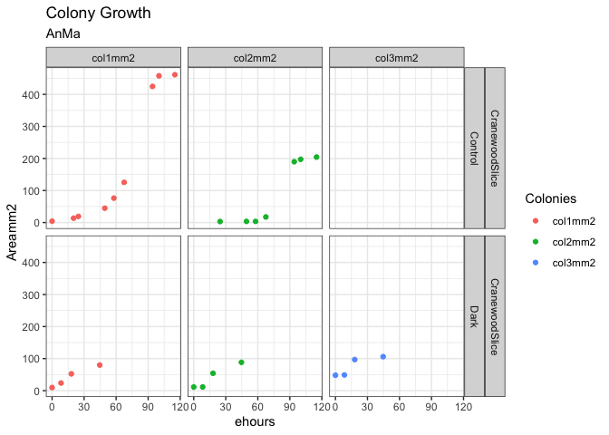<!-- -->

# Colony Size vs. Hours Elapsed since First Measure.

Plot the ln(Areamm2) to check whether growth follows an exponential pattern
Default log in R is log base E, not log base 10.

```r
MyData %>%
  ggplot() +
  geom_point(aes(x = ehours, y = log(Areamm2), colour = Colonies)) +
  facet_grid(cols = vars(Colonies), rows = vars(Substrate, Treatment)) +
  theme_bw() +
  labs(title = "Colony Growth",
       subtitle = MyInitials)
```

```
## Warning: Removed 11 rows containing missing values (geom_point).
```

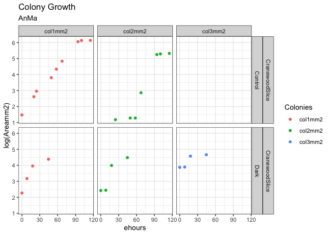<!-- -->


## My Favourite Caption

## Let R find the best fit parameters for models of the data.
Create R function for linear equation.


```r
#define a linear equation as a function.
#x will be taken from 'ehours' when we run the fit.
linear_eqn <- function(x, m, intercept){(x * m) + intercept
}
```


```r
#define starting, lower, and upper bounds for fit parameters to constrain linear equations
linear_eqn_start <- list(m = 1, intercept = min(MyData$Areamm2, na.rm = TRUE))
linear_eqn_lower <- c(0,0)

linear_eqn_upper <- c(max(MyData$Areamm2, na.rm = TRUE), max(MyData$Areamm2, na.rm = TRUE))
```

Create R function for exponential equation.

```r
#define an exponential equation as a function.
#x will be taken from 'ehours' when we run the fit.
exp_eqn <- function(x, mu, intercept){intercept * exp(x*mu)
}
```


```r
#define starting, lower, and upper bounds for fit parameters to constrain linear equations
exp_eqn_start <- list(mu = 0.1, intercept = min(MyData$Areamm2, na.rm = TRUE))
exp_eqn_lower <- c(0,0)

exp_eqn_upper <- c(1, max(MyData$Areamm2, na.rm = TRUE))
```

Create R function for logistic equation.

```r
#define a logistic equation as a function.
#x will be taken from 'ehours' when we run the fit.
logistic_eqn <- function(x, pmax, mu, intercept){(pmax*intercept*exp(mu*x))/(pmax + (intercept*(exp(mu*x)-1)))
}
```


```r
#define starting, lower, and upper bounds for fit parameters to constrain logistic fit
logistic_eqn_start<-list(pmax = max(MyData$Areamm2, na.rm = TRUE), mu = 0.05, intercept = min(MyData$Areamm2, na.rm = TRUE))

logistic_eqn_lower<-c((max(MyData$Areamm2, na.rm = TRUE) * 0.5),0.001,((min(MyData$Areamm2, na.rm = TRUE) * 0.1)))

logistic_eqn_upper<-c((max(MyData$Areamm2, na.rm = TRUE) * 2),1,((min(MyData$Areamm2, na.rm = TRUE) * 4)))
```


Each user measured multiple colonies, possibly on multiple substrates with multiple treatments.
We create a 'nested' data frame where all data in columns YYYYMMDDHHMM, Areamm2, ehours, from a single user, a single colony, on a single substrate, with a single treatment are 'nested' together for later fitting of growth curves.

```r
MyData_nest <- as_tibble(MyData) %>%
  #filter(Treatment != "Hot") %>%
  nest(data = c(YYYYMMDDHHMM, Areamm2, ehours, Temp_C))
```

## Fit and plot treatment colony specific linear growth trajectories using nest purrr:map & broom::augment
This chunk uses complicated code from the 'Tidyverse' package.
R will iteratively vary the parameters of the fitting equations to minimize the residuals (discrepancies) between the data points (nested) and the points predicted by the model with a given set of parameters.

```r
colony_lin  <- MyData_nest %>% 
  mutate(
  fit = map(data, possibly(~nlsLM(Areamm2 ~ linear_eqn(x = ehours, m, intercept), data = .x, start = linear_eqn_start, lower = linear_eqn_lower, upper = linear_eqn_upper), otherwise = NULL)),
  predict = map(fit, possibly(augment, otherwise = NULL)),
  tidied =  map(fit, possibly(tidy, otherwise = NULL)),
  param = map(fit, possibly(glance, otherwise = NULL))
  )

colony_lin %>%
  unnest(predict)  %>% 
  ggplot() +  
  geom_line(aes(x = ehours, y = .fitted), size = 0.5) +
geom_ribbon(aes(x = ehours, ymin = (.fitted - .resid), ymax = (.fitted + .resid), alpha = 0.1),show.legend = FALSE) +
  facet_grid(cols = vars(Colonies), rows = vars(Treatment, Substrate)) +
  geom_point(data = MyData, aes(x = ehours, y = Areamm2), colour = "green") +
  theme_bw() +
  labs(y = ".fitted Areamm^2",
       title = "Colony Growth, Linear Fits",
       subtitle = MyInitials,
       caption = "Linear line, residuals grey ribbon")
```

```
## Warning: Removed 11 rows containing missing values (geom_point).
```

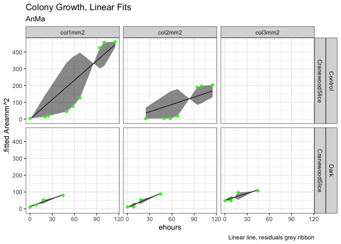<!-- -->

```r
#parameters of colony specific linear fits
colony_lin %>% 
  unnest(tidied) %>%
  select(-c(data, fit, predict, param)) %>%
  mutate_if(is.numeric, round, digits = 2)
```

<div data-pagedtable="false">
  <script data-pagedtable-source type="application/json">
{"columns":[{"label":["Initials_4letter"],"name":[1],"type":["chr"],"align":["left"]},{"label":["Substrate"],"name":[2],"type":["chr"],"align":["left"]},{"label":["Treatment"],"name":[3],"type":["chr"],"align":["left"]},{"label":["...4"],"name":[4],"type":["lgl"],"align":["right"]},{"label":["...5"],"name":[5],"type":["dbl"],"align":["right"]},{"label":["Colonies"],"name":[6],"type":["chr"],"align":["left"]},{"label":["term"],"name":[7],"type":["chr"],"align":["left"]},{"label":["estimate"],"name":[8],"type":["dbl"],"align":["right"]},{"label":["std.error"],"name":[9],"type":["dbl"],"align":["right"]},{"label":["statistic"],"name":[10],"type":["dbl"],"align":["right"]},{"label":["p.value"],"name":[11],"type":["dbl"],"align":["right"]}],"data":[{"1":"AnMa","2":"CranewoodSlice","3":"Control","4":"NA","5":"NA","6":"col1mm2","7":"m","8":"3.86","9":"0.96","10":"4.02","11":"0.01"},{"1":"AnMa","2":"CranewoodSlice","3":"Control","4":"NA","5":"NA","6":"col1mm2","7":"intercept","8":"0.00","9":"66.87","10":"0.00","11":"1.00"},{"1":"AnMa","2":"CranewoodSlice","3":"Control","4":"NA","5":"NA","6":"col2mm2","7":"m","8":"1.46","9":"0.92","10":"1.59","11":"0.17"},{"1":"AnMa","2":"CranewoodSlice","3":"Control","4":"NA","5":"NA","6":"col2mm2","7":"intercept","8":"0.00","9":"71.81","10":"0.00","11":"1.00"},{"1":"AnMa","2":"CranewoodSlice","3":"Dark","4":"NA","5":"NA","6":"col1mm2","7":"m","8":"1.57","9":"0.26","10":"6.12","11":"0.03"},{"1":"AnMa","2":"CranewoodSlice","3":"Dark","4":"NA","5":"NA","6":"col1mm2","7":"intercept","8":"13.60","9":"6.26","10":"2.17","11":"0.16"},{"1":"AnMa","2":"CranewoodSlice","3":"Dark","4":"NA","5":"NA","6":"col2mm2","7":"m","8":"1.85","9":"0.38","10":"4.89","11":"0.04"},{"1":"AnMa","2":"CranewoodSlice","3":"Dark","4":"NA","5":"NA","6":"col2mm2","7":"intercept","8":"8.50","9":"9.25","10":"0.92","11":"0.45"},{"1":"AnMa","2":"CranewoodSlice","3":"Dark","4":"NA","5":"NA","6":"col3mm2","7":"m","8":"1.39","9":"0.55","10":"2.52","11":"0.13"},{"1":"AnMa","2":"CranewoodSlice","3":"Dark","4":"NA","5":"NA","6":"col3mm2","7":"intercept","8":"50.38","9":"13.46","10":"3.74","11":"0.06"}],"options":{"columns":{"min":{},"max":[10]},"rows":{"min":[10],"max":[10]},"pages":{}}}
  </script>
</div>

## Fit and plot treatment colony specific exponential growth trajectories using nest purrr:map & broom::augment

```r
colony_exp <- MyData_nest %>% 
  mutate(
  fit = map(data, possibly(~nlsLM(Areamm2 ~ exp_eqn(x = ehours, mu, intercept), data = .x, start = exp_eqn_start, lower = exp_eqn_lower, upper = exp_eqn_upper), otherwise = NULL)),
  predict = map(fit, possibly(augment, otherwise = NULL)),
  tidied =  map(fit, possibly(tidy, otherwise = NULL)),
  param = map(fit,possibly(glance, otherwise = NULL))
  )

colony_exp %>%
  unnest(predict)  %>% 
  ggplot() +  
  geom_line(aes(x = ehours, y = .fitted), size = 0.5) +
geom_ribbon(aes(x = ehours, ymin = (.fitted - .resid), ymax = (.fitted + .resid), alpha = 0.1),show.legend = FALSE) +
  facet_grid(cols = vars(Colonies), rows = vars(Treatment, Substrate)) +
  geom_point(data = MyData, aes(x = ehours, y = Areamm2), colour = "green") +
  theme_bw() +
  labs(y = ".fitted Areamm^2",
       title = "Colony Growth, Exponential Fits",
       subtitle = MyInitials,
       caption = "Exponential line, residuals grey ribbon")
```

```
## Warning: Removed 11 rows containing missing values (geom_point).
```

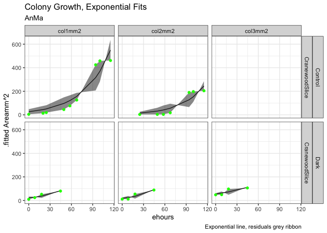<!-- -->

```r
#parameters of colony specific exponential fits
colony_exp %>% 
  unnest(tidied) %>%
  select(-c(data, fit, predict, param)) %>%
  mutate_if(is.numeric, round, digits = 2)
```

<div data-pagedtable="false">
  <script data-pagedtable-source type="application/json">
{"columns":[{"label":["Initials_4letter"],"name":[1],"type":["chr"],"align":["left"]},{"label":["Substrate"],"name":[2],"type":["chr"],"align":["left"]},{"label":["Treatment"],"name":[3],"type":["chr"],"align":["left"]},{"label":["...4"],"name":[4],"type":["lgl"],"align":["right"]},{"label":["...5"],"name":[5],"type":["dbl"],"align":["right"]},{"label":["Colonies"],"name":[6],"type":["chr"],"align":["left"]},{"label":["term"],"name":[7],"type":["chr"],"align":["left"]},{"label":["estimate"],"name":[8],"type":["dbl"],"align":["right"]},{"label":["std.error"],"name":[9],"type":["dbl"],"align":["right"]},{"label":["statistic"],"name":[10],"type":["dbl"],"align":["right"]},{"label":["p.value"],"name":[11],"type":["dbl"],"align":["right"]}],"data":[{"1":"AnMa","2":"CranewoodSlice","3":"Control","4":"NA","5":"NA","6":"col1mm2","7":"mu","8":"0.03","9":"0.01","10":"4.95","11":"0.00"},{"1":"AnMa","2":"CranewoodSlice","3":"Control","4":"NA","5":"NA","6":"col1mm2","7":"intercept","8":"26.16","9":"14.59","10":"1.79","11":"0.12"},{"1":"AnMa","2":"CranewoodSlice","3":"Control","4":"NA","5":"NA","6":"col2mm2","7":"mu","8":"0.03","9":"0.01","10":"3.03","11":"0.03"},{"1":"AnMa","2":"CranewoodSlice","3":"Control","4":"NA","5":"NA","6":"col2mm2","7":"intercept","8":"6.85","9":"7.48","10":"0.92","11":"0.40"},{"1":"AnMa","2":"CranewoodSlice","3":"Dark","4":"NA","5":"NA","6":"col1mm2","7":"mu","8":"0.03","9":"0.01","10":"3.12","11":"0.09"},{"1":"AnMa","2":"CranewoodSlice","3":"Dark","4":"NA","5":"NA","6":"col1mm2","7":"intercept","8":"21.48","9":"8.02","10":"2.68","11":"0.12"},{"1":"AnMa","2":"CranewoodSlice","3":"Dark","4":"NA","5":"NA","6":"col2mm2","7":"mu","8":"0.04","9":"0.01","10":"2.83","11":"0.11"},{"1":"AnMa","2":"CranewoodSlice","3":"Dark","4":"NA","5":"NA","6":"col2mm2","7":"intercept","8":"18.41","9":"9.33","10":"1.97","11":"0.19"},{"1":"AnMa","2":"CranewoodSlice","3":"Dark","4":"NA","5":"NA","6":"col3mm2","7":"mu","8":"0.02","9":"0.01","10":"2.16","11":"0.16"},{"1":"AnMa","2":"CranewoodSlice","3":"Dark","4":"NA","5":"NA","6":"col3mm2","7":"intercept","8":"54.73","9":"13.21","10":"4.14","11":"0.05"}],"options":{"columns":{"min":{},"max":[10]},"rows":{"min":[10],"max":[10]},"pages":{}}}
  </script>
</div>


## Fit and plot treatment colony specific logistic growth trajectories using nest purrr:map & broom::augment

```r
colony_log <- MyData_nest  %>% 
  #filter(Colonies == "col1mm2") %>%
  mutate(
  fit = map(data, possibly(~nlsLM(Areamm2 ~ logistic_eqn(x = ehours, pmax, mu, intercept), data = .x, start = logistic_eqn_start, lower = logistic_eqn_lower, upper = logistic_eqn_upper), otherwise = NULL)),
  predict = map(fit, possibly(augment, otherwise = NULL)),
  tidied =  map(fit, possibly(tidy, otherwise = NULL)),
  param = map(fit,possibly(glance, otherwise = NULL))
  )

colony_log %>% 
  unnest(predict) %>%
  ggplot() +  
  geom_line(aes(x = ehours, y = .fitted), size = 0.5) +
geom_ribbon(aes(x = ehours, ymin = (.fitted - .resid), ymax = (.fitted + .resid), alpha = 0.1),show.legend = FALSE) +
  geom_point(data = MyData, aes(x = ehours, y = Areamm2), colour = "green") +
  facet_grid(cols = vars(Colonies), rows = vars(Treatment, Substrate)) +
  theme_bw() +
  labs(y = ".fitted Areamm^2",
       title = "Colony Growth, Logistic Fits",
       subtitle = MyInitials,
       caption = "Logistic line, residuals grey ribbon")
```

```
## Warning: Removed 11 rows containing missing values (geom_point).
```

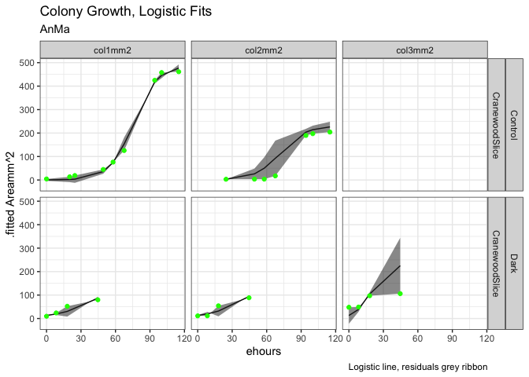<!-- -->

```r
#parameters of colony specific logistic fits
colony_log %>%
  unnest(tidied) %>%
  select(-c(data, fit, predict, param)) %>%
  mutate_if(is.numeric, round, digits = 2)
```

<div data-pagedtable="false">
  <script data-pagedtable-source type="application/json">
{"columns":[{"label":["Initials_4letter"],"name":[1],"type":["chr"],"align":["left"]},{"label":["Substrate"],"name":[2],"type":["chr"],"align":["left"]},{"label":["Treatment"],"name":[3],"type":["chr"],"align":["left"]},{"label":["...4"],"name":[4],"type":["lgl"],"align":["right"]},{"label":["...5"],"name":[5],"type":["dbl"],"align":["right"]},{"label":["Colonies"],"name":[6],"type":["chr"],"align":["left"]},{"label":["term"],"name":[7],"type":["chr"],"align":["left"]},{"label":["estimate"],"name":[8],"type":["dbl"],"align":["right"]},{"label":["std.error"],"name":[9],"type":["dbl"],"align":["right"]},{"label":["statistic"],"name":[10],"type":["dbl"],"align":["right"]},{"label":["p.value"],"name":[11],"type":["dbl"],"align":["right"]}],"data":[{"1":"AnMa","2":"CranewoodSlice","3":"Control","4":"NA","5":"NA","6":"col1mm2","7":"pmax","8":"487.31","9":"20.92","10":"23.30","11":"0.00"},{"1":"AnMa","2":"CranewoodSlice","3":"Control","4":"NA","5":"NA","6":"col1mm2","7":"mu","8":"0.10","9":"0.01","10":"7.62","11":"0.00"},{"1":"AnMa","2":"CranewoodSlice","3":"Control","4":"NA","5":"NA","6":"col1mm2","7":"intercept","8":"0.32","9":"0.27","10":"1.19","11":"0.28"},{"1":"AnMa","2":"CranewoodSlice","3":"Control","4":"NA","5":"NA","6":"col2mm2","7":"pmax","8":"230.66","9":"55.97","10":"4.12","11":"0.01"},{"1":"AnMa","2":"CranewoodSlice","3":"Control","4":"NA","5":"NA","6":"col2mm2","7":"mu","8":"0.09","9":"0.08","10":"1.18","11":"0.30"},{"1":"AnMa","2":"CranewoodSlice","3":"Control","4":"NA","5":"NA","6":"col2mm2","7":"intercept","8":"0.32","9":"1.59","10":"0.20","11":"0.85"},{"1":"AnMa","2":"CranewoodSlice","3":"Dark","4":"NA","5":"NA","6":"col1mm2","7":"pmax","8":"230.66","9":"2597.20","10":"0.09","11":"0.94"},{"1":"AnMa","2":"CranewoodSlice","3":"Dark","4":"NA","5":"NA","6":"col1mm2","7":"mu","8":"0.05","9":"0.17","10":"0.31","11":"0.81"},{"1":"AnMa","2":"CranewoodSlice","3":"Dark","4":"NA","5":"NA","6":"col1mm2","7":"intercept","8":"12.98","9":"19.71","10":"0.66","11":"0.63"},{"1":"AnMa","2":"CranewoodSlice","3":"Dark","4":"NA","5":"NA","6":"col2mm2","7":"pmax","8":"230.66","9":"2183.29","10":"0.11","11":"0.93"},{"1":"AnMa","2":"CranewoodSlice","3":"Dark","4":"NA","5":"NA","6":"col2mm2","7":"mu","8":"0.05","9":"0.16","10":"0.34","11":"0.79"},{"1":"AnMa","2":"CranewoodSlice","3":"Dark","4":"NA","5":"NA","6":"col2mm2","7":"intercept","8":"12.98","9":"20.28","10":"0.64","11":"0.64"},{"1":"AnMa","2":"CranewoodSlice","3":"Dark","4":"NA","5":"NA","6":"col3mm2","7":"pmax","8":"230.66","9":"155.11","10":"1.49","11":"0.38"},{"1":"AnMa","2":"CranewoodSlice","3":"Dark","4":"NA","5":"NA","6":"col3mm2","7":"mu","8":"0.15","9":"0.40","10":"0.37","11":"0.77"},{"1":"AnMa","2":"CranewoodSlice","3":"Dark","4":"NA","5":"NA","6":"col3mm2","7":"intercept","8":"12.98","9":"74.58","10":"0.17","11":"0.89"}],"options":{"columns":{"min":{},"max":[10]},"rows":{"min":[10],"max":[10]},"pages":{}}}
  </script>
</div>


## Compare Linear, Exponential, and Logistic Models using ANOVA
Doug to implement if feasible;  too slow, too long


## Organize all class data

```r
ClassData <- ColonyData %>%
  pivot_longer(cols = colnames(ColonyData[5:7]), names_to = 'Colonies', values_to = "Areamm2") %>%
  filter(Areamm2 != "NULL") %>%
  mutate(Areamm2 = as.numeric(Areamm2)) %>%
  mutate(YYYYMMDDHHMM = ymd_hm(YYYYMMDDHHMM)) %>%
  group_by(Initials_4letter) %>%
  mutate(ehours = as.numeric((YYYYMMDDHHMM - min(YYYYMMDDHHMM, na.rm = TRUE))/3600)) %>% 
  filter(ehours < 320)
```

## Plot class data facet by Substrate and Treatment

```r
ClassDataPlot <- ClassData %>%
  ggplot() +
  geom_point(aes(x = ehours, y = Areamm2, colour = Initials_4letter)) +
  facet_grid(rows = vars(Substrate), cols = vars(Treatment)) +
  theme_bw() +
  labs(title = "Class Colony Growth")

 ClassDataPlot 
```

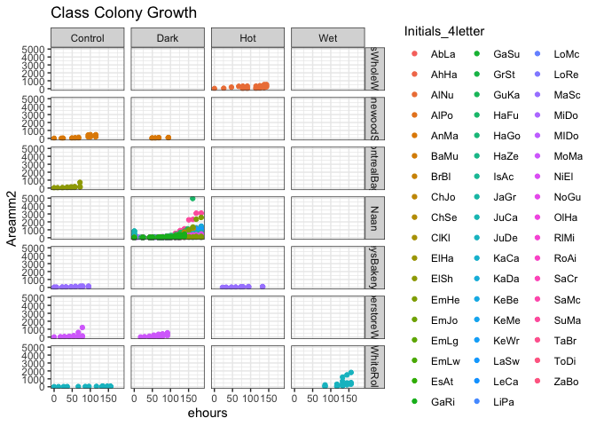<!-- -->

# Exploratory plot of all combinations of substrate and treatment run by the class.


```r
Class_nest <- as_tibble(ClassData) %>%
  nest(data = c(Temp_C, Initials_4letter, YYYYMMDDHHMM, Areamm2, ehours, Colonies))
```

## Fit logistic model to pooled class data, nested by Substrate and Treatment
Some data 'nests' have too little data to fit or too little variation in the data to support a valid fit.  The range of minimum and maximum values across different Substrate/Treatment 'nests' also makes it difficult to assign starting, minimum and maximum values for parameters.
Doug added 'possibly' as an error catch that allows the fit of nests to proceed even if one nest is unable to be fit.

```r
#define starting values for fit parameters to constrain logistic fit
#logistic_eqn_start<-list(pmax = max(ClassData$Areamm2, na.rm = TRUE), mu = 0.05, intercept = min(ClassData$Areamm2, na.rm = TRUE))

logistic_eqn_start<-list(pmax = 300, mu = 0.05, intercept = 1)

#define lower, and upper bounds for fit parameters to constrain logistic fit
#logistic_eqn_lower<-c(50,0.001,1)

#logistic_eqn_upper<-c(1000,1,20)

#fit a pooled model using the logistic equation nested by temp_C

Class_log <- Class_nest %>%
  mutate(
   fit = map(data, possibly(~nlsLM(Areamm2 ~ logistic_eqn(x = ehours, pmax, mu, intercept), data = .x, start = logistic_eqn_start), otherwise = NULL)),
  predict = map(fit, possibly(augment, otherwise = NULL)),
  tidied =  map(fit, possibly(tidy, otherwise = NULL)),
  param = map(fit, possibly(glance, otherwise = NULL))
  )

# , lower = logistic_eqn_lower, upper = logistic_eqn_upper

Class_log %>%
  unnest(predict) %>%
  ggplot() +
  geom_point(aes(x = ehours, y = Areamm2)) +
  geom_line(aes(x = ehours, y = .fitted), size = 0.5) +
geom_ribbon(aes(x = ehours, ymin = (.fitted - .resid), ymax = (.fitted + .resid), alpha = 0.1),show.legend = FALSE) +
  facet_grid(cols = vars(Substrate), rows = vars(Treatment)) +
  theme_bw() +
  labs(y = "Areamm^2",
       title = "Colony Growth, Logistic Fits",
       caption = "Logistic line, residuals grey ribbon, points data")
```

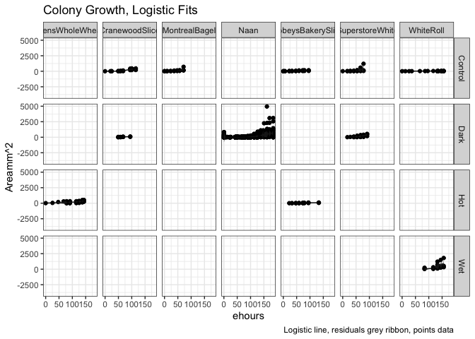<!-- -->

```r
#parameters of colony specific logistic fits
Class_log %>%
  unnest(tidied) %>%
  select(-c(data, fit, predict, param)) %>%
  mutate_if(is.numeric, round, digits = 2)
```

<div data-pagedtable="false">
  <script data-pagedtable-source type="application/json">
{"columns":[{"label":["Substrate"],"name":[1],"type":["chr"],"align":["left"]},{"label":["Treatment"],"name":[2],"type":["chr"],"align":["left"]},{"label":["...3"],"name":[3],"type":["lgl"],"align":["right"]},{"label":["...4"],"name":[4],"type":["dbl"],"align":["right"]},{"label":["term"],"name":[5],"type":["chr"],"align":["left"]},{"label":["estimate"],"name":[6],"type":["dbl"],"align":["right"]},{"label":["std.error"],"name":[7],"type":["dbl"],"align":["right"]},{"label":["statistic"],"name":[8],"type":["dbl"],"align":["right"]},{"label":["p.value"],"name":[9],"type":["dbl"],"align":["right"]}],"data":[{"1":"WhiteRoll","2":"Control","3":"NA","4":"NA","5":"pmax","6":"30.36","7":"6.590000e+00","8":"4.61","9":"0.00"},{"1":"WhiteRoll","2":"Control","3":"NA","4":"NA","5":"mu","6":"0.05","7":"1.200000e-01","8":"0.46","9":"0.65"},{"1":"WhiteRoll","2":"Control","3":"NA","4":"NA","5":"intercept","6":"6.82","7":"1.626000e+01","8":"0.42","9":"0.68"},{"1":"WhiteRoll","2":"Wet","3":"NA","4":"NA","5":"pmax","6":"1009.98","7":"7.050100e+02","8":"1.43","9":"0.17"},{"1":"WhiteRoll","2":"Wet","3":"NA","4":"NA","5":"mu","6":"0.09","7":"1.300000e-01","8":"0.73","9":"0.48"},{"1":"WhiteRoll","2":"Wet","3":"NA","4":"NA","5":"intercept","6":"0.00","7":"6.000000e-02","8":"0.06","9":"0.95"},{"1":"Naan","2":"Dark","3":"NA","4":"NA","5":"pmax","6":"835.48","7":"7.477000e+01","8":"11.17","9":"0.00"},{"1":"Naan","2":"Dark","3":"NA","4":"NA","5":"mu","6":"0.05","7":"0.000000e+00","8":"11.66","9":"0.00"},{"1":"Naan","2":"Dark","3":"NA","4":"NA","5":"intercept","6":"0.81","7":"3.900000e-01","8":"2.09","9":"0.04"},{"1":"SobeysBakerySlice","2":"Control","3":"NA","4":"NA","5":"pmax","6":"121.84","7":"2.227000e+01","8":"5.47","9":"0.00"},{"1":"SobeysBakerySlice","2":"Control","3":"NA","4":"NA","5":"mu","6":"0.06","7":"3.000000e-02","8":"2.34","9":"0.03"},{"1":"SobeysBakerySlice","2":"Control","3":"NA","4":"NA","5":"intercept","6":"6.43","7":"6.440000e+00","8":"1.00","9":"0.33"},{"1":"SobeysBakerySlice","2":"Hot","3":"NA","4":"NA","5":"pmax","6":"84.06","7":"1.129000e+01","8":"7.44","9":"0.00"},{"1":"SobeysBakerySlice","2":"Hot","3":"NA","4":"NA","5":"mu","6":"0.08","7":"3.000000e-02","8":"2.57","9":"0.02"},{"1":"SobeysBakerySlice","2":"Hot","3":"NA","4":"NA","5":"intercept","6":"0.16","7":"3.800000e-01","8":"0.43","9":"0.67"},{"1":"BensWholeWheat","2":"Hot","3":"NA","4":"NA","5":"pmax","6":"386439084.25","7":"1.289643e+15","8":"0.00","9":"1.00"},{"1":"BensWholeWheat","2":"Hot","3":"NA","4":"NA","5":"mu","6":"0.02","7":"3.000000e-02","8":"0.53","9":"0.60"},{"1":"BensWholeWheat","2":"Hot","3":"NA","4":"NA","5":"intercept","6":"31.33","7":"6.315000e+01","8":"0.50","9":"0.63"},{"1":"CranewoodSlice","2":"Control","3":"NA","4":"NA","5":"pmax","6":"343.40","7":"7.018000e+01","8":"4.89","9":"0.00"},{"1":"CranewoodSlice","2":"Control","3":"NA","4":"NA","5":"mu","6":"0.12","7":"9.000000e-02","8":"1.36","9":"0.20"},{"1":"CranewoodSlice","2":"Control","3":"NA","4":"NA","5":"intercept","6":"0.03","7":"1.900000e-01","8":"0.16","9":"0.87"},{"1":"CranewoodSlice","2":"Dark","3":"NA","4":"NA","5":"pmax","6":"93.87","7":"1.336000e+01","8":"7.02","9":"0.00"},{"1":"CranewoodSlice","2":"Dark","3":"NA","4":"NA","5":"mu","6":"0.13","7":"6.000000e-02","8":"2.12","9":"0.06"},{"1":"CranewoodSlice","2":"Dark","3":"NA","4":"NA","5":"intercept","6":"0.04","7":"1.300000e-01","8":"0.28","9":"0.79"},{"1":"MontrealBagel","2":"Control","3":"NA","4":"NA","5":"pmax","6":"218002471.15","7":"3.861935e+14","8":"0.00","9":"1.00"},{"1":"MontrealBagel","2":"Control","3":"NA","4":"NA","5":"mu","6":"0.06","7":"9.000000e-02","8":"0.68","9":"0.50"},{"1":"MontrealBagel","2":"Control","3":"NA","4":"NA","5":"intercept","6":"4.74","7":"1.765000e+01","8":"0.27","9":"0.79"},{"1":"SuperstoreWhite","2":"Control","3":"NA","4":"NA","5":"pmax","6":"7877.16","7":"5.159916e+05","8":"0.02","9":"0.99"},{"1":"SuperstoreWhite","2":"Control","3":"NA","4":"NA","5":"mu","6":"0.07","7":"1.500000e-01","8":"0.43","9":"0.67"},{"1":"SuperstoreWhite","2":"Control","3":"NA","4":"NA","5":"intercept","6":"2.64","7":"2.171000e+01","8":"0.12","9":"0.90"},{"1":"SuperstoreWhite","2":"Dark","3":"NA","4":"NA","5":"pmax","6":"4084916.22","7":"1.045782e+11","8":"0.00","9":"1.00"},{"1":"SuperstoreWhite","2":"Dark","3":"NA","4":"NA","5":"mu","6":"0.04","7":"6.000000e-02","8":"0.67","9":"0.52"},{"1":"SuperstoreWhite","2":"Dark","3":"NA","4":"NA","5":"intercept","6":"12.62","7":"3.646000e+01","8":"0.35","9":"0.73"}],"options":{"columns":{"min":{},"max":[10]},"rows":{"min":[10],"max":[10]},"pages":{}}}
  </script>
</div>


# Bibliography


