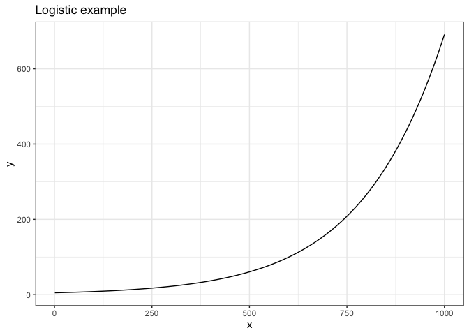
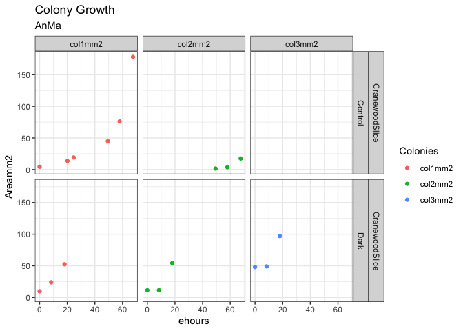
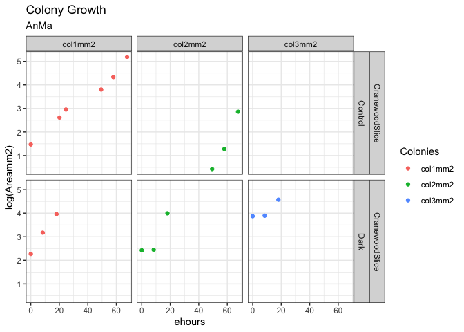
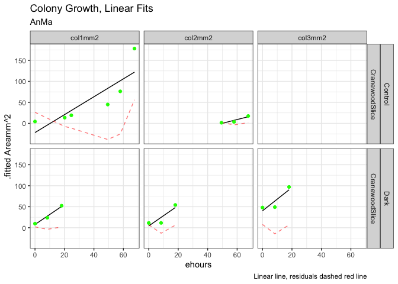
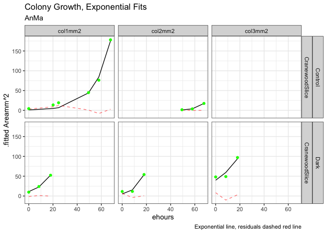
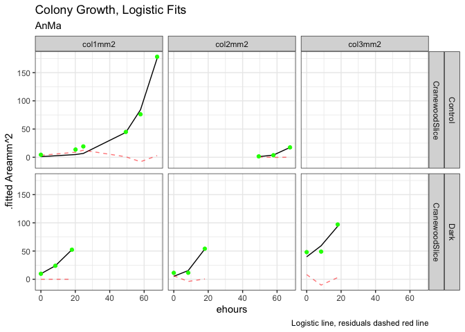
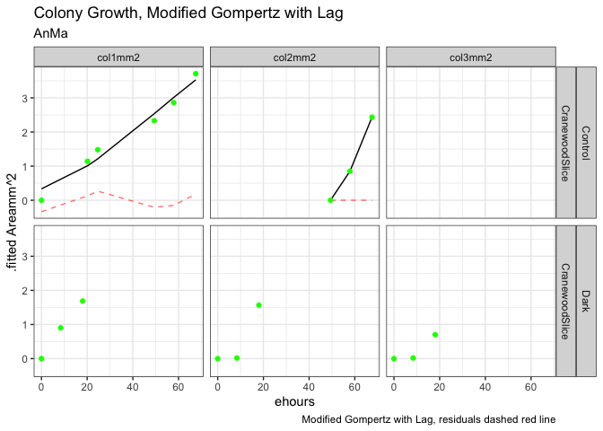
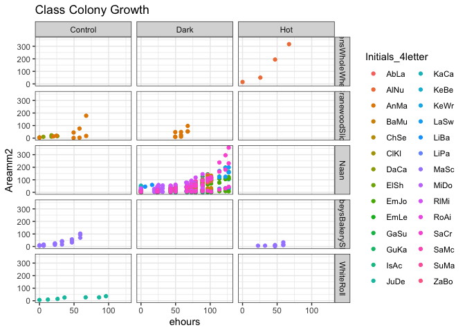

csl: plos-one.csl
# Acknowledgements
This report uses test data accumulated by the BIOL2201 Class, 2021, Mount Allison University under the guidance of L. Barney.

# Run These Chunks First


```r
knitr::opts_chunk$set(echo = TRUE, message = FALSE)
knitr::opts_chunk$set(fig.path='Figs/')
```

Set variables for project

```r
# Project <- "salinity_growth"
# FileIDSingle <- "Ab"
# Replic <- "AllSal"
# DataFolder <- "ProcessData"
# 
# #grouping variables for rows & columns, and for nesting for fitting
# RowVar <- "salinity" #expected salinity
# RowVar2 <- "CalcSal"
# ColVar <- "strain"
# NestVar <- "par_ue"
# NestVarII <- "id"
# 
# #filtering variables
# ChlAb = c("680", "720", "750")
# Wavelength_nm <- c("680min720", "680min750", "680", "720", "750")
# Par_ue = 300
# Strains <- c("CZS25K")
# StartDate <- c("20200916", "20200923", "20201013")
# TissueTreated = FALSE
# Media = "BG11+Na2CO3"
# SourceSal = "4"
# StopHours = 200
# 
# #fitting variable
# FitVar = "CorrOD"


#Set your initials code for your MicroColonyGrowth data.
MyInitials <- c("AnMa")

ColonyGoogleSheet <- "https://docs.google.com/spreadsheets/d/1DWyASxmu5DURkcegWM0Sykp9x3F3eQfMxdz0VYJ9mOI/edit?usp=sharing"
```


Additional libraries needed to run the project.
'googledrive' and 'googlesheets4' manage access to googlesheets, used for MetaData catalogs


# Introduction
We import microbial growth data, tidy it, plot growth data vs. time and fit models of microbial growth to the data.

# Some possible models for microbial growth
Each model defines a pattern of growth and generates fitted parameters useful for comparing growth across conditions or across taxa.  

## Linear
Microbial population increases by a constant amount per unit time.
(Pseudo)Linear growth is sometimes observed when a constant input of a resource (ex. light) is shared among an increasing number of cells.  
The population adds a constant number of cells per unit time, but each cell is growing more slowly with each time increment as its share of the constant resource input decreases.  

Two fitted parameters; Intercept (P0) and linear slope (m)
Pt = ehours*m + P0

### Linear Example
Having figures appear from .md in GitHub requires chunk names without spaces.  
https://stackoverflow.com/questions/51531228/unable-to-view-plots-on-md-file-in-github

```r
linear_eqn <- function(x, m, Intercept){(x * m) + Intercept
}

linear_eqn_test <- function(x, m = 0.005, Intercept = 5){x*m + Intercept
}

TestFrame <- data.frame(x = c(1,1000))

ggplot(TestFrame, aes(x=x)) + 
  stat_function(fun = linear_eqn_test) +
  labs(title = "Linear example") +
  theme_bw()
```

<!-- -->


## Exponential  
Microbial population increases by a constant proportion per unit time.
Exponential growth is observed when microbial cell replication is not resource limited, but is rather limited by intrinsic processes like nutrient uptake rates or DNA replication rate.

Two fitted parameters; intercept (P0) and exponential growth rate constant (mu, µ)
Pt = P0 *(exp(mu*ehours))

### Exponential Example

```r
exp_eqn <- function(x, mu, Intercept){Intercept *exp(x*mu)
}
  
exp_eqn_test <- function(x, mu = 0.005, Intercept = 5){Intercept *exp(x*mu)
}
ggplot(TestFrame, aes(x=x)) + 
  stat_function(fun = exp_eqn_test) +
  labs(title = "Exponential example") +
  theme_bw()
```

<!-- -->


## Exponential rise towards a plateau
The gap between a maximum population and the current microbial population decreases by a constant proportion per unit time.
Three parameters; intercept (P0), exponential growth rate constant (mu) and plateau (Max)
Pt = Max - ((Max-Intercept)*exp(x*-mu)

### Exponential rise towards a plateau example

```r
exp_rise_plat_eqn <- function(x, mu = 0.005, Intercept){Max - ((Max-Intercept)*exp(x*-mu))
}

exp_rise_plat_eqn_test <- function(x, mu = 0.005, Intercept = 0.5, Max = 1000){Max - ((Max-Intercept)*exp(x*-mu))
}
ggplot(TestFrame, aes(x=x)) + 
  stat_function(fun = exp_rise_plat_eqn_test) +
  labs(title = "Exponential Rise towards Plateau example") +
  theme_bw()
```

<!-- -->


## Logistic
Microbial population initially increases exponentially but slows as population approaches a plateau, Pmax, passing through a pseudolinear phase.

Pmax is maximum population tenable under the prevailing conditions, sometimes termed the carrying capacity.
mu dominates the early part of the rise, transitioning towards an asymptote towards Pmax.
Three parameters; intercept (P0), exponential rate constant (mu) and maximum population Pmax.
There are multiple equivalent formulations of the logistic equation.
Pt= {Pmax e^µt }/{Pmax + P0 (e^µt- 1)}

### Logistic example

```r
logistic_eqn <- function(x, mu, Intercept, Max){(Max*Intercept*exp(mu*x))/(Max + (Intercept*(exp(mu*x)-1)))
}

logistic_eqn_test <- function(x, mu = 0.005, Intercept = 5, Max = 10000){(Max*Intercept*exp(mu*x))/(Max + (Intercept*(exp(mu*x)-1)))
}

ggplot(TestFrame, aes(x=x)) + 
  stat_function(fun = logistic_eqn_test) +
  labs(title = "Logistic example") +
  theme_bw()
```

<!-- -->

### Logistic Zavrel example
An alternate logistic formulation [@zavrelMonitoringFitnessProductivity2021]; possibly identical to above

```r
logistic_zavrel_eqn <- function(x, Intercept, Max, r){(Intercept*Max)/(Intercept + ((Max - Intercept) * exp(-r*x)))
}

logistic_zavrel_eqn_test <- function(x, Intercept = 5, Max = 10000, r = 0.005){(Intercept*Max)/(Intercept + ((Max - Intercept) * exp(-r*x)))
}
                        
ggplot(TestFrame, aes(x=x)) + 
  stat_function(fun = logistic_zavrel_eqn_test) +
  labs(title = "Logistic Zavrel example") +
  theme_bw()
```

<!-- -->

```r
ggplot(TestFrame, aes(x=x)) + 
  stat_function(fun = function(x, Intercept = 5, Max = 10000, r = 0.005){(Intercept*Max)/(Intercept + ((Max - Intercept) * exp(-r*x)))}) +
  labs(title = "Logistic Zavrel example") +
  theme_bw()
```

<!-- -->

## Modified Gompertz Fit with Lag
Gompertz equations [@zwieteringModelingBacterialGrowth1990] have shapes similar to Logistic fits but are more readily modified to include 'lag' as a parameter for an initial time period over which cell count does not (measurably) increase.
'lag' may be a true biological lag representing cellular acclimation to new growth conditions, and/or may result from cell counts below the level of instrumental resolution, giving no detectable growth.

The Gompertz equations are based on fitting the ln of (data normalized to an 'Intercept').
Therefore the plots start at '0'; ln(Intercept/Intercept) = ln(1) = 0.
The reported value for Amu is comparable to mu from a Logistic or Exponential fit.
But the reported value for Amax = ln(Max/Intercept).
To retrieve an estimate for Max we need to take an antilog and multiply through by the Intercept.
Chosing what value to use as an intercept for the Gompertz equations is the main challenge.  
The first value or a single minimum value may be aberrant.
An average of kth(minimum values) is possible.
The advantage of the normalization is that the Intercept parameter is no longer fit, which improves statistical power for the fitting of additional parameters such as Lag.


Pt = ModGompertzEqn <- (Amax*(exp(-exp((Amu*exp(1))/Amax*(Lag-x)+1))))
Pt = ModGompertzEqn <- ((ln(Max/Intercept)*(exp(-exp((Amu*exp(1))/ln(Max/Intercept)*(Lag-x)+1))))

ModGompertzEqn <- function(Amax,Amu,Lag,x){(Amax*(exp(-exp((Amu*exp(1))/Amax*(Lag-x)+1))))}

### Modified Gompertz Fit with Lag example

```r
#natural log(RFU/min(RFU)); works, but confusing
mod_gomp_lag_eqn <-  function(x, Amax,Amu,Lag){(Amax*(exp(-exp((Amu*exp(1))/Amax*(Lag-x)+1))))
  }

mod_gomp_lag_eqn_test <-  function(x, Amax = 1000/10, Amu  = 0.5, Lag = 200 ){(Amax*(exp(-exp((Amu*exp(1))/Amax*(Lag-x)+1))))
  }

ggplot(TestFrame, aes(x=x)) + 
  stat_function(fun = mod_gomp_lag_eqn_test) +
  labs(title = "Modified Gompertz with Lag example") +
  theme_bw()
```

<!-- -->


# Materials and Methods 
We grow cultures. To compare results across cultures we want to fit the growth data with models to get fitted parameters.


## Import example data. 
The import function may open a Google log in to get an authorization code in a separate browser window. Copy/paste the authorization code into the 'Console' window below.
See next chunk for manual alternative if needed; download .csv from GoogleSheet, then upload the .csv to RStudio.cloud.


```r
# gs4_deauth()
# ColonyData <- read_sheet(ColonyGoogleSheet)
# 
# ColonyData
```

Alternative
Manually Download Data from Googlesheets as .csv.
Manually Upload .csv to folder containing .Rproj
Read in .csv into ColonyData object

```r
ColonyData <- read_csv("MicroColonyData2021.csv", col_names = TRUE)
ColonyData
```

```
## # A tibble: 238 x 8
##    Initials_4letter YYYYMMDDHHMM Substrate Treatment col1mm2 col2mm2 col3mm2
##    <chr>                   <dbl> <chr>     <chr>       <dbl>   <dbl>   <dbl>
##  1 DaCa             202001171518 Cranewoo… Control     15.9       NA      NA
##  2 DaCa             202001161326 Cranewoo… Control      5.71      NA      NA
##  3 DaCa             202001161903 Cranewoo… Control     10.2       NA      NA
##  4 DaCa             202001170650 Cranewoo… Control     11.6       NA      NA
##  5 DaCa             202001170650 Cranewoo… Control     22.3       NA      NA
##  6 DaCa             202001161326 Cranewoo… Control      4.66      NA      NA
##  7 JuDe             202101221946 WhiteRoll Control      6.22      NA      NA
##  8 JuDe             202101230756 WhiteRoll Control      9.29      NA      NA
##  9 JuDe             202101232155 WhiteRoll Control     14.6       NA      NA
## 10 JuDe             202101240759 WhiteRoll Control     25.5       NA      NA
## # … with 228 more rows, and 1 more variable: Temp_C <dbl>
```


Example Error correction chunk if some data columns have converted to 'list' format upon import by 'plucking' the first entry in each cell in each column and converting to numeric format.
Could make this more sophisticated.

```r
# ColonyData <- ColonyData %>%
#   mutate (YYYYMMDDHHMM = as.numeric(as.character(pluck(col1mm2, 1))),
#           col1mm2_test = as.numeric(as.character(pluck(col1mm2, 1))),
#           col2mm2_test = as.numeric(as.character(pluck(col2mm2, 1))),
#           col3mm2_test = as.numeric(as.character(pluck(col3mm2, 1))))
# 
# ColonyData
```

Filter the class data to include only 'MyData' (defined by 'MyInitials' set above). 
Convert the data to long format for analyses.
Convert the YYYYMMDDHHMM data column to a formatted datetime column,
Generate a numeric ehours column for elapsed time.
Add a ln(normalized area column) for Gompertz fitting

```r
#filter data,long format for analyses
MyData <- ColonyData %>%
  filter(Initials_4letter == MyInitials) %>%
  pivot_longer(cols = colnames(ColonyData[5:7]), names_to = 'Colonies', values_to = "Areamm2") %>%
  mutate(Areamm2 = as.numeric(Areamm2))

#convert YYYYMMDDHHMM to datetime format
MyData <- MyData %>%
  group_by(Substrate, Treatment) %>%
  mutate(YYYYMMDDHHMM = ymd_hm(YYYYMMDDHHMM)) %>%
  mutate(ehours = as.numeric(((YYYYMMDDHHMM - min(YYYYMMDDHHMM, na.rm = TRUE)))/3600)) %>%
  ungroup()

#ln(Area/minArea)
MyData <- MyData %>%
  group_by(Substrate, Treatment, Colonies) %>%
  mutate(lnAreaNorm = log(Areamm2/min(Areamm2, na.rm = TRUE))) %>%
  filter(!is.na(Areamm2)) %>%
  ungroup()
```

```
## Warning in min(Areamm2, na.rm = TRUE): no non-missing arguments to min;
## returning Inf
```


# Results  
Upload representative images to folder containing .Rproj.
Add representative images to your .Rmd.
Will work with .jpg and .png; not sure about other graphic formats.
May not succeed embedding image to .md file.

```r
knitr::include_graphics(file.path("202101240946.jpg"))
```


## Example of Mould Colony on Naan, 202101240946.jpg

## Plot the data with a separate facet for each colony.
Or, plot the data with all colonies under a common combination of substrate and treatment in a single panel.

```r
#set Y axis limit range
#YLIM = c(0,max(MyData$Areamm2, na.rm = TRUE))

MyData %>%
  ggplot() +
  geom_point(aes(x = ehours, y = Areamm2, colour = Colonies)) +
  facet_grid(cols = vars(Treatment), rows = vars(Substrate)) +
  theme_bw() +
  labs(title = "Colony Growth",
       subtitle = MyInitials)
```

<!-- -->

```r
MyData %>%
  ggplot() +
  geom_point(aes(x = ehours, y = Areamm2, colour = Colonies)) +
  facet_grid(cols = vars(Colonies), rows = vars(Substrate, Treatment)) +
  theme_bw() +
  labs(title = "Colony Growth",
       subtitle = MyInitials)
```

<!-- -->

# Colony Size vs. Hours Elapsed since First Measure.

Plot the ln(Areamm2) to check whether growth follows an exponential pattern
Default log in R is log base E, not log base 10.

```r
MyData %>%
  ggplot() +
  geom_point(aes(x = ehours, y = log(Areamm2), colour = Colonies)) +
  facet_grid(cols = vars(Colonies), rows = vars(Substrate, Treatment)) +
  theme_bw() +
  labs(title = "Colony Growth",
       subtitle = MyInitials)
```

<!-- -->


## Let R find the best fit parameters for different models of the data.

Each user measured multiple colonies, possibly on multiple substrates with multiple treatments.
We create a 'nested' data frame where all data in columns YYYYMMDDHHMM, Areamm2, ehours, from a single user, a single colony, on a single substrate, with a single treatment are 'nested' together for later fitting of growth curves.


```r
# test <- FitData %>%
#   group_by(!!sym(NestVar), !!sym(RowVar2), !!sym(RowVar), !!sym(ColVar), Wavelength, exp_date) %>%
```


```r
MyData_nest <- as_tibble(MyData) %>%
  #filter(Treatment != "Hot") %>%
  nest(data = c(YYYYMMDDHHMM, Areamm2, lnAreaNorm, ehours, Temp_C))
```

## Fit and plot treatment colony specific linear growth trajectories using nest purrr:map & broom::augment
This chunk uses code from the 'Tidyverse' purrr package.
R will iteratively vary the parameters of the fitting equations to minimize the residuals (discrepancies) between the data points in a given nested and the points predicted by the model with a given set of parameters.
If that fails, R returns a 'null' result for the fit for the given nest, and proceeds to attempt the next nest of data.
The nlsLM fitting function requires a 'list' of 'start' values for each fitted parameter.
nlsLM optionally accepts vectors of 'lower' and 'upper' boundary values for each fitted parameter.
Avoid using 'lower' and 'upper' boundaries when feasible, because they can lead to erroneous fits when the fitting iterations hit a boundary for a fitted parameter and then sit there.
Sometimes with noisy data, setting 'lower' and 'upper' boundaries can help constrain the fit.
Sometimes there are mechanistic reasons to constrain the range for fitted values; as for example setting 0 as the minimum value for a lag phase.


```r
#define starting, lower, and upper bounds for fit parameters to constrain linear equations
# linear_eqn_start <- list(m = 1, Intercept = min(MyData$Areamm2, na.rm = TRUE))
# linear_eqn_lower <- c(0,0)
# 
# linear_eqn_upper <- c(max(MyData$Areamm2, na.rm = TRUE), max(MyData$Areamm2, na.rm = TRUE))

#replaced by dynamic generation of starting, lower and upper parameter bounds based upon nested data
# ##Succeeded in extracting min value from data; on the way to start values
# colony_lin3 <- MyData_nest %>% 
#   mutate(
#    test =  map(data, `[[`, c("Areamm2")),
#    test2 = map(test, min, na.rm = TRUE)
#   )

#Combine map with map_dbl to get min & max & slope
#Areamm2 is the Y axis fitting variable in this example
#max_x is the maximum X axis value
# colony_lin4 <- MyData_nest %>% 
#   mutate(
#    min_y =  map_dbl(map(data, `[[`, c("Areamm2")), min, na.rm = TRUE),
#    max_y = map_dbl(map(data, `[[`, c("Areamm2")), max, na.rm = TRUE),
#    max_x = map_dbl(map(data, `[[`, c("ehours")), max, na.rm = TRUE),
#    slope = (max_y - min_y)/max_x,
#    mu_guess = (log(max_y) - log(min_y))/max_x
#   )
# 
# colony_lin4

 
#Need to use pmap to step through data nests & start values in parallel
#For pmap need to refer to list elements with ..1, ..2, ..3 etc. in correct order
#https://stackoverflow.com/questions/56157959/r-why-is-pmap-not-working-while-map2-does
```


```r
#nest-specific start for nlsLM
Colony_lin  <- MyData_nest %>% 
  mutate(
    min_y =  map_dbl(map(data, `[[`, c("Areamm2")), min, na.rm = TRUE),
    max_y = map_dbl(map(data, `[[`, c("Areamm2")), max, na.rm = TRUE),
    max_x = map_dbl(map(data, `[[`, c("ehours")), max, na.rm = TRUE),
    slope = (max_y - min_y)/max_x,
    fit = pmap(list(data, slope, min_y), possibly(~nlsLM(Areamm2 ~ linear_eqn(x = ehours, m, Intercept), data = ..1, start = c(m = ..2, Intercept = ..3)), otherwise = NULL)),
    predict = map(fit, possibly(augment, otherwise = NULL)),
    tidied =  map(fit, possibly(tidy, otherwise = NULL)),
    param = map(fit, possibly(glance, otherwise = NULL))
  ) 


Colony_lin %>%
  unnest(predict)  %>% 
  ggplot() +  
  geom_line(aes(x = ehours, y = .fitted), size = 0.5) +
  geom_line(aes(x = ehours, y = .resid, alpha = 0.1), linetype = "dashed", colour = "red", show.legend = FALSE) +
  facet_grid(cols = vars(Colonies), rows = vars(Treatment, Substrate)) +
  geom_point(data = MyData, aes(x = ehours, y = Areamm2), colour = "green") +
  theme_bw() +
  labs(y = ".fitted Areamm^2",
       title = "Colony Growth, Linear Fits",
       subtitle = MyInitials,
       caption = "Linear line, residuals dashed red line")
```

<!-- -->

```r
#parameters of colony specific linear fits
Colony_lin %>% 
  unnest(tidied) %>%
  select(-c(data, fit, predict, param)) %>%
  mutate_if(is.numeric, round, digits = 2)
```

```
## # A tibble: 10 x 13
##    Initials_4letter Substrate Treatment Colonies min_y max_y max_x slope term 
##    <chr>            <chr>     <chr>     <chr>    <dbl> <dbl> <dbl> <dbl> <chr>
##  1 AnMa             Cranewoo… Control   col1mm2   4.36 178.   67.5  2.57 m    
##  2 AnMa             Cranewoo… Control   col1mm2   4.36 178.   67.5  2.57 Inte…
##  3 AnMa             Cranewoo… Control   col2mm2   1.53  17.5  67.5  0.24 m    
##  4 AnMa             Cranewoo… Control   col2mm2   1.53  17.5  67.5  0.24 Inte…
##  5 AnMa             Cranewoo… Dark      col1mm2   9.68  52.4  18.0  2.37 m    
##  6 AnMa             Cranewoo… Dark      col1mm2   9.68  52.4  18.0  2.37 Inte…
##  7 AnMa             Cranewoo… Dark      col2mm2  11.3   54.2  18.0  2.38 m    
##  8 AnMa             Cranewoo… Dark      col2mm2  11.3   54.2  18.0  2.38 Inte…
##  9 AnMa             Cranewoo… Dark      col3mm2  48.0   97.0  18.0  2.72 m    
## 10 AnMa             Cranewoo… Dark      col3mm2  48.0   97.0  18.0  2.72 Inte…
## # … with 4 more variables: estimate <dbl>, std.error <dbl>, statistic <dbl>,
## #   p.value <dbl>
```

## Fit and plot treatment colony specific exponential growth trajectories using nest purrr:map & broom::augment

```r
#nest-specific start for nlsLM
Colony_exp  <- MyData_nest %>% 
  mutate(
    min_y =  map_dbl(map(data, `[[`, c("Areamm2")), min, na.rm = TRUE),
    max_y = map_dbl(map(data, `[[`, c("Areamm2")), max, na.rm = TRUE),
    max_x = map_dbl(map(data, `[[`, c("ehours")), max, na.rm = TRUE),
    mu_guess = (log(max_y) - log(min_y))/max_x,
    fit = pmap(list(data, mu_guess, min_y), possibly(~nlsLM(Areamm2 ~ exp_eqn(x = ehours, mu, Intercept), data = ..1, start = c(mu = ..2, Intercept = ..3)), otherwise = NULL)),
    predict = map(fit, possibly(augment, otherwise = NULL)),
    tidied =  map(fit, possibly(tidy, otherwise = NULL)),
    param = map(fit, possibly(glance, otherwise = NULL))
  ) 

Colony_exp %>%
  unnest(predict)  %>% 
  ggplot() +  
  geom_line(aes(x = ehours, y = .fitted), size = 0.5) +
   geom_line(aes(x = ehours, y = .resid, alpha = 0.1), linetype = "dashed", colour = "red", show.legend = FALSE) +
  facet_grid(cols = vars(Colonies), rows = vars(Treatment, Substrate)) +
  geom_point(data = MyData, aes(x = ehours, y = Areamm2), colour = "green") +
  theme_bw() +
  labs(y = ".fitted Areamm^2",
       title = "Colony Growth, Exponential Fits",
       subtitle = MyInitials,
       caption = "Exponential line, residuals dashed red line")
```

<!-- -->

```r
#parameters of colony specific exponential fits
Colony_exp %>% 
  unnest(tidied) %>%
  select(-c(data, fit, predict, param)) %>%
  mutate_if(is.numeric, round, digits = 2)
```

```
## # A tibble: 10 x 13
##    Initials_4letter Substrate Treatment Colonies min_y max_y max_x mu_guess
##    <chr>            <chr>     <chr>     <chr>    <dbl> <dbl> <dbl>    <dbl>
##  1 AnMa             Cranewoo… Control   col1mm2   4.36 178.   67.5     0.05
##  2 AnMa             Cranewoo… Control   col1mm2   4.36 178.   67.5     0.05
##  3 AnMa             Cranewoo… Control   col2mm2   1.53  17.5  67.5     0.04
##  4 AnMa             Cranewoo… Control   col2mm2   1.53  17.5  67.5     0.04
##  5 AnMa             Cranewoo… Dark      col1mm2   9.68  52.4  18.0     0.09
##  6 AnMa             Cranewoo… Dark      col1mm2   9.68  52.4  18.0     0.09
##  7 AnMa             Cranewoo… Dark      col2mm2  11.3   54.2  18.0     0.09
##  8 AnMa             Cranewoo… Dark      col2mm2  11.3   54.2  18.0     0.09
##  9 AnMa             Cranewoo… Dark      col3mm2  48.0   97.0  18.0     0.04
## 10 AnMa             Cranewoo… Dark      col3mm2  48.0   97.0  18.0     0.04
## # … with 5 more variables: term <chr>, estimate <dbl>, std.error <dbl>,
## #   statistic <dbl>, p.value <dbl>
```

## Fit and plot treatment colony specific logistic growth trajectories using nest purrr:map & broom::augment

```r
#nest-specific start for nlsLM
Colony_log  <- MyData_nest %>% 
  mutate(
    min_y =  map_dbl(map(data, `[[`, c("Areamm2")), min, na.rm = TRUE),
    max_y = map_dbl(map(data, `[[`, c("Areamm2")), max, na.rm = TRUE),
    max_x = map_dbl(map(data, `[[`, c("ehours")), max, na.rm = TRUE),
    mu_guess = (log(max_y) - log(min_y))/max_x,
    fit = pmap(list(data, mu_guess, min_y, max_y), possibly(~nlsLM(Areamm2 ~ logistic_eqn(x = ehours, mu, Intercept, Max), data = ..1, start = c(mu = ..2, Intercept = ..3, Max = ..4)), otherwise = NULL)),
    predict = map(fit, possibly(augment, otherwise = NULL)),
    tidied =  map(fit, possibly(tidy, otherwise = NULL)),
    param = map(fit, possibly(glance, otherwise = NULL))
  )
```

```
## Warning in nls.lm(par = start, fn = FCT, jac = jac, control = control, lower = lower, : lmdif: info = -1. Number of iterations has reached `maxiter' == 50.

## Warning in nls.lm(par = start, fn = FCT, jac = jac, control = control, lower = lower, : lmdif: info = -1. Number of iterations has reached `maxiter' == 50.
```

```r
Colony_log %>% 
  unnest(predict) %>%
  ggplot() +  
  geom_line(aes(x = ehours, y = .fitted), size = 0.5) +
   geom_line(aes(x = ehours, y = .resid, alpha = 0.1), linetype = "dashed", colour = "red", show.legend = FALSE) +
  geom_point(data = MyData, aes(x = ehours, y = Areamm2), colour = "green") +
  facet_grid(cols = vars(Colonies), rows = vars(Treatment, Substrate)) +
  theme_bw() +
  labs(y = ".fitted Areamm^2",
       title = "Colony Growth, Logistic Fits",
       subtitle = MyInitials,
       caption = "Logistic line, residuals dashed red line")
```

<!-- -->

```r
#parameters of colony specific logistic fits
Colony_log %>%
  unnest(tidied) %>%
  select(-c(data, fit, predict, param)) %>%
  mutate_if(is.numeric, round, digits = 2)
```

```
## # A tibble: 15 x 13
##    Initials_4letter Substrate Treatment Colonies min_y max_y max_x mu_guess
##    <chr>            <chr>     <chr>     <chr>    <dbl> <dbl> <dbl>    <dbl>
##  1 AnMa             Cranewoo… Control   col1mm2   4.36 178.   67.5     0.05
##  2 AnMa             Cranewoo… Control   col1mm2   4.36 178.   67.5     0.05
##  3 AnMa             Cranewoo… Control   col1mm2   4.36 178.   67.5     0.05
##  4 AnMa             Cranewoo… Control   col2mm2   1.53  17.5  67.5     0.04
##  5 AnMa             Cranewoo… Control   col2mm2   1.53  17.5  67.5     0.04
##  6 AnMa             Cranewoo… Control   col2mm2   1.53  17.5  67.5     0.04
##  7 AnMa             Cranewoo… Dark      col1mm2   9.68  52.4  18.0     0.09
##  8 AnMa             Cranewoo… Dark      col1mm2   9.68  52.4  18.0     0.09
##  9 AnMa             Cranewoo… Dark      col1mm2   9.68  52.4  18.0     0.09
## 10 AnMa             Cranewoo… Dark      col2mm2  11.3   54.2  18.0     0.09
## 11 AnMa             Cranewoo… Dark      col2mm2  11.3   54.2  18.0     0.09
## 12 AnMa             Cranewoo… Dark      col2mm2  11.3   54.2  18.0     0.09
## 13 AnMa             Cranewoo… Dark      col3mm2  48.0   97.0  18.0     0.04
## 14 AnMa             Cranewoo… Dark      col3mm2  48.0   97.0  18.0     0.04
## 15 AnMa             Cranewoo… Dark      col3mm2  48.0   97.0  18.0     0.04
## # … with 5 more variables: term <chr>, estimate <dbl>, std.error <dbl>,
## #   statistic <dbl>, p.value <dbl>
```

# In progress; add modified Gompertz with lag

## Fit and plot treatment colony specific modified Gompertz with lag growth trajectories using nest purrr:map & broom::augment.  
Note fit is run on lnAreaNorm

```r
#nest-specific start for nlsLM
#not sure about how to start lag

#intermediate steps
    # Areammout = map(data, `[[`, c("Areamm2")),
    # ehoursout = map(data, `[[`, c("ehours")),
    # lag_guess1 = map2_dbl(.x = ehoursout, .y = Areammout , ~(.x[which.min(.y)])),

Colony_modgompertzlag  <- MyData_nest %>% 
  mutate(
    min_y =  map_dbl(map(data, `[[`, c("lnAreaNorm")), min, na.rm = TRUE),
    max_y = map_dbl(map(data, `[[`, c("lnAreaNorm")), max, na.rm = TRUE),
    max_x = map_dbl(map(data, `[[`, c("lnAreaNorm")), max, na.rm = TRUE),
    mu_guess = (max_y - min_y)/max_x,
    lag_guess = map2_dbl(.x = map(data, `[[`, c("ehours")), .y = map(data, `[[`, c("Areamm2")), ~(.x[which.min(.y)])),
    fit = pmap(list(data, max_y, mu_guess, lag_guess), possibly(~nlsLM(lnAreaNorm ~ mod_gomp_lag_eqn(x = ehours, Amax, Amu, Lag), data = ..1, start = c(Amax = ..2, Amu = ..3, Lag = ..4), lower = c(Amax = 0, Amu = 0, Lag =0)), otherwise = NULL)),
    predict = map(fit, possibly(augment, otherwise = NULL)),
    tidied =  map(fit, possibly(tidy, otherwise = NULL)),
    param = map(fit,possibly(glance, otherwise = NULL))
    )
```

```
## Warning in nls.lm(par = start, fn = FCT, jac = jac, control = control, lower = lower, : lmdif: info = -1. Number of iterations has reached `maxiter' == 50.

## Warning in nls.lm(par = start, fn = FCT, jac = jac, control = control, lower = lower, : lmdif: info = -1. Number of iterations has reached `maxiter' == 50.

## Warning in nls.lm(par = start, fn = FCT, jac = jac, control = control, lower = lower, : lmdif: info = -1. Number of iterations has reached `maxiter' == 50.
```

```r
Colony_modgompertzlag %>% 
  unnest(predict) %>%
  ggplot() +  
  geom_line(aes(x = ehours, y = .fitted), size = 0.5) +
   geom_line(aes(x = ehours, y = .resid, alpha = 0.1), linetype = "dashed", colour = "red", show.legend = FALSE) +
  geom_point(data = MyData, aes(x = ehours, y = lnAreaNorm), colour = "green") +
  facet_grid(cols = vars(Colonies), rows = vars(Treatment, Substrate)) +
  theme_bw() +
  labs(y = ".fitted Areamm^2",
       title = "Colony Growth, Modified Gompertz with Lag",
       subtitle = MyInitials,
       caption = "Modified Gompertz with Lag, residuals dashed red line")
```

<!-- -->

```r
#parameters of colony specific logistic fits
Colony_modgompertzlag %>%
  unnest(tidied) %>%
  select(-c(data, fit, predict, param)) %>%
  mutate_if(is.numeric, round, digits = 2)
```

```
## # A tibble: 6 x 14
##   Initials_4letter Substrate Treatment Colonies min_y max_y max_x mu_guess
##   <chr>            <chr>     <chr>     <chr>    <dbl> <dbl> <dbl>    <dbl>
## 1 AnMa             Cranewoo… Control   col1mm2      0  3.71  3.71        1
## 2 AnMa             Cranewoo… Control   col1mm2      0  3.71  3.71        1
## 3 AnMa             Cranewoo… Control   col1mm2      0  3.71  3.71        1
## 4 AnMa             Cranewoo… Control   col2mm2      0  2.43  2.43        1
## 5 AnMa             Cranewoo… Control   col2mm2      0  2.43  2.43        1
## 6 AnMa             Cranewoo… Control   col2mm2      0  2.43  2.43        1
## # … with 6 more variables: lag_guess <dbl>, term <chr>, estimate <dbl>,
## #   std.error <dbl>, statistic <dbl>, p.value <dbl>
```


## Compare Linear, Exponential, and Logistic Models using ANOVA
Doug to implement if feasible;  too slow, too long


## Organize all class data

```r
ClassData <- ColonyData %>%
  pivot_longer(cols = colnames(ColonyData[5:7]), names_to = 'Colonies', values_to = "Areamm2") %>%
  filter(Areamm2 != "NULL") %>%
  filter(!is.na(Areamm2)) %>%
  mutate(Areamm2 = as.numeric(Areamm2)) %>%
  mutate(YYYYMMDDHHMM = ymd_hm(YYYYMMDDHHMM)) %>%
  group_by(Initials_4letter) %>%
  mutate(ehours = as.numeric((YYYYMMDDHHMM - min(YYYYMMDDHHMM, na.rm = TRUE))/3600)) %>% 
  filter(ehours < 320)

ClassData <- ClassData %>%
  group_by(Initials_4letter, Colonies, Substrate, Treatment) %>%
  mutate(lnAreaNorm = log(Areamm2/min(Areamm2, na.rm = TRUE))) %>%
  filter(!is.na(Areamm2)) %>%
  ungroup()
```

## Plot class data facet by Substrate and Treatment

```r
ClassDataPlot <- ClassData %>%
  ggplot() +
  geom_point(aes(x = ehours, y = Areamm2, colour = Initials_4letter)) +
  facet_grid(rows = vars(Substrate), cols = vars(Treatment)) +
  theme_bw() +
  labs(title = "Class Colony Growth")

 ClassDataPlot 
```

<!-- -->


## Fit logistic model to pooled class data, nested by Substrate and Treatment

```r
Class_nest <- as_tibble(ClassData) %>%
  nest(data = c(Temp_C, Initials_4letter, YYYYMMDDHHMM, Areamm2, lnAreaNorm, ehours, Colonies))
```

Some data 'nests' have too little data to fit or too little variation in the data to support a valid fit.
Using nest-specific starting values helps.
Doug added 'possibly' as an error catch that allows the fit of nests to proceed even if one nest is unable to be fit.

```r
Class_log  <- Class_nest %>% 
  mutate(
    min_y =  map_dbl(map(data, `[[`, c("Areamm2")), min, na.rm = TRUE),
    max_y = map_dbl(map(data, `[[`, c("Areamm2")), max, na.rm = TRUE),
    max_x = map_dbl(map(data, `[[`, c("ehours")), max, na.rm = TRUE),
    mu_guess = (log(max_y) - log(min_y))/max_x,
    fit = pmap(list(data, mu_guess, min_y, max_y), possibly(~nlsLM(Areamm2 ~ logistic_eqn(x = ehours, mu, Intercept, Max), data = ..1, start = c(mu = ..2, Intercept = ..3, Max = ..4)), otherwise = NULL)),
    predict = map(fit, possibly(augment, otherwise = NULL)),
    tidied =  map(fit, possibly(tidy, otherwise = NULL)),
    param = map(fit, possibly(glance, otherwise = NULL))
  )
```

```
## Warning in nls.lm(par = start, fn = FCT, jac = jac, control = control, lower = lower, : lmdif: info = -1. Number of iterations has reached `maxiter' == 50.
```

```r
Class_log %>%
  unnest(predict) %>%
  ggplot() +
  geom_point(aes(x = ehours, y = Areamm2)) +
  geom_line(aes(x = ehours, y = .fitted), size = 0.5) +
geom_line(aes(x = ehours, y = .resid, alpha = 0.1), linetype = "dashed", colour = "red", show.legend = FALSE) +
  facet_grid(cols = vars(Substrate), rows = vars(Treatment)) +
  theme_bw() +
  labs(y = "Areamm^2",
       title = "Colony Growth, Logistic Fits",
       caption = "Logistic line, residuals dashed red line, points data")
```

<!-- -->

```r
#parameters of Colony specific logistic fits
Class_log %>%
  unnest(tidied) %>%
  select(-c(data, fit, predict, param)) %>%
  mutate_if(is.numeric, round, digits = 2)
```

```
## # A tibble: 21 x 11
##    Substrate Treatment min_y max_y max_x mu_guess term  estimate std.error
##    <chr>     <chr>     <dbl> <dbl> <dbl>    <dbl> <chr>    <dbl>     <dbl>
##  1 Cranewoo… Control    1.53 178.   67.5     0.07 mu     7.00e-2  1.30e- 1
##  2 Cranewoo… Control    1.53 178.   67.5     0.07 Inte…  1.09e+0  6.47e+ 0
##  3 Cranewoo… Control    1.53 178.   67.5     0.07 Max    8.67e+7  2.74e+14
##  4 WhiteRoll Control    6.22  36.1  96.2     0.02 mu     7.00e-2  3.00e- 2
##  5 WhiteRoll Control    6.22  36.1  96.2     0.02 Inte…  5.26e+0  2.91e+ 0
##  6 WhiteRoll Control    6.22  36.1  96.2     0.02 Max    3.12e+1  2.94e+ 0
##  7 Naan      Dark       0.04 356.  127.      0.07 mu     2.00e-2  0.      
##  8 Naan      Dark       0.04 356.  127.      0.07 Inte…  7.17e+0  1.66e+ 0
##  9 Naan      Dark       0.04 356.  127.      0.07 Max    1.71e+7  7.94e+11
## 10 SobeysBa… Control    6.42 103.   58.9     0.05 mu     4.00e-2  2.00e- 2
## # … with 11 more rows, and 2 more variables: statistic <dbl>, p.value <dbl>
```


```r
Class_modgompertzlag  <- Class_nest %>% 
  mutate(
    min_y =  map_dbl(map(data, `[[`, c("lnAreaNorm")), min, na.rm = TRUE),
    max_y = map_dbl(map(data, `[[`, c("lnAreaNorm")), max, na.rm = TRUE),
    max_x = map_dbl(map(data, `[[`, c("lnAreaNorm")), max, na.rm = TRUE),
    mu_guess = (max_y - min_y)/max_x,
    lag_guess = map2_dbl(.x = map(data, `[[`, c("ehours")), .y = map(data, `[[`, c("Areamm2")), ~(.x[which.min(.y)])),
    fit = pmap(list(data, max_y, mu_guess, lag_guess), possibly(~nlsLM(lnAreaNorm ~ mod_gomp_lag_eqn(x = ehours, Amax, Amu, Lag), data = ..1, start = c(Amax = ..2, Amu = ..3, Lag = ..4), lower = c(Amax = 0, Amu = 0, Lag =0)), otherwise = NULL)),
    predict = map(fit, possibly(augment, otherwise = NULL)),
    tidied =  map(fit, possibly(tidy, otherwise = NULL)),
    param = map(fit,possibly(glance, otherwise = NULL))
    )
```

```
## Warning in nls.lm(par = start, fn = FCT, jac = jac, control = control, lower = lower, : lmdif: info = -1. Number of iterations has reached `maxiter' == 50.
```

```r
Class_modgompertzlag %>% 
  unnest(predict) %>%
  ggplot() +  
  geom_point(aes(x = ehours, y = lnAreaNorm), colour = "green") +
  geom_line(aes(x = ehours, y = .fitted), size = 0.5) +
  geom_line(aes(x = ehours, y = .resid, alpha = 0.1), linetype = "dashed", colour = "red", show.legend = FALSE) +
  facet_grid(cols = vars(Substrate), rows = vars(Treatment)) +
  theme_bw() +
  labs(y = ".fitted Areamm^2",
       title = "Colony Growth, Modified Gompertz with Lag",
       caption = "Modified Gompertz with Lag, residuals dashed red line")
```

<!-- -->

```r
#parameters of colony specific logistic fits
Class_modgompertzlag %>%
  unnest(tidied) %>%
  select(-c(data, fit, predict, param)) %>%
  mutate_if(is.numeric, round, digits = 2)
```

```
## # A tibble: 15 x 12
##    Substrate Treatment min_y max_y max_x mu_guess lag_guess term  estimate
##    <chr>     <chr>     <dbl> <dbl> <dbl>    <dbl>     <dbl> <chr>    <dbl>
##  1 Cranewoo… Control       0  3.71  3.71        1      49.4 Amax    475.  
##  2 Cranewoo… Control       0  3.71  3.71        1      49.4 Amu       0.74
##  3 Cranewoo… Control       0  3.71  3.71        1      49.4 Lag     220.  
##  4 WhiteRoll Control       0  1.76  1.76        1       0   Amax      1.59
##  5 WhiteRoll Control       0  1.76  1.76        1       0   Amu       0.05
##  6 WhiteRoll Control       0  1.76  1.76        1       0   Lag       4.71
##  7 Naan      Dark          0  4.35  4.35        1       0   Amax      3.58
##  8 Naan      Dark          0  4.35  4.35        1       0   Amu       0.02
##  9 Naan      Dark          0  4.35  4.35        1       0   Lag       0   
## 10 SobeysBa… Control       0  2.69  2.69        1       0   Amax      3.25
## 11 SobeysBa… Control       0  2.69  2.69        1       0   Amu       0.05
## 12 SobeysBa… Control       0  2.69  2.69        1       0   Lag       4.25
## 13 Cranewoo… Dark          0  1.69  1.69        1      49.5 Amax      1.62
## 14 Cranewoo… Dark          0  1.69  1.69        1      49.5 Amu       0.13
## 15 Cranewoo… Dark          0  1.69  1.69        1      49.5 Lag      55.6 
## # … with 3 more variables: std.error <dbl>, statistic <dbl>, p.value <dbl>
```


# Bibliography


