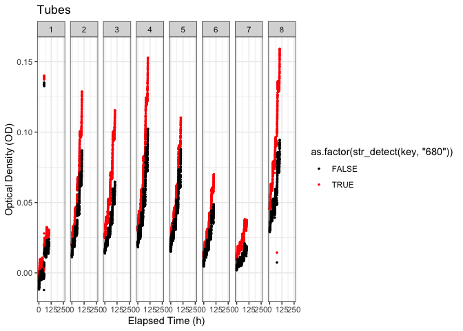
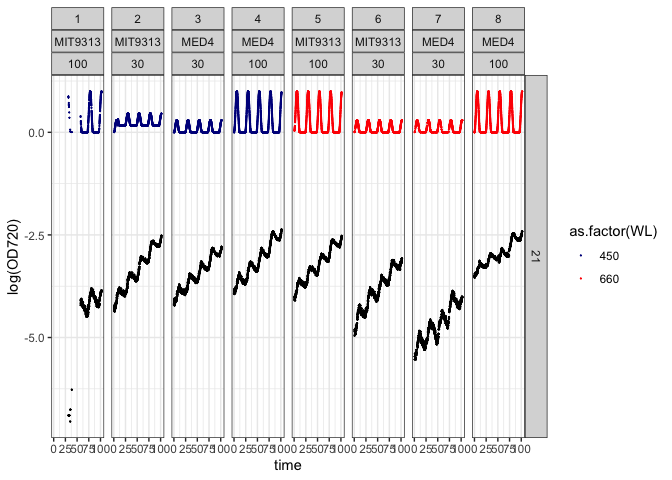

# Run These Chunks First


# Introduction
Implement logistic growth curve fits to MultiCulti growth trajectories imported and tidied using MultiColourDataImport.Rmd

# Load Libraries and set project variables

Run only first time in session


```r
# libraries; Note check actual dependencies
library(tidyverse)
library(lubridate)
library(stringr)
library(broom)
library(knitr)
library(zoo)
#library(tidyquant)
#library(data.table)
#library(googledrive)
#library(googlesheets4)
library(minpack.lm)
#library(dplyr)

#attach psych for harmonic.mean() for averaging rates
#library(psych)
```

Run only first time in session


```r
#"..", takes up a level in the directory path
Project <- "PICO"
ImportedData <- file.path("ImportedColourData")
PlotsPath <- file.path("Figs")
FittedData <- file.path("FittedData", "ColourLogGrowthFits")

Sensor <- "od-680"


#set the hour of day at which photoperiod starts for later generation of ToD Time of Day
StartHour <- 6
```

Run only first time in session
Think about how to accomodate data from single colour multiculti as well

```r
MyWavelengths = c(405, 450, 475, 530, 615, 660, 730, "WW")
MCMIXColours = c("violet", "darkblue", "dodgerblue", "green","orange","red","purple", "black")

names(MCMIXColours) <- MyWavelengths
MCMIXColours
```

```
##          405          450          475          530          615          660 
##     "violet"   "darkblue" "dodgerblue"      "green"     "orange"        "red" 
##          730           WW 
##     "purple"      "black"
```


# List previously processed files

Run only first time in session


```r
list.files(path = FittedData, pattern = Project, full.names = TRUE)
```

```
## [1] "FittedData/ColourLogGrowthFits/20200124_PICO_MCMIX004_RUN1_FitDataNestGrowth.Rds"    
## [2] "FittedData/ColourLogGrowthFits/20200124_PICO_MCMIX004_RUN1_ProcessDataNestGrowth.Rds"
```

# List available tidied, organized .Rds files of MultiCulti data.

Exported from runs of MultiColourImport.Rmd Run only first time in session


```r
list.files(path = ImportedData, pattern = Project, full.names = TRUE)
```

```
## [1] "ImportedColourData/20200124_PICO_MCMIX004_RUN1_TargetDataMetaFilter.Rds"
```

# Select and Read ProcessFile

Run for each file in a session; all chunks below run for each file.


```r
FitFile <- "ImportedColourData/20200124_PICO_MCMIX004_RUN1_TargetDataMetaFilter.Rds"

#more robust indexing probably feasible
FitFileName <- str_split(string = FitFile, "/")[[1]][2] %>%
  str_remove(pattern = ".Rds") %>%
  str_remove(pattern = "_TargetDataMetaFilter")

FitData <- readRDS(FitFile)  %>%
  ungroup()

colnames(FitData)
```

```
##  [1] "time"                        "Filename"                   
##  [3] "CDateTime"                   "Tube"                       
##  [5] "abs_time"                    "ToD"                        
##  [7] "ExpDate"                     "MC"                         
##  [9] "actinic-lights.light-1-B450" "actinic-lights.light-2-B450"
## [11] "actinic-lights.light-2-B470" "actinic-lights.light-3-B450"
## [13] "actinic-lights.light-4-B450" "actinic-lights.light-5-R660"
## [15] "actinic-lights.light-6-R660" "actinic-lights.light-7-R660"
## [17] "actinic-lights.light-8-R660" "actinic_par"                
## [19] "OD680"                       "OD720"                      
## [21] "PrimaryOperator"             "Run"                        
## [23] "Description"                 "Motivation"                 
## [25] "doi"                         "ProjectID"                  
## [27] "ID"                          "Strain"                     
## [29] "Inoc_mL"                     "Media_mL"                   
## [31] "ExpCul"                      "InnocDate"                  
## [33] "Par_ue"                      "Photoperiod"                
## [35] "Temp_c"                      "Media"                      
## [37] "MediaDate"                   "Source"                     
## [39] "SourceSalinity"              "Plate"                      
## [41] "Well"                        "EndDate"                    
## [43] "Salinity"                    "N2"                         
## [45] "O2"                          "Ar"                         
## [47] "CO2"                         "WL"                         
## [49] "LightShape"                  "Optode"                     
## [51] "InocpH"                      "FinalpH"                    
## [53] "Par_ueAdjusted"              "DateOfAdjustment"           
## [55] "ElaspedHoursAtAdjustment"    "MovAvg"                     
## [57] "IsMovAvgOutlier"
```

Remove extraneous columns from FitData; could have done at end of MultiDataImport.Rmd

```r
FitData <- FitData %>%
  select(-contains("actinic-lights.light")) %>%
  select(-c("Plate", "Well", "MovAvg", "IsMovAvgOutlier"))

colnames(FitData)
```

```
##  [1] "time"                     "Filename"                
##  [3] "CDateTime"                "Tube"                    
##  [5] "abs_time"                 "ToD"                     
##  [7] "ExpDate"                  "MC"                      
##  [9] "actinic_par"              "OD680"                   
## [11] "OD720"                    "PrimaryOperator"         
## [13] "Run"                      "Description"             
## [15] "Motivation"               "doi"                     
## [17] "ProjectID"                "ID"                      
## [19] "Strain"                   "Inoc_mL"                 
## [21] "Media_mL"                 "ExpCul"                  
## [23] "InnocDate"                "Par_ue"                  
## [25] "Photoperiod"              "Temp_c"                  
## [27] "Media"                    "MediaDate"               
## [29] "Source"                   "SourceSalinity"          
## [31] "EndDate"                  "Salinity"                
## [33] "N2"                       "O2"                      
## [35] "Ar"                       "CO2"                     
## [37] "WL"                       "LightShape"              
## [39] "Optode"                   "InocpH"                  
## [41] "FinalpH"                  "Par_ueAdjusted"          
## [43] "DateOfAdjustment"         "ElaspedHoursAtAdjustment"
```

Add ln and deltaOD columns; filter for failed ln

```r
FitData <- FitData %>%
  mutate(#lnOD720 = log(OD720),
         #lnOD680 = log(OD680),
         deltaOD = OD680 - OD720) %>%
         #lndeltaOD = log(deltaOD)) %>%
  #drop_na(lndeltaOD)  %>%
  drop_na(Tube, MC, ExpDate) 
  #filter(!is.infinite(lnOD720)) %>%
  #filter(!is.infinite(lnOD680)) %>%
  #filter(!is.infinite(lndeltaOD)) %>%
  #filter(!is.nan(lnOD720)) %>%
  #filter(!is.nan(lnOD680)) %>%
  #filter(!is.nan(lndeltaOD))
```


# Generate a plot of the data in the selected tidied MultiCulti file.


```r
#Run <- c("MultiCulti/20200124_PICO_MCMIX004_RUN1.csv", "MultiCulti/20200124_PICO_MCMIX006_RUN2.csv")

FitData %>%
  ggplot() +
  geom_point(aes(x = time, y = OD720), size = 0.1) +
  geom_point(aes(x = time, y = actinic_par/1000, colour = as.factor(WL)), size = 0.05) +
  scale_colour_manual(values = MCMIXColours) +
  facet_grid(rows = vars(O2), cols = vars(as.factor(Tube), Strain, Par_ue)) +
  theme_bw()
```

<!-- -->

```r
FitData %>%
  ggplot() +
  geom_point(aes(x = time, y = log(OD720)), size = 0.1) +
  geom_point(aes(x = time, y = actinic_par/100, colour = as.factor(WL)), size = 0.05) +
  scale_colour_manual(values = MCMIXColours) +
  facet_grid(rows = vars(O2), cols = vars(as.factor(Tube), Strain, Par_ue)) +
  theme_bw()
```

<!-- -->

# For split files only; select the interval that covers before the change in actinic light

```r
#even multiples of 24 + StartHour to start at photoperiod
#LowerTime <- 24 * 1
UpperTime <- 24 * 8

FitData <- FitData %>%
  filter(time <= UpperTime)
```


# Attempt Logistic Fits of Data
Create R function for logistic equation.

```r
#define a logistic equation as a function.
#x will be taken from 'time' when we run the fit.
logistic_eqn <- function(x, mu, Intercept, Max){(Max*Intercept*exp(mu*x))/(Max + (Intercept*(exp(mu*x)-1)))
}
```

Set starting values for logistic model
Replaced this with Max's extraction of start values from nests

```r
# #define starting, lower, and upper bounds for fit parameters to constrain logistic fit
# # logistic_eqn_start<-list(pmax = max(ProcessData$Areamm2, na.rm = TRUE), mu = 0.05, intercept = min(MyData$Areamm2, na.rm = TRUE))
# # 
# # logistic_eqn_lower<-c((max(MyData$Areamm2, na.rm = TRUE) * 0.5),0.001,((min(MyData$Areamm2, na.rm = TRUE) * 0.1)))
# # 
# # logistic_eqn_upper<-c((max(MyData$Areamm2, na.rm = TRUE) * 2),1,((min(MyData$Areamm2, na.rm = TRUE) * 4)))
# 
# logistic_eqn_start <- list(pmax = 0.3, mu = 0.01, intercept = 0.01)
# logistic_eqn_lower <- c(0.1, -0.1, 0.001)
# logistic_eqn_upper <- c(0.5, 0.1, 0.1)
```

Logistic fits across entire data sets; not appropriate for split condition runs
This chunk uses code from the 'Tidyverse' 'purrr' package.
R will iteratively vary the parameters of the fitting equations to minimize the residuals (discrepancies) between the data points in a given nest and the points predicted by the model with a given set of parameters.
If that fails, R returns a 'null' result for the fit for the given nest, and proceeds to attempt the next nest of data.  

The nlsLM fitting function requires a vector of 'start' values for each fitted parameter.
nlsLM optionally accepts vectors of 'lower' and 'upper' boundary values for each fitted parameter.
Avoid using 'lower' and 'upper' boundaries when feasible, because they can lead to erroneous fits when the fitting iterations hit a boundary for a fitted parameter and then sit there.
Sometimes with noisy data, setting 'lower' and 'upper' boundaries can help constrain the fit.
Sometimes there are mechanistic reasons to constrain the range for fitted values; as for example setting 0 as the minimum value for a lag phase.

```r
FitDataNestGrowth  <- FitData %>% 
  nest(data = c(time, abs_time, ToD, actinic_par, OD680, OD720, deltaOD)) %>%
  mutate(max_time = map_dbl(map(data, `[[`, c("time")), max, na.rm = TRUE),
    min_OD720 =  map_dbl(map(data, `[[`, c("OD720")), min, na.rm = TRUE),
    max_OD720 = map_dbl(map(data, `[[`, c("OD720")), max, na.rm = TRUE),
    mu_OD720guess = (log(max_OD720) - log(min_OD720))/max_time,
    min_deltaOD =  map_dbl(map(data, `[[`, c("OD720")), min, na.rm = TRUE),
    max_deltaOD = map_dbl(map(data, `[[`, c("OD720")), max, na.rm = TRUE),
    mu_deltaODguess = (log(max_OD720) - log(min_OD720))/max_time,
    OD720_logistic = pmap(list(data, mu_OD720guess, min_OD720, max_OD720), possibly(~nlsLM(OD720~ logistic_eqn(x = time, mu, Intercept, Max), data = ..1, start = c(mu = ..2, Intercept = ..3, Max = ..4)), otherwise = NULL)),
    OD720_logistic_tidied =  map(OD720_logistic, possibly(tidy, otherwise = NULL)),
 OD720_logistic_param = map(OD720_logistic, possibly(glance, otherwise = NULL)),
 deltaOD_logistic = pmap(list(data, mu_deltaODguess, min_deltaOD, max_deltaOD), possibly(~nlsLM(deltaOD ~ logistic_eqn(x = time, mu, Intercept, Max), data = ..1, start = c(mu = ..2, Intercept = ..3, Max = ..4)), otherwise = NULL)),
    deltaOD_logistic_tidied =  map(deltaOD_logistic, possibly(tidy, otherwise = NULL)),
 deltaOD_logistic_param = map(deltaOD_logistic,possibly(glance, otherwise = NULL))
  )
```

```
## Warning in nls.lm(par = start, fn = FCT, jac = jac, control = control, lower = lower, : lmdif: info = -1. Number of iterations has reached `maxiter' == 50.

## Warning in nls.lm(par = start, fn = FCT, jac = jac, control = control, lower = lower, : lmdif: info = -1. Number of iterations has reached `maxiter' == 50.

## Warning in nls.lm(par = start, fn = FCT, jac = jac, control = control, lower = lower, : lmdif: info = -1. Number of iterations has reached `maxiter' == 50.

## Warning in nls.lm(par = start, fn = FCT, jac = jac, control = control, lower = lower, : lmdif: info = -1. Number of iterations has reached `maxiter' == 50.
```


```r
#improve with automated annotate placement based upon data traces; difficulty is that data is nested until expansion for ggplot b/c we need to conserve memory so data traces are not easily accessible
# segmentYstart <- as.numeric(IntervalDataTube1[IntervalDataTube1$time == 52, "lnOD680"])
# segmentYend <- as.numeric(IntervalDataTube1[IntervalDataTube1$time == 54, "lnOD680"])

#Replace annotation settings with values derived from data
OD_x = 170
OD_y = 0.08

Par_x = 190
Par_y = 0.04

Resid_x = 30
Resid_y = -0.01

Predict_x = 55
Predict_y = 0.04

#predictions of condition specific fits
OD720LogGrowthPlot <- FitDataNestGrowth %>%
  #filter(Tube == 1) %>%
  mutate(OD720_logistic_predict = map(OD720_logistic, possibly(augment, otherwise = NULL))) %>%
  unnest(cols = c(data, OD720_logistic_predict),names_sep = "_") %>%
  ggplot() +
  geom_point(aes(x = data_time, y = data_OD720), colour = "darkgreen", size = 0.1) +
  scale_colour_manual(values = MCMIXColours) +
  geom_point(aes(x = data_time, y = OD720_logistic_predict_.fitted), colour = "black", size = 0.1) +
  geom_point(aes(x = data_time, y = OD720_logistic_predict_.resid), colour = "red", size = 0.05) +geom_point(aes(x = data_time, y = data_actinic_par/1000, colour = as.factor(WL)), size = 0.05, alpha = 0.1) +
  coord_cartesian(xlim = c(-5, 260)) +
  scale_x_continuous(breaks=seq(0, 250, by = 125)) +
  facet_grid(rows = vars(O2), cols = vars(Tube, WL, Par_ue, Strain)) +
  labs(subtitle = "Tube; Growth Light (nm; µE); Strain", caption = FitFileName, y = "Optical Density 720nm (OD720)", x = "Elapsed Time (h)") +
  theme_bw() +
  labs(colour = "Actinic PAR (nm)")

OD720LogGrowthPlot
```

<!-- -->

```r
OD720LogGrowthPlotExpand <- FitDataNestGrowth %>%
  filter(Tube == 1) %>%
  mutate(OD720_logistic_predict = map(OD720_logistic, possibly(augment, otherwise = NULL))) %>%
  unnest(cols = c(data, OD720_logistic_predict),names_sep = "_") %>%
  ggplot() +
  geom_point(aes(x = data_time, y = data_OD720), colour = "darkgreen", size = 0.1) +
  scale_colour_manual(values = MCMIXColours) +
  geom_point(aes(x = data_time, y = OD720_logistic_predict_.fitted), colour = "black", size = 0.1) +
  geom_point(aes(x = data_time, y = OD720_logistic_predict_.resid), colour = "red", size = 0.05) + 
  geom_point(aes(x = data_time, y = data_actinic_par/1000, colour = as.factor(WL)), size = 0.1, alpha = 0.1) +
  coord_cartesian(xlim = c(-5, 260)) +
  scale_x_continuous(breaks=seq(0, 250, by = 125)) +
  facet_grid(rows = vars(O2), cols = vars(Tube, WL, Par_ue, Strain)) +
  annotate(geom = "text", x = OD_x, y = OD_y, label = "deltaOD", size = 5, colour = "darkgreen") +
  annotate(geom = "text", x = Par_x, y = Par_y, label = "Light level", size = 5, colour = "darkblue") +
  annotate(geom = "text", x = Resid_x, y = Resid_y, label = "Model residuals", size = 5, colour = "red") +
  annotate(geom = "text", x = Predict_x, y = Predict_y, label = "Logistic Regression", size = 5, colour = "black") +
  #7_cartesian(xlim = c(-5, 255)) +
  labs(subtitle = "Tube; Growth Light (nm; µE); Strain", caption = FitFileName, y = "Optical Density 720nm (OD720)", x = "Elapsed Time (h)") +
  theme_bw() +
  labs(colour = "Actinic PAR (nm)")

OD720LogGrowthPlotExpand
```

<!-- -->

```r
DeltaODLogGrowthPlot <- FitDataNestGrowth %>%
  #filter(Tube == 1) %>%
  mutate(deltaOD_logistic_predict = map(deltaOD_logistic, possibly(augment, otherwise = NULL))) %>%
  unnest(cols = c(data, deltaOD_logistic_predict),names_sep = "_") %>%
  ggplot() +
  geom_point(aes(x = data_time, y = data_deltaOD), colour = "darkgreen", size = 0.1) +
  scale_colour_manual(values = MCMIXColours) +
  geom_point(aes(x = data_time, y = deltaOD_logistic_predict_.fitted), colour = "black", size = 0.1) +
  geom_point(aes(x = data_time, y = deltaOD_logistic_predict_.resid), colour = "red", size = 0.05) +geom_point(aes(x = data_time, y = data_actinic_par/1000, colour = as.factor(WL)), size = 0.05, alpha = 0.1) +
  coord_cartesian(xlim = c(-5, 260)) +
  scale_x_continuous(breaks=seq(0, 250, by = 125)) +
  facet_grid(rows = vars(O2), cols = vars(Tube, WL, Par_ue, Strain)) +
  labs(subtitle = "Tube; Growth Light (nm; µE); Strain", caption = FitFileName, y = "Delta Optical Density (deltaOD)", x = "Elapsed Time (h)") +
  theme_bw() +
  labs(colour = "Actinic PAR (nm)")

DeltaODLogGrowthPlot
```

<!-- -->

```r
DeltaODLogGrowthPlotExpand <- FitDataNestGrowth %>%
  filter(Tube == 1) %>%
  mutate(deltaOD_logistic_predict = map(deltaOD_logistic, possibly(augment, otherwise = NULL))) %>%
  unnest(cols = c(data, deltaOD_logistic_predict),names_sep = "_") %>%
  ggplot() +
  geom_point(aes(x = data_time, y = data_deltaOD), colour = "darkgreen", size = 0.1) +
  scale_colour_manual(values = MCMIXColours) +
  geom_point(aes(x = data_time, y = deltaOD_logistic_predict_.fitted), colour = "black", size = 0.1) +
  geom_point(aes(x = data_time, y = deltaOD_logistic_predict_.resid), colour = "red", size = 0.05) + 
  geom_point(aes(x = data_time, y = data_actinic_par/1000, colour = as.factor(WL)), size = 0.5, alpha = 0.1) +
  coord_cartesian(xlim = c(0, 250)) +
  scale_x_continuous(breaks=seq(0, 250, by = 125)) +
  facet_grid(rows = vars(O2), cols = vars(Tube, WL, Par_ue, Strain)) +
  annotate(geom = "text", x = OD_x, y = OD_y, label = "deltaOD", size = 5, colour = "darkgreen") +
  annotate(geom = "text", x = Par_x, y = Par_y, label = "Light level", size = 5, colour = "darkblue") +
  annotate(geom = "text", x = Resid_x, y = Resid_y, label = "Model residuals", size = 5, colour = "red") +
  annotate(geom = "text", x = Predict_x, y = Predict_y, label = "Logistic Regression", size = 5, colour = "black") +
  labs(subtitle = "Tube; Growth Light (nm; µE); Strain", caption = FitFileName , y = "Delta Optical Density (deltaOD)", x = "Elapsed Time (h)") +
  theme_bw() +
  labs(colour = "Actinic PAR (nm)")

DeltaODLogGrowthPlotExpand
```

<!-- -->


```r
# ggsave(file = file.path(PlotsPath, paste(ProcessFileName, "OD720LogGrowthPlot",".png",sep = "")), plot = OD720LogGrowthPlot, device = NULL, scale = 1, height=10, width= 20, units = c("cm"),dpi = 300, limitsize = TRUE)
# 
# ggsave(file = file.path(PlotsPath, paste(ProcessFileName, "OD720LogGrowthPlotExpand",".png",sep = "")), plot = OD720LogGrowthPlotExpand, device = NULL, scale = 1, height=10, width= 20, units = c("cm"),dpi = 300, limitsize = TRUE)
# 
# ggsave(file = file.path(PlotsPath, paste(ProcessFileName, "DeltaODLogGrowthPlot",".png",sep = "")), plot = DeltaODLogGrowthPlot, device = NULL, scale = 1, height=10, width= 20, units = c("cm"),dpi = 300, limitsize = TRUE)
# 
# ggsave(file = file.path(PlotsPath, paste(ProcessFileName, "DeltaODLogGrowthPlotExpand",".png",sep = "")), plot = DeltaODLogGrowthPlotExpand, device = NULL, scale = 1, height=10, width= 20, units = c("cm"),dpi = 300, limitsize = TRUE)
```


```r
kable(FitDataNestGrowth %>%
 unnest(cols = c(OD720_logistic_tidied),names_sep = "_") %>%
  select(c(Filename, Tube, Strain, Par_ue, Photoperiod, Temp_c, O2, WL, LightShape, OD720_logistic_tidied_term, OD720_logistic_tidied_estimate, OD720_logistic_tidied_std.error)) %>%
  pivot_wider(names_from =  OD720_logistic_tidied_term, values_from = c(OD720_logistic_tidied_estimate, OD720_logistic_tidied_std.error), names_sep = "_") %>%
  rename(OD720_pmax = OD720_logistic_tidied_estimate_Max,
         OD720_pmax_se = OD720_logistic_tidied_std.error_Max,
         OD720_mu= OD720_logistic_tidied_estimate_mu,
         OD720_mu_se = OD720_logistic_tidied_std.error_mu,
         OD720_intercept = OD720_logistic_tidied_estimate_Intercept,
         OD720_intercept_se = OD720_logistic_tidied_std.error_Intercept)
)
```


|Filename                                        | Tube|Strain  | Par_ue| Photoperiod| Temp_c| O2|WL  |LightShape |  OD720_mu| OD720_intercept|   OD720_pmax| OD720_mu_se| OD720_intercept_se| OD720_pmax_se|
|:-----------------------------------------------|----:|:-------|------:|-----------:|------:|--:|:---|:----------|---------:|---------------:|------------:|-----------:|------------------:|-------------:|
|MultiColourData/20200124_PICO_MCMIX004_RUN1.csv |    1|MIT9313 |    100|          12|     22| 21|450 |Sine       | 0.0886492|       0.0002352| 1.793670e-02|   0.0087058|          0.0001180|  2.506000e-04|
|MultiColourData/20200124_PICO_MCMIX004_RUN1.csv |    2|MIT9313 |     30|          12|     22| 21|450 |Sine       | 0.0217843|       0.0140569| 1.533002e-01|   0.0007852|          0.0002852|  1.319510e-02|
|MultiColourData/20200124_PICO_MCMIX004_RUN1.csv |    3|MED4    |     30|          12|     22| 21|450 |Sine       | 0.0157118|       0.0162239| 1.649533e-01|   0.0008682|          0.0002695|  3.120660e-02|
|MultiColourData/20200124_PICO_MCMIX004_RUN1.csv |    4|MED4    |    100|          12|     22| 21|450 |Sine       | 0.0162100|       0.0207506| 3.738668e-01|   0.0009170|          0.0004131|  1.268006e-01|
|MultiColourData/20200124_PICO_MCMIX004_RUN1.csv |    5|MIT9313 |    100|          12|     22| 21|660 |Sine       | 0.0171384|       0.0191853| 1.815734e-01|   0.0008534|          0.0003316|  2.604790e-02|
|MultiColourData/20200124_PICO_MCMIX004_RUN1.csv |    6|MIT9313 |     30|          12|     22| 21|660 |Sine       | 0.0222008|       0.0090386| 7.597410e-02|   0.0009800|          0.0002195|  5.911000e-03|
|MultiColourData/20200124_PICO_MCMIX004_RUN1.csv |    7|MED4    |     30|          12|     22| 21|660 |Sine       | 0.0188566|       0.0044980| 3.647370e-02|   0.0016239|          0.0001630|  6.589700e-03|
|MultiColourData/20200124_PICO_MCMIX004_RUN1.csv |    8|MED4    |    100|          12|     22| 21|660 |Sine       | 0.0092371|       0.0318199| 1.208001e+05|   0.0008904|          0.0003918|  2.528126e+10|

```r
 #%>%
  #mutate(GrowthFlag = if_else((OD720_intercept + OD720_intercept_se) < (OD720_pmax - OD720_pmax_se), 1, 0)))
```

Plot Logistic Fit Terms vs. conditions

```r
FitDataNestGrowth %>%
 unnest(cols = c(OD720_logistic_tidied),names_sep = "_") %>%
  select(c(Filename, Tube, Strain, Par_ue, Photoperiod, Temp_c, O2, WL, LightShape, OD720_logistic_tidied_term, OD720_logistic_tidied_estimate, OD720_logistic_tidied_std.error)) %>%
  pivot_wider(names_from =  OD720_logistic_tidied_term, values_from = c(OD720_logistic_tidied_estimate, OD720_logistic_tidied_std.error), names_sep = "_") %>%
  rename(OD720_pmax = OD720_logistic_tidied_estimate_Max,
         OD720_pmax_se = OD720_logistic_tidied_std.error_Max,
         OD720_mu = OD720_logistic_tidied_estimate_mu,
         OD720_mu_se = OD720_logistic_tidied_std.error_mu,
         OD720_intercept = OD720_logistic_tidied_estimate_Intercept,
         OD720_intercept_se = OD720_logistic_tidied_std.error_Intercept) %>%
  mutate(GrowthFlag = if_else((OD720_intercept + OD720_intercept_se)  < (OD720_pmax - OD720_pmax_se), 1, 0)) %>%
  ggplot() +
  geom_point(aes(x = Par_ue, y = OD720_mu, colour = as.factor(WL))) +
  geom_errorbar(aes(x = Par_ue, ymin = OD720_mu - OD720_mu_se, ymax = OD720_mu + OD720_mu_se, colour = as.factor(WL))) + 
  scale_colour_manual(values = MCMIXColours) +
  facet_grid (cols = vars(Strain), rows = vars(O2)) +
  theme_bw()
```

<!-- -->

```r
FitDataNestGrowth %>%
 unnest(cols = c(deltaOD_logistic_tidied),names_sep = "_") %>%
  select(c(Filename, Tube, Strain, Par_ue, Photoperiod, Temp_c, O2, WL, LightShape, deltaOD_logistic_tidied_term, deltaOD_logistic_tidied_estimate, deltaOD_logistic_tidied_std.error)) %>%
  pivot_wider(names_from =  deltaOD_logistic_tidied_term, values_from = c(deltaOD_logistic_tidied_estimate, deltaOD_logistic_tidied_std.error), names_sep = "_") %>%
  rename(deltaOD_pmax = deltaOD_logistic_tidied_estimate_Max,
         deltaOD_pmax_se = deltaOD_logistic_tidied_std.error_Max,
         deltaOD_mu = deltaOD_logistic_tidied_estimate_mu,
         deltaOD_mu_se = deltaOD_logistic_tidied_std.error_mu,
         deltaOD_intercept = deltaOD_logistic_tidied_estimate_Intercept,
         deltaOD_intercept_se = deltaOD_logistic_tidied_std.error_Intercept) %>%
  mutate(GrowthFlag = if_else((deltaOD_intercept + deltaOD_intercept_se)  < (deltaOD_pmax - deltaOD_pmax_se), 1, 0)) %>%
  ggplot() +
  geom_point(aes(x = Par_ue, y = deltaOD_mu, colour = as.factor(WL))) +
  geom_errorbar(aes(x = Par_ue, ymin = deltaOD_mu - deltaOD_mu_se, ymax = deltaOD_mu + deltaOD_mu_se, colour = as.factor(WL))) + 
  scale_colour_manual(values = MCMIXColours) +
  facet_grid (cols = vars(Strain), rows = vars(O2)) +
  theme_bw()
```

<!-- -->

```r
FitDataNestGrowth %>%
 unnest(cols = c(OD720_logistic_tidied),names_sep = "_") %>%
  select(c(Filename, Tube, Strain, Par_ue, Photoperiod, Temp_c, O2, WL, LightShape, OD720_logistic_tidied_term, OD720_logistic_tidied_estimate, OD720_logistic_tidied_std.error)) %>%
  pivot_wider(names_from =  OD720_logistic_tidied_term, values_from = c(OD720_logistic_tidied_estimate, OD720_logistic_tidied_std.error), names_sep = "_") %>%
  rename(OD720_pmax = OD720_logistic_tidied_estimate_Max,
         OD720_pmax_se = OD720_logistic_tidied_std.error_Max,
         OD720_mu = OD720_logistic_tidied_estimate_mu,
         OD720_mu_se = OD720_logistic_tidied_std.error_mu,
         OD720_intercept = OD720_logistic_tidied_estimate_Intercept,
         OD720_intercept_se = OD720_logistic_tidied_std.error_Intercept) %>%
  mutate(GrowthFlag = if_else((OD720_intercept + OD720_intercept_se)  < (OD720_pmax - OD720_pmax_se), 1, 0)) %>%
  ggplot() +
  geom_point(aes(x = Par_ue, y = OD720_pmax, colour = as.factor(WL))) +
  geom_errorbar(aes(x = Par_ue, ymin = OD720_pmax - OD720_pmax_se, ymax = OD720_pmax + OD720_pmax_se, colour = as.factor(WL))) + 
  scale_colour_manual(values = MCMIXColours) +
  facet_grid (cols = vars(Strain), rows = vars(O2)) +
  theme_bw()
```

<!-- -->

```r
FitDataNestGrowth %>%
 unnest(cols = c(deltaOD_logistic_tidied),names_sep = "_") %>%
  select(c(Filename, Tube, Strain, Par_ue, Photoperiod, Temp_c, O2, WL, LightShape, deltaOD_logistic_tidied_term, deltaOD_logistic_tidied_estimate, deltaOD_logistic_tidied_std.error)) %>%
  pivot_wider(names_from =  deltaOD_logistic_tidied_term, values_from = c(deltaOD_logistic_tidied_estimate, deltaOD_logistic_tidied_std.error), names_sep = "_") %>%
  rename(deltaOD_pmax = deltaOD_logistic_tidied_estimate_Max,
         deltaOD_pmax_se = deltaOD_logistic_tidied_std.error_Max,
         deltaOD_mu = deltaOD_logistic_tidied_estimate_mu,
         deltaOD_mu_se = deltaOD_logistic_tidied_std.error_mu,
         deltaOD_intercept = deltaOD_logistic_tidied_estimate_Intercept,
         deltaOD_intercept_se = deltaOD_logistic_tidied_std.error_Intercept) %>%
  mutate(GrowthFlag = if_else((deltaOD_intercept + deltaOD_intercept_se)  < (deltaOD_pmax - deltaOD_pmax_se), 1, 0)) %>%
  ggplot() +
  geom_point(aes(x = Par_ue, y = deltaOD_pmax, colour = as.factor(WL))) +
  geom_errorbar(aes(x = Par_ue, ymin = deltaOD_pmax - deltaOD_pmax_se, ymax = deltaOD_pmax + deltaOD_pmax_se, colour = as.factor(WL))) + 
  scale_colour_manual(values = MCMIXColours) +
  facet_grid (cols = vars(Strain), rows = vars(O2)) +
  theme_bw()
```

<!-- -->


Plotting Growth Summary 
plots logistic fit terms vs conditions 

```r
FitDataNestGrowth %>%
 unnest(cols = c(OD720_logistic_tidied),names_sep = "_") %>%
  select(c(Filename, Tube, Strain, Par_ue, Photoperiod, Temp_c, O2, WL, LightShape, OD720_logistic_tidied_term, OD720_logistic_tidied_estimate, OD720_logistic_tidied_std.error)) %>%
  pivot_wider(names_from =  OD720_logistic_tidied_term, values_from = c(OD720_logistic_tidied_estimate, OD720_logistic_tidied_std.error), names_sep = "_") %>%
  rename(OD720_pmax = OD720_logistic_tidied_estimate_Max,
         OD720_pmax_se = OD720_logistic_tidied_std.error_Max,
         OD720_mu = OD720_logistic_tidied_estimate_mu,
         OD720_mu_se = OD720_logistic_tidied_std.error_mu,
         OD720_intercept = OD720_logistic_tidied_estimate_Intercept,
         OD720_intercept_se = OD720_logistic_tidied_std.error_Intercept) %>%
  mutate(GrowthFlag = if_else((OD720_intercept + OD720_intercept_se)  < (OD720_pmax - OD720_pmax_se), 1, 0)) %>%
  ggplot() +
  geom_point(aes(x = Par_ue, y = OD720_mu, colour = as.factor(WL))) +
  geom_errorbar(aes(x = Par_ue, ymin = OD720_mu - OD720_mu_se, ymax = OD720_mu + OD720_mu_se, colour = as.factor(WL))) + 
  scale_colour_manual(values = MCMIXColours) +
  facet_grid (cols = vars(Strain), rows = vars(O2)) +
  theme_bw()
```

<!-- -->

```r
FitDataNestGrowth %>%
 unnest(cols = c(deltaOD_logistic_tidied),names_sep = "_") %>%
  select(c(Filename, Tube, Strain, Par_ue, Photoperiod, Temp_c, O2, WL, LightShape, deltaOD_logistic_tidied_term, deltaOD_logistic_tidied_estimate, deltaOD_logistic_tidied_std.error)) %>%
  pivot_wider(names_from =  deltaOD_logistic_tidied_term, values_from = c(deltaOD_logistic_tidied_estimate, deltaOD_logistic_tidied_std.error), names_sep = "_") %>%
  rename(deltaOD_pmax = deltaOD_logistic_tidied_estimate_Max,
         deltaOD_pmax_se = deltaOD_logistic_tidied_std.error_Max,
         deltaOD_mu = deltaOD_logistic_tidied_estimate_mu,
         deltaOD_mu_se = deltaOD_logistic_tidied_std.error_mu,
         deltaOD_intercept = deltaOD_logistic_tidied_estimate_Intercept,
         deltaOD_intercept_se = deltaOD_logistic_tidied_std.error_Intercept) %>%
  mutate(GrowthFlag = if_else((deltaOD_intercept + deltaOD_intercept_se)  < (deltaOD_pmax - deltaOD_pmax_se), 1, 0)) %>%
  ggplot() +
  geom_point(aes(x = Par_ue, y = deltaOD_mu, colour = as.factor(WL))) +
  geom_errorbar(aes(x = Par_ue, ymin = deltaOD_mu - deltaOD_mu_se, ymax = deltaOD_mu + deltaOD_mu_se, colour = as.factor(WL))) + 
  scale_colour_manual(values = MCMIXColours) +
  facet_grid (cols = vars(Strain), rows = vars(O2)) +
  theme_bw()
```

<!-- -->

```r
FitDataNestGrowth %>%
 unnest(cols = c(OD720_logistic_tidied),names_sep = "_") %>%
  select(c(Filename, Tube, Strain, Par_ue, Photoperiod, Temp_c, O2, WL, LightShape, OD720_logistic_tidied_term, OD720_logistic_tidied_estimate, OD720_logistic_tidied_std.error)) %>%
  pivot_wider(names_from =  OD720_logistic_tidied_term, values_from = c(OD720_logistic_tidied_estimate, OD720_logistic_tidied_std.error), names_sep = "_") %>%
  rename(OD720_pmax = OD720_logistic_tidied_estimate_Max,
         OD720_pmax_se = OD720_logistic_tidied_std.error_Max,
         OD720_mu = OD720_logistic_tidied_estimate_mu,
         OD720_mu_se = OD720_logistic_tidied_std.error_mu,
         OD720_intercept = OD720_logistic_tidied_estimate_Intercept,
         OD720_intercept_se = OD720_logistic_tidied_std.error_Intercept) %>%
  mutate(GrowthFlag = if_else((OD720_intercept + OD720_intercept_se)  < (OD720_pmax - OD720_pmax_se), 1, 0)) %>%
  ggplot() +
  geom_point(aes(x = Par_ue, y = OD720_pmax, colour = as.factor(WL))) +
  geom_errorbar(aes(x = Par_ue, ymin = OD720_pmax - OD720_pmax_se, ymax = OD720_pmax + OD720_pmax_se, colour = as.factor(WL))) + 
  scale_colour_manual(values = MCMIXColours) +
  facet_grid (cols = vars(Strain), rows = vars(O2)) +
  theme_bw()
```

<!-- -->

```r
FitDataNestGrowth %>%
 unnest(cols = c(deltaOD_logistic_tidied),names_sep = "_") %>%
  select(c(Filename, Tube, Strain, Par_ue, Photoperiod, Temp_c, O2, WL, LightShape, deltaOD_logistic_tidied_term, deltaOD_logistic_tidied_estimate, deltaOD_logistic_tidied_std.error)) %>%
  pivot_wider(names_from =  deltaOD_logistic_tidied_term, values_from = c(deltaOD_logistic_tidied_estimate, deltaOD_logistic_tidied_std.error), names_sep = "_") %>%
  rename(deltaOD_pmax = deltaOD_logistic_tidied_estimate_Max,
         deltaOD_pmax_se = deltaOD_logistic_tidied_std.error_Max,
         deltaOD_mu = deltaOD_logistic_tidied_estimate_mu,
         deltaOD_mu_se = deltaOD_logistic_tidied_std.error_mu,
         deltaOD_intercept = deltaOD_logistic_tidied_estimate_Intercept,
         deltaOD_intercept_se = deltaOD_logistic_tidied_std.error_Intercept) %>%
  mutate(GrowthFlag = if_else((deltaOD_intercept + deltaOD_intercept_se)  < (deltaOD_pmax - deltaOD_pmax_se), 1, 0)) %>%
  ggplot() +
  geom_point(aes(x = Par_ue, y = deltaOD_pmax, colour = as.factor(WL))) +
  geom_errorbar(aes(x = Par_ue, ymin = deltaOD_pmax - deltaOD_pmax_se, ymax = deltaOD_pmax + deltaOD_pmax_se, colour = as.factor(WL))) + 
  scale_colour_manual(values = MCMIXColours) +
  facet_grid (cols = vars(Strain), rows = vars(O2)) +
  theme_bw()
```

<!-- -->


# Save .Rds of FitDataNestGrowth containing logistic fits of growth data from time resolved and whole interval fits


```r
saveRDS(object = FitDataNestGrowth, file = file.path(FittedData, paste(FitFileName,  "FitDataNestGrowth.Rds",  sep = "_")), ascii = FALSE, version = NULL, compress = TRUE, refhook = NULL)
```
